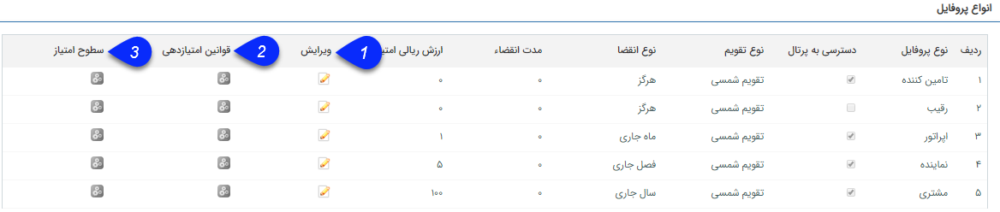
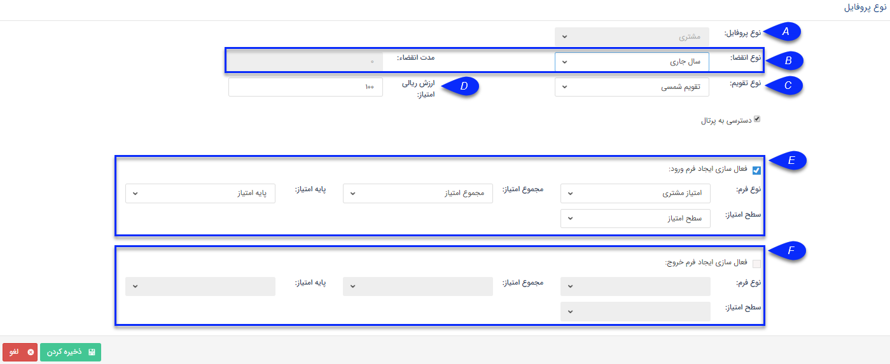
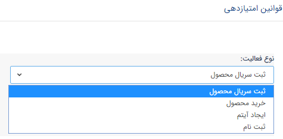
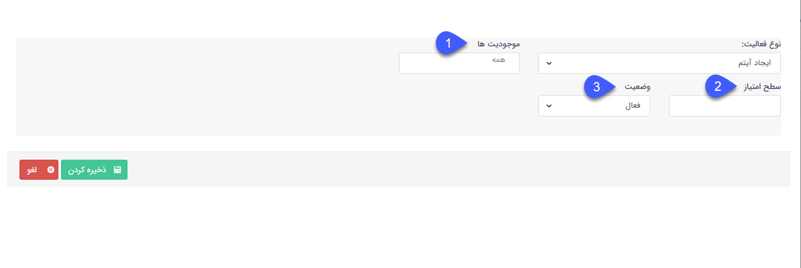
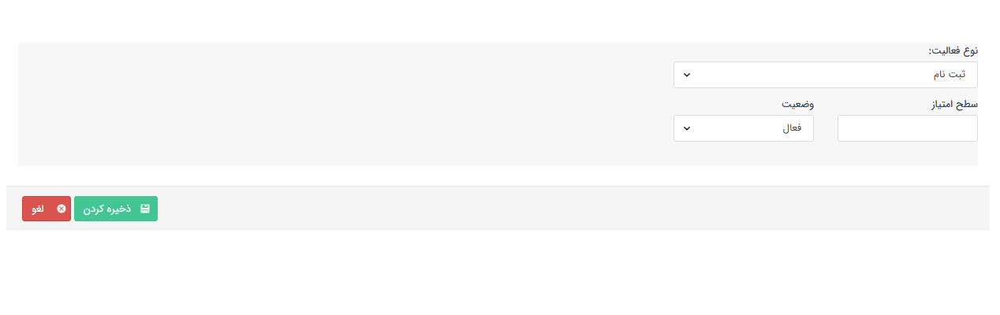

## مدیریت انواع پروفایل

در این قسمت میتوانید برای انواع پروفایل سطوح امتیاز دهی مختلف تعریف کنید.

انواع پروفایل ها :

تامین کننده ، رقیب، اپراتور، نماینده و مشتری

1 . ویرایش نوع پروفایل

می توانید برای هر یک از انواع پروفایل تنظیمات زیر را انجام دهید:    

A. نوع پروفایل: نوع پروفایل هویتی که روی آن امتیاز را تعریف می کنید را نمایش می دهد.

B. انقضا: مدت زمان مجاز برای منقضی شدن امتیاز را انتخاب کنید. توجه داشته باشید که فقط در صورتی امکان مشخص کردن مدت انقضا به صورت دستی وجود دارد که نوع انقضا روی "روز مشخص" باشد.

C. نوع تقویم: نوع تقویم را به صورت شمسی و یا میلادی مشخص کنید.

D. ارزش ریالی امتیاز: ارزش ریالی مرتبط با سطوح امتیاز را در این قسمت مشخص کنید.

E. ایجاد فرم ورود به امتیاز: در صورتی که پروفایل مرتبط به سطح امتیاز تعریف شده برسد فرمی از نوعی که در این قسمت انتخاب می شود ایجاد می شود و هر یک از مقادیر مجموع امتیاز و پایه امتیاز و سطوح امتیاز در فیلدهای مرتبطی که به آن ها در این قسمت نگاشت شده قرار می گیرند.

 F. ایجاد فرم خروج از امتیاز: در صورتی که پروفایل مرتبط از سطح امتیاز خارج شود فرمی از نوعی که در این قسمت انتخاب می شود ایجاد می شود و هر یک از مقادیر مجموع امتیاز و پایه امتیاز و سطوح امتیاز در فیلدهای مرتبطی که به آن ها در این قسمت نگاشت شده قرار می گیرند.
 
 2. تعریف قوانین امتیاز دهی:

در این قسمت می توان براساس نوع فعالیت، قوانین امتیاز دهی را تعریف کرد:

انواع فعالیت ها که میتوان براساس آنها قوانین امتیاز دهی تعریف کرد عبارتست از

1. ثبت سریال محصول:

  چنانچه هویت مرتبط پیامکی حاوی سریال محصولی که خریداری کرده است ارسال کند و محصول مربوطه در اصالت کالا معرفی شده باشد، به ازای هر سریال به میزان مشخص شده در این قسمت امتیاز کسب می کند.

a. دسته بندی محصولات: محصولی که هویت مرتبط با ارسال سریال آن امتیاز کسب می کند را انتخاب کنید. (ا مکان تعریف امتیاز بر روی گروه و دسته بندی محصول از این صفحه وجود ندارد. و برای هر محصول باید به صورت تکی امتیاز تعریف کرد.)

b.سطح امتیاز: امتیاز کسب شده به ازای محصول انتخابی را مشخص کنید.

c. وضعیت: فعال یا غیرفعال بودن امتیاز برای این محصول را مشخص کنید.

> نکته:امکان ورود امتیاز از طریق اکسل در مدیریت محصولات وجود دارد. امتیازات وارد شده از طریق مدیریت محصولات به این قسمت هم اعمال می شود.

> نکته:  در صورت تعریف چند امتیاز برای یک محصول، آخرین امتیاز ثبت شده برای هر محصول ملاک امتیازدهی می باشد.

2. خرید محصول:

در صورتی که برای هویت مرتبط فاکتور فروشی صادر گردد که شامل این محصول باشد به ازای آن محصول به میزان مشخص شده در این قسمت امتیاز کسب می کند.

چنانچه از روی آن، فاکتور برگشتی ثبت شود به میزان برگشتی ثبت شده، امتیاز هویت مرتبط کاهش می‌یابد.

a. دسته بندی محصولات: محصولی که جهت امتیازدهی مدنظر دارید را انتخاب کنید. (ا مکان تعریف امتیاز بر روی گروه و دسته بندی محصول از این صفحه وجود ندارد. و برای هر محصول باید به صورت تکی امتیاز تعریف کرد.)

b.سطح امتیاز: امتیاز کسب شده به ازای محصول انتخابی را مشخص کنید.

c. وضعیت: فعال یا غیرفعال بودن امتیاز برای این محصول را مشخص کنید.

> نکته: در صورت ویرایش فاکتور با توجه به میزان تغییرات آن (افزایش یا کاهش تعداد) امتیاز کسب شده یا امتیاز آن کاهش می‌یابد.

> نکته: در صورت حذف فاکتور به میزان امتیاز ثبت شده به ازای آن، از امتیاز های هویت مرتبط کسر خواهد شد.

> نکته: در صورت حذف فاکتور برگشتی به همان میزانی که برایش امتیاز مصرفی ثبت شده بود،  امتیاز کسب شده ثبت می شود.

 3. ایجاد آیتم

در این روش باید یک نوع آیتم CRM را انتخاب کنیم. در این مورد انواع آیتم انتخاب شده بر دو نوع مالی و غیر مالی تقسیم می شوند.

a. موجودیت ها: آیتم و زیرنوع آیتمی که هویت مرتبط به ازای آن امتیاز کسب می کند را انتخاب کنید.

b. سطح امتیاز: امتیاز کسب شده به ازای محصول انتخابی را مشخص کنید.

c.. وضعیت: فعال یا غیرفعال بودن امتیاز برای این محصول را مشخص کنید.

_ چنانچه آیتم انتخاب شده مالی باشد:

_  کاربر مشخص می کند که به ازای هر چند مبلغ ریال، از آن آیتم مربوط، چند امتیاز کسب می شود.

_    آیتم مالی باید حتما در وضعیت تایید باشد تا کسب امتیاز صورت گیرد.

_ چنانچه آیتم انتخاب شده غیر مالی باشد:

_       با ذخیره آیتم کسب امتیاز صورت می گیرد.

_     در صورت حذف آیتم، به میزان امتیاز کسب شده، آن امتیاز کاهش می‌یابد.

_      در صورت ویرایش آیتم مالی با توجه به میزان تغییرات (کاهش یا افزایش  مبلغ) کسب یا کاهش امتیاز به ثبت می رسد.

4.    ثبت نام:

چنانچه فردی از طریق صفحه ثبت نام، اقدام به انجام عملیات ثبت نام کند، برای فرد مربوط، به میزان مشخص شده امتیاز ثبت می شود. میتوان این وضعیت این امتیاز را فعال یا غیر فعال نیز کرد.

3.  بخش سطوح امتیاز:

در این قسمت سطح امتیاز پلکانی لازم برای ایجاد فرم ورود مشخص می شود. در واقع اگر جمع امتیازات کسب شده توسط هویت مرتبط به این سطح برسد، فرم ورود به امتیاز ایجاد می شود و در صورتی که برای فرم مربوطه چرخه ای طراحی شده باشد در کارتابل مالک قرار گرفته و پیگیری های لازم جهت دریافت پاداش صورت می گیرد.

> نکته: امکان استفاده از امتیازات کسب شده فقط زمانی امکان پذیر است که امتیازات هویت صفر نشود. (مجموع امتیازات نمی تواند منفی باشد.)

