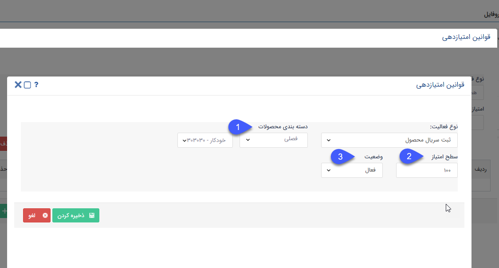

## ثبت سریال محصول 

>  مسیر دسترسی:  **تنظیمات** >**مدیریت انواع پروفایل** > **قوانین امتیازدهی** > **نوع فعالیت** > **ثبت سریال محصول** 

  چنانچه هویت مرتبط پیامکی حاوی سریال محصولی که خریداری کرده است ارسال کند و محصول مربوطه در اصالت کالا معرفی شده باشد، به ازای هر سریال به میزان مشخص شده در این قسمت امتیاز کسب می کند.

a) دسته بندی محصولات: محصولی که جهت امتیازدهی مدنظر دارید را انتخاب کنید. ( امکان تعریف امتیاز بر روی گروه و دسته بندی محصول از این صفحه وجود ندارد. و برای هر محصول باید به صورت تکی امتیاز تعریف کرد.)

b) سطح امتیاز: امتیاز کسب شده به ازای محصول انتخابی را مشخص کنید.

c) وضعیت: فعال یا غیرفعال بودن امتیاز برای این محصول را مشخص کنید.

