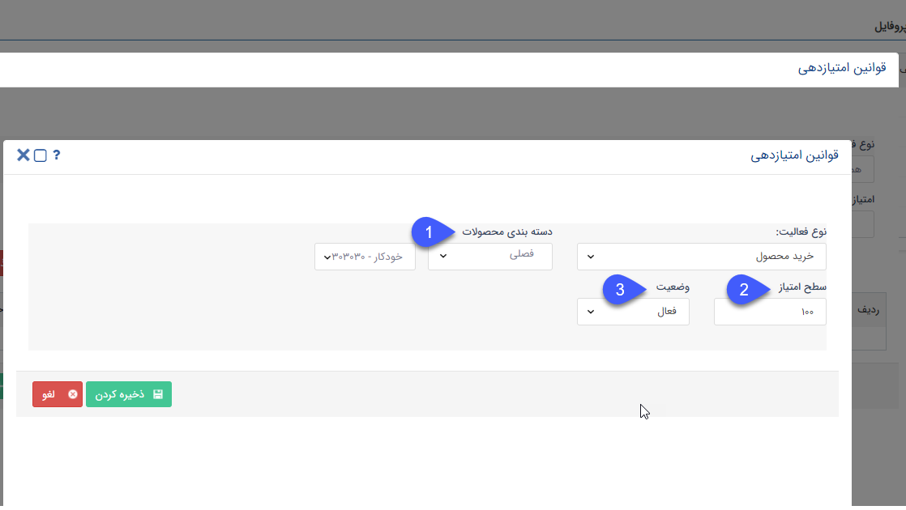

## خرید محصول 

>  مسیر دسترسی:  **تنظیمات** >**مدیریت انواع پروفایل** > **قوانین امتیازدهی** > **نوع فعالیت** > **خرید محصول** 

درصورتی که برای محصول انتخاب شده در این بخش فاکتور فروش صادر و تایید گردد، به ازای تعداد محصول موجود در فاکتور، هویت مرتبط با آن فاکتور به میزان مشخص شده در این قسمت امتیاز کسب می‌کند.

چنانچه از روی آن فاکتور، فاکتور برگشتی ثبت شود به میزان برگشتی ثبت شده، هویت مرتبط امتیاز مصرف شده کسب می کند.

a) دسته بندی محصولات: محصولی که جهت امتیازدهی مدنظر دارید را انتخاب کنید. (امکان تعریف امتیاز بر روی گروه و دسته بندی محصول از این صفحه وجود ندارد. و برای هر محصول باید به صورت تکی امتیاز تعریف کرد.) 

b) سطح امتیاز: امتیاز کسب شده به ازای محصول انتخابی را مشخص کنید.

c) وضعیت: فعال یا غیرفعال بودن امتیاز برای این محصول را مشخص کنید.

> نکته: در صورت ویرایش فاکتور با توجه به میزان تغییرات آن (کاهش  یا افزایش تعداد) امتیاز کسب شده یا مصرف شده به ثبت می رسد.

> نکته: در صورت حذف فاکتور به میزان امتیاز ثبت شده به ازای آن، از امتیاز های هویت مرتبط کسر خواهد شد.

> نکته: در صورت حذف فاکتور برگشتی به همان میزانی که برایش امتیاز مصرفی ثبت شده بود،  امتیاز کسب شده ثبت می شود.

