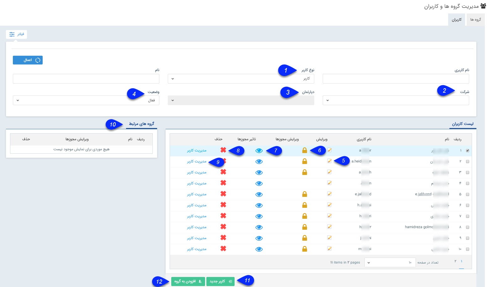

## کاربران

در این صفحه امکان ایجاد و ویرایش کاربران وجود دارد. این قسمت جزو امنیتی ترین قسمت های نرم افزار محسوب می شود. لذا دسترسی به آن بر اساس نیاز های سازمان باید به تعداد افراد محدود و مشخصی داده شود.

میتوان براساس پارامتر های زیر کاربر یا کاربران مد نظر خود را جستجو کنید.

1.نوع کاربر : میتوانید کاربر مورد نظر خود را براساس نوع کاربری ( کاربر /مشتری/نماینده) جستجو کنید. توجه داشته باشید که این پارامتر به صورت پیشفرض بر روی کاربر تنظیم شده است، برای مشاهده تمامی کاربران این لیست را روی حالت "همه" تنظیم کنید تا تمامی انواع کاربران را در لیست مشاهده کنید.

2. شرکت: با این پارامتر می توانید کاربر مورد نظر خود را بر اساس شعبه جستجو کنید.

3. دپارتمان: پس از انتخاب شعبه ، می توانید کاربر را بر اساس دپارتمان جستجو کنید.

4. وضعیت: می توانید کاربر را بر اساس وضعیت (فعال/غیرفعال) جستجو کنید.

5. ویرایش: کاربر انتخاب شده را می توانید ویرایش کنید.

6. ویرایش مجوزها: مجوزهای هر کاربر را میتوانید ویرایش کنید. برای اطلاعات بیشتر به قسمت مجوزها مراجعه کنید.

7. تاثیر مجوز ها: به دلیل اینکه از قسمت های مختلف نرم افزار می توان مجوزهای کاربران را تعیین نمود، با کلیک بر روی این دکمه، تمامی مجوز های  تخصیص داده شده به کاربر را می توانید مشاهده نمایید.

8. حذف: می توانید کاربر مورد نظر را حذف کنید. در نظر داشته باشید که اگر این نام کاربری که قصد حذف آن را دارید در نرم افزار هر گونه سابقه ای ایجاد کرده باشد، نرم افزار اجازه حذف آن را نخواهد داد. لذا می توانید کاربر را به جای حذف از قسمت ویرایش آن، غیر فعال کنید.

9. مدیریت کاربر: با استفاده از این گزینه می توانید وارد کنسول مدیریت کاربر شوید. .
 
 
.png)

A.  با کلیک بر روی این گزینه می توانید با این کاربری وارد نرم افزار شده و محیط نرم افزار را از دید او مشاهده کنید.

B. در صورت نیاز می توانید از این بخش رمز عبور کاربر را ریست کنید و  با تعیین کردن و تکرار یک رمز عبور جدید در این قسمت و استفاده از دکمه اعمال، رمز عبور جدیدی برای این کاربر تنظیم کنید.

10. گروه های مرتبط: با کلیک بر روی هر کاربر لیست گروه های کاربری  که او در آنها عضو است را در این قسمت نمایش می دهد.

11. کاربر جدید: با استفاده از این دکمه می توانید یک کاربر جدید ایجاد کنید. برای اطلاعات بیشتر قسمت [کاربر جدید](https://github.com/1stco/PayamGostarDocs/blob/master/help%202.5.4/Settings/Manage-groups-and-users/users/Build-a-new-user/Build-a-new-user.md) مطالعه کنید.

12. افزودن به گروه: می توانید کاربری را که انتخاب کرده اید به یک گروه کاربری دلخواه اضافه کنید.

 
 
 