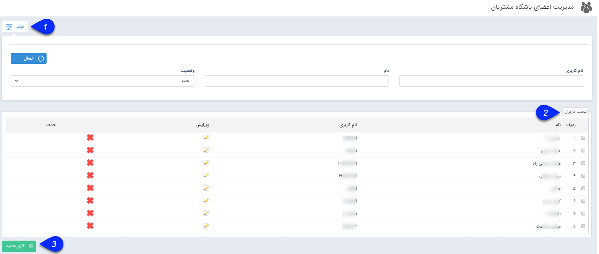

## مدیریت اعضای باشگاه مشتریان

با استفاده از این بخش، می توانید برای مشتریان خود نام کاربری و رمز عبور ایجاد کنید و یا مشتریانی که در باشگاه مشتریان شما عضو هستند را ویرایش کنید.  تعیین نام کاربری جدید همانند ساخت کاربر نرم افزار است. برای مشاهده راهنمای مرتبط با کاربر جدید، [ساخت کاربر جدید ](https://github.com/1stco/PayamGostarDocs/blob/master/help%202.5.4/Settings/Manage-groups-and-users/users/Build-a-new-user/Build-a-new-user.md)را مطالعه نمایید. برای مشاهده راهنمای باشگاه مشتریان اینجا کلیک کنید.

1. فیلتر: می توانید برای یافتن مشتریان مورد نظر خود از فیلترهای موجود استفاده کنید.

2. لیست کاربران: در این قسمت لیست مشتریانی که از روش های مختلف برای آن ها کاربری باشگاه مشتریان ایجاد شده است را مشاهده می کنید، در صورت نیاز می توانید آن ها را ویرایش یا حذف نمایید.

3. کاربر جدید: با کلیک بر روی این دکمه می توانید یک کاربر جدید از نوع مشتری، ایجاد کنید.

