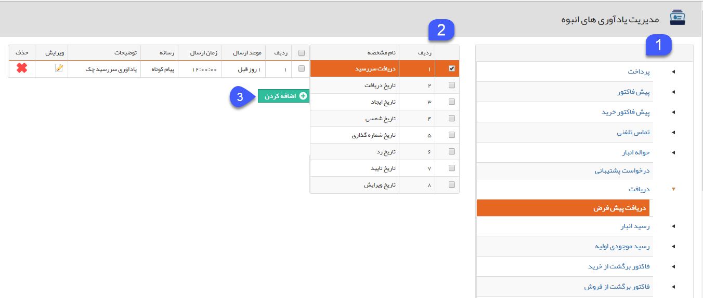
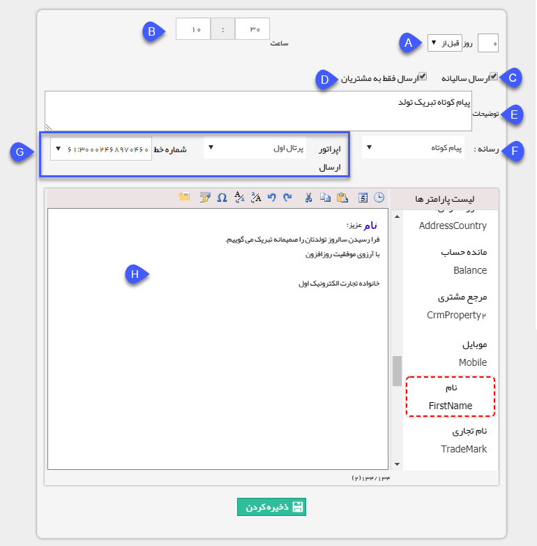

## مدیریت یادآوری های انبوه

از طریق این صفحه می توان یک پیام از هریک از رسانه ها (پیام کوتاه، ایمیل، فکس) بر اساس تاریخ های مشخصی که در آیتم های ثبت شده برای هویت ها درج شده است، تنظیم نمود تا این پیام در تاریخ مرتبط با هر هویت یا چند روز قبل یا بعد از آن به صورت خودکار توسط سیستم ارسال گردد. از این قسمت می توان برای مواردی مانند ارسال پیام تبریک در تاریخ تولد مخاطبان، یادآوری در تاریخ سررسید دریافت های ثبت شده یا موارد مشابه  استفاده نمود.

1. در این قسمت لیست انواع موجودیت های CRMو زیرنوع های هر موجودیت به صورت درختی مشاهده می شود، برای تنظیم پیام در تاریخ مرتبط با هریک از موجودیت ها روی آیتم کلیک کنید. در این صورت در ستون سمت چپ لیست تمامی فیلدهای از نوع تاریخ مرتبط با آن موجودیت (حتی تاریخ ایجاد و ویرایش) را مشاهده خواهید کرد.

2. پس از انتخاب موجودیت مورد نظر، از این لیست تاریخی که می خواهید پیام در آن زمان ارسال گردد را انتخاب نمایید. توجه کنید که این لیست شامل فیلدهای از نوع تاریخ پیشفرض آیتم (حتی تاریخ ایجاد و ویرایش) و فیلدهای از نوع تاریخ اضافه شده به آن از طریق[ شخصی سازی](https://github.com/1stco/PayamGostarDocs/blob/master/help%202.5.4/Settings/Personalization-crm/Overview/General-information/Add-features/Add-features.md) می باشد.

3. با کلیک بر روی اضافه کردن، می توانید یک پیام جهت ارسال در تاریخ انتخابی تنظیم نمایید. همچنین میتوانید تنظیماتی اعمال کنیدکه این پیام به صورت سالیانه  یا چند روز قبل یا بعد از فیلد تاریخی پر شده در ساعت مشخصی ارسال گردد.

A. در مرحله اول باید مشخص کرد، این پیام چند روز قبل و یا چند روز بعد از تاریخ مورد نظر ارسال شود. عدد صفر به معنی ارسال در همان روز است.

B. ساعت ارسال پیام را مشخص کنید.

C. در صورت فعال بودن ارسال سالیانه، نرم افزار دیگر مقدار سال وارد شده در فیلد تاریخ را در نظر نمی گیرد و هر سال در روز و ماه تعیین شده ارسال را انجام می دهد. (برای مواردی مانند تبریک تولد مخاطبان مناسب است)

D. با فعال کردن این گزینه، پیام تنها به مخاطبانی که توسط کاربران در سیستم ایجاد شده اند ارسال می شود. (نرم افزار مخاطبانی که از طریق بانک اطلاعات فهرست مشاغل اول در نرم افزار قرار داده شده اند را در نظر نمی گیرد.)

E. توضیحات مرتبط با این پیام را ایجاد کنید. (متن وارد شده در این قسمت برای مخاطبان ارسال نمی گردد و صرفاً توضیحاتی جهت مشخص شدن موضوع پیام برای کاربران می باشد)

F.در مرحله بعد، باید نوع رسانه و ابزار مناسب برای ارسال این پیام انتخاب شود. در این مثال، نوع ابزار پیام کوتاه است.

G. درگاهی که برای ارسال باید استفاده شود را تعیین کنید.

H. در مرحله آخر، متن پیام باید تنظیم شود. برای تنظیم این متن می توانید از[ پارامترهای هوشمند ](https://github.com/1stco/PayamGostarDocs/blob/master/help%202.5.4/Marketing/matn-hoshmand/matn-hoshmand.md)استفاده نمایید. تا برای هر مخاطب با نام و مشخصات خود مخاطب ارسال شود.

> نکته1: در صورت استفاده از این بخش، سیستم سرور پیام گستر در زمان تعیین شده جهت ارسال پیام، باید روشن باشد تا پیام ها ارسال شود.

> نکته 2: نرم افزار هر روز حدود ساعت 24 پیام های تنظیم شده در این قسمت را بررسی کرده و پیام هایی را که باید فردا ارسال کند، در صف ارسال پیام ها قرار خواهد داد. بنابراین نمی توانید پیامی را برای همان روز رویداد به صورت یادآوری انبوه تعیین نمایید. (تاریخ ارسال یادآوری انبوه باید از فردا یا روز قبل از رویداد شروع گردد.)    

