## قالب شماره دهی

> مسیر دسترسی:  **تنظیمات** >  **الگوی شماره‌گذاری**

از قالب شماره دهی برای  شماره گذاری هویت ها و انواع آیتم های مالی مانند فاکتورها، پیش فاکتورها، قرار دادها، دریافت ها و پرداخت ها استفاده می شود. شماره دهی این آیتم ها به دو  صورت دستی و سیستمی قابل انجام میباشد
 
برای تعریف قالب شماره‌دهی از مسیر تنظیمات، تعریف الگو شماره‌گذاری اقدام نمایید.

### شماره دهی سیستمی

برای تعریف قالب شماره دهی سیستمی، کاربر بایستی مجوز مدیریت شخصی سازی CRM  را داشته باشد.

 برای شماره دهی به آیتم ها به روش زیر عملگردد :
 
###  تعریف قالب شماره دهی مورد نظر

می توان از منو تنظیمات بخش قالب شماره دهی با کلیک بر روی دکمه افزودن، الگوی جدیدی برای شماره گذاری تعریف کرد. همچنین از این صفحه امکان ویرایش و حذف قالب های تعریف شده وجود دارد و می توان الگوی مورد نظر را براساس پارامترهای عنوان و قالب فیلتر کرد.

> نکته : در لیست قالب های شماره دهی، تنها امکان حذف قالب هایی وجود دارد که تا به حال در آیتمی برای شماره گذاری استفاده نشده است.

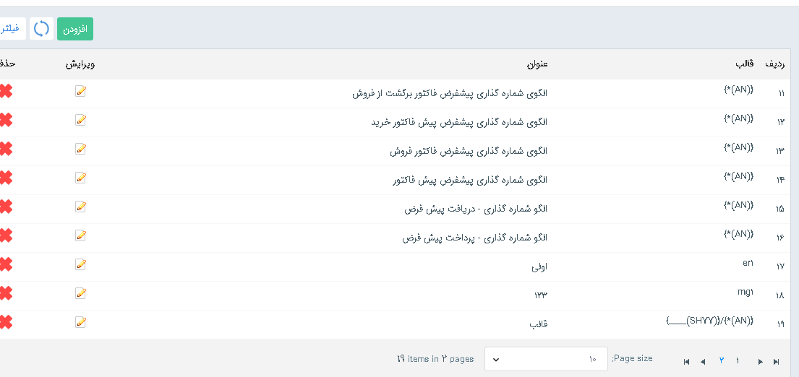

همچنین می‌توان با کلیک روی ویرایش نوع/افزودن زیرنوع  در صفحه شخصی سازی crm، و  کلیک بر روی دکمه + الگوی جدید تعریف کرد و از الگوهای تعریف شده، الگویی را برای شماره دهی این موجودیت انتخاب نمود.

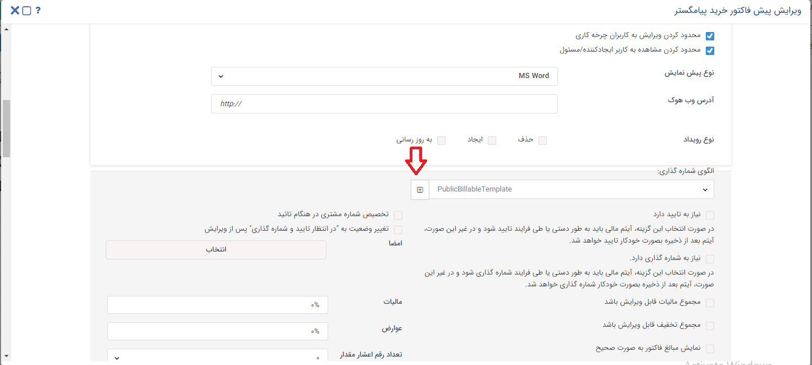

با کلیک بر روی دکمه افزودن فرم زیر برای تعریف قالب شماره دهی نمایش داده می شود.

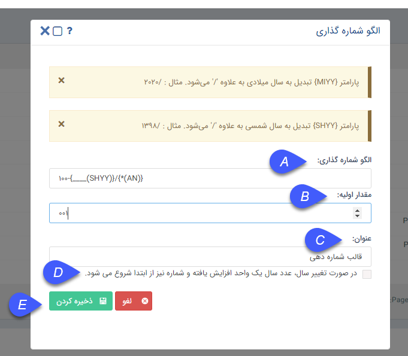

A.     الگو شماره گذاری: در این قسمت  امکان تعریف فرمت مورد نظر برای الگو شماره گذاری وجود دارد.

سه نوع پارامتر سیستمی برای استفاده در قالب شماره دهی وجود دارد :

1.      پارامتر (AN) برای شماره دهی آیتم ها بصورت خودکار میباشد، در صورت استفاده از این پارامتر در الگو شماره گذاری، آیتم ها به صورت خودکار براساس مقدار اولیه‌ی تعریف شده به
صورت پی در پی شماره دهی میشوند

> نکته : لازم به ذکر است در صورت عدم استفاده از این پارامتر در الگو، تنها فرمت تعریف شده در الگو شماره گذاری به عنوان شماره‌ی آیتم در نظر گرفته می شود و مقدار اولیه در شماره
نمایش داده نمیشود و باید آن آیتم را بصورت دستی شماره دهی کرد.

2.      پارامتر(MIYY)برای نمایش سال میلادی استفاده میشود.

3.      پارامتر (SHYY) برای نمایش سال شمسی در الگوی شماره گذاری استفاده میشود.

علاوه بر پارامتر های سیستمی امکان استفاده از کاراکتر های ثابت و تعریف پارامتر دلخواه در قالب شماره دهی وجود دارد که در ادامه به صورت مفصل توضیح داده خواهد شد.

برای تعریف الگو شماره گذاری مراحل زیر را طی کنید :

1. هر پارامتر سیستمی یا پارامترهایی که توسط شما در قالب تعریف میگردد بایستی در داخل آکولاد تعریف گردد.

مثال :    {*(AN)}

2. برای تعریف هر پارامتر در داخل آکولاد بایستی تعداد کاراکتر آن مطابق روش های زیر مشخص کرد:

2.1.تعریف قالب شماره دهی با تعداد کاراکتر محدود:

 برای این حصول ، پس از آکولاد میتوان با کاراکتر underline  تعداد کاراکتر های مجاز  قالب شماره دهی را تعیین کرد.

برای نمونه در صورت استفاده از سه underline ، تعداد 3 کاراکتر برای این قالب در نظر گرفته خواهد شد.

مثال :

AN)})___}

لازم به ذکر است در این حالت فیلد مقدار اولیه بایستی حداکثر سه کاراکتره تعریف گردد.

 برای نمونه : در صورت تعریف مقدار اولیه 000 برای الگو مثال بالا، شماره آیتم ها از 001 الی 999 خواهد بود و پس از شماره 999 آیتم جدید دیگری ذخیره نخواهد شد.

2.2.تعریف قالب شماره دهی با تعداد کاراکتر های نامحدود :  

با استفاده از کاراکتر *  محدودیتی برای تعداد کاراکتر قالب شماره دهی در نظر گرفته نخواهد شد و  در این صورت شما میتوانید مقدار اولیه را با تعداد کاراکتر دلخواه مقدار دهی کنید.

برای نمونه ، در قالب شماره دهی  زیر با وارد کردن * پیش از (AN) و  تعریف مقدار اولیه 0 برای این قالب،  شماره آیتم ها از 1 الی بی نهایت خواهد بود.

AN)})*}

 

3.  برای استفاده از پارامترهای سیستمی نام پارامتر بایستی داخل پرانتز مطابق الگوی بالا تعریف گردد.

4. در صورت اینکه بخواهید شماره ها از کاراکترهای ثابت پیروی کنند،این کاراکتر بایستی در قالب تعریف گردد.

مثال : فرض کنید شما میخواهید از کاراکتر dr- به صورت ثابت در شماره آیتم های خود استفاده کنید برای این حصول قالب میتواند به صورت نمونه به شکل زیر تعریف گردد

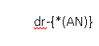

در صورت تعریف این الگو با مقدار اولیه 1، شماره اولین آیتم با این الگو به این صورت خواهد بود.

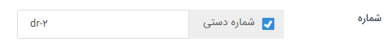

5. در صورت اینکه بخواهید از یک پارامتر دلخواه در قالب شماره دهی استفاده کنید که این پارامتر در شماره قابل ویرایش باشد، بایستی الگوی زیر  را تعریف نمایید.

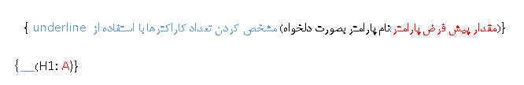

با فرض تعریف این الگو برای یک قالب، مقدار پیش فرض A به جای این پارامتر در شماره آیتم ها نمایش داده میشود که به صورت دستی قابل ویرایش است .

برای تعریف الگو شماره گذاری رعایت موارد زیر الزامی میباشد :

1. از یک نوع پارامتر سیستمی نمیتوان به دفعات در یک قالب استفاده کرد.

مثال :  نمیتوان از پارامتر (SHYY) بیش از یکبار در یک قالب استفاده کرد.

2. امکان استفاده از چند پارامتر سیستمی باهم وجود دارد.

برای نمونه میتوان در یک قالب هم از پارامتر میلادی هم از پارامتر شمسی در یک قالب استفاده کرد.

3. لازم به ذکر است در تعریف پارامتر های شمسی و میلادی به منظور مشخص نمودن تعداد کاراکترهای آن پارامتر،  بایستی  چهار underline  و یا * در داخل آکولاد قبل از پارامتر قرارگیرد

مثال : {*(MIYY)}

مثال : {(MIYY)____}

4. در صورت استفاده از پارامترهای SHYY  و MIYY  در قالب شماره دهی، هنگام شماره دهی دستی آیتم می توان از سال 1357 الی یک سال پس از سال جاری، آیتم را شماره گذاری کرد.

5.  بین هر دو پارامتر استفاده شده در قالب شماره دهی بایستی از یک کاراکتر برای جدا کردن آنها استفاده کرد. این کاراکتر می تواند بصورت دلخواه(به جز کاراکتر . و +) انتخاب شود.

مثال : {(MIYY)____} {*(AN)}/

ذکر چند نمونه برای تعریف الگوی شماره گذاری :

فرض کنید می خواهید آیتم های مورد نظرتان بصورت موارد زیر شماره دهی شود، بنابراین به صورت زیر الگو آن تعریف گردد.

شماره :  002

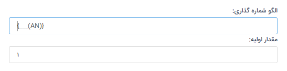

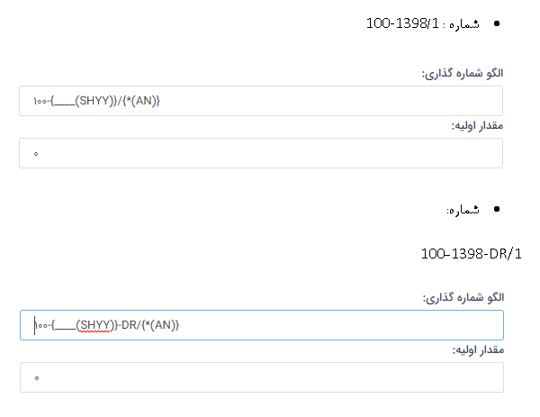

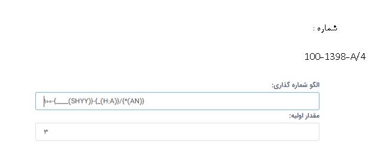

> نکته : در مثال اخر در تعریف الگو شماره گذاری از پارامتر دلخواه با نام H  و با مقدار پیش فرض A  استفاده شده است(که می توان هر پارامتری را با نام و مقدار پیش فرض دلخواه تعریف کرد)
هنگام استفاده از این الگو، در شماره آیتم مقدار A بعنوان مقدار پیش فرض نمایش داده می شود که بصورت دستی می توان این پارامتر را در آیتم ویرایش کرد.

B. مقدار اولیه : این مقدار بعنوان مقدار شروع شماره دهی قالب  در الگو در نظر گرفته می شود .

> نکته : اولین شماره ای که به آیتم اختصاص داده می شود یکی پس از مقدار اولیه تعریف شده می باشد برای نمونه اگر مقدار اولیه 001 تعریف شود ، اولین شماره ی آیتمی که از این الگو
استفاده می کند 002 خواهد بود .

C. عنوان : عنوان قالب را وارد می کنیم.

D.در صورتی که بخواهیم با تغییر سال ، عدد سال یک واحد افزایش پیدا کند و شماره از ابتدای مقدار اولیه الگو پیروی کند ، باید این چک باکس فعال شود. در غیر این صورت با تغییر سال یک واحد به سال اضافه می شود و شماره از ادامه شماره های قبلی پیروی می کند.

E. ذخیره کردن : با کلیک روی دکمه ذخیره کردن ، این الگو در لیست قالب ها قرار می گیرد. با نگهداشتن ماوس روی آن قالب، می‌توان عنوان قالب را هم مشاهده کرد .

> نکته: امکان استفاده از یک قالب برای آیتم های مختلف وجود دارد. در صورتی که از یک قالب برای چندین آیتم استفاده شود در زمان شماره دهی به هر آیتم، آخرین شماره قالب مورد نظر به
عنوان آخرین شماره اختصاص یافته در نظر گرفته شده و سیستم این شماره را یک واحد افزایش داده و به آیتم اختصاص می دهد. لازم به ذکر است که در این روش کلیه شماره های یک قالب
به آیتم های مختلف اختصاص می یابند. به این ترتیب در کلیه نمونه های یک نوع آیتم، شماره ها ممکن است پشت سر هم نباشند. 

برای نمونه : اگر در این بخش یک الگویی تعریف کنیم که قالب شماره دهی آن A_{*(AN)} و مقدار اولیه برای آن 1000 تعریف شده باشد و این الگو در هویت حقوقی و پیش فاکتور پیش
 فرض استفاده گردد، با فرض اینکه اول یک هویت ایجاد شود و بعد پیش فاکتور پیش فرض، شماره A_1001 به هویت و شماره A_1002 به پیش فاکتور پیش فرض اختصاص می یابد.
 
 > نکته : در صورتی که شماره ای به آیتم اختصاص پیدا کند و آن آیتم حذف گردد، شماره تخصیص یافته شده به آن آیتم  را فقط میتوان به صورت دستی به آیتم دیگری تخصیص داد.

> نکته : در صورت انتخاب یک قالب شماره گذاری برای یک نوع موجودیت در بخش شخصی سازی، اگر از آن نوع آیتم ایجاد شده باشد و شماره گرفته باشد، دیگر امکان تغییر قالب شماره گذاری
و انتخاب قالب دیگر برای آن آیتم وجود ندارد.

> نکته : لازم به ذکر است، الگوی شماره گذاری طبق آیتم های ذخیره شده پیش میرود.

> نکته : باید در نظر داشت که اگر الگویی به آیتمی اختصاص داده شود نمیتوان به آن آیتم به صورت دستی شماره ای خارج ار الگو تخصیص داد.

> نکته : لازم به ذکر است فعالیت تبدیل نوع برای آیتم های مالی و یا تبدیل هویت ،اگر آیتم و یا هویت شماره داشته باشد، تنها در صورتی تبدیل نوع انجام می شود که قالب شماره دهی آیتم مبدا
 و مقصد یکسان باشد.
 
####  ویرایش قالب شماره دهی

در صورت ویرایش قالب شماره دهی، تمامی آیتم هایی که از این الگو استفاده کرده اند طبق الگوی جدید ویرایش می شوند.

برای نمونه :

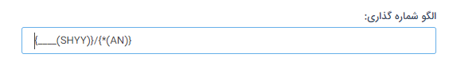

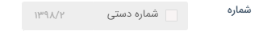

فرض کنید الگوی تعریف شده بصورت زیر ویرایش شود :

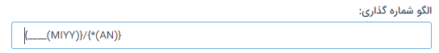

شماره آن آیتم بصورت زیر ویرایش خواهد شد :

### شماره دهی دستی

موارد زیر در مورد وارد کردن شماره دستی باید درنظر گرفته شوند:

1. در صورتی که کاربر شماره ای را به صورت دستی وارد کند، تنها در صورتی ذخیره می شود که شماره وارد کرده در تمام آیتم های دارای این قالب تکراری نباشد.

2. در صورتی که آخرین شماره در یک آیتم به صورت دستی وارد شده باشد، شماره دهی های بعدی این آیتم، از آخرین شماره ای که کاربر به صورت دستی وارد کرده بوده، ادامه می یابد.

> نکته : کاربر برای شماره دهی دستی آیتم ها نیاز به مجوز شماره گذاری روی آن نوع ایتم را دارد .

 
 

