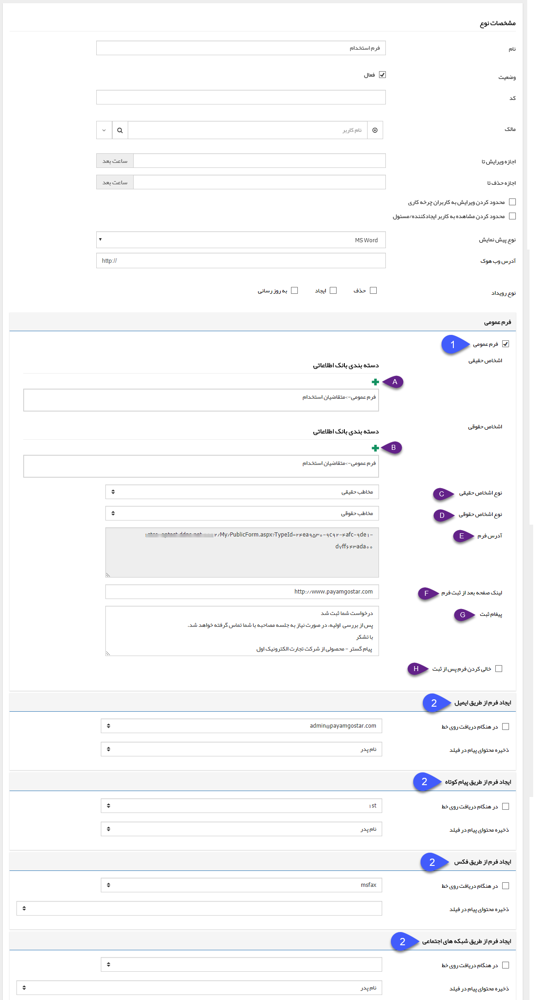
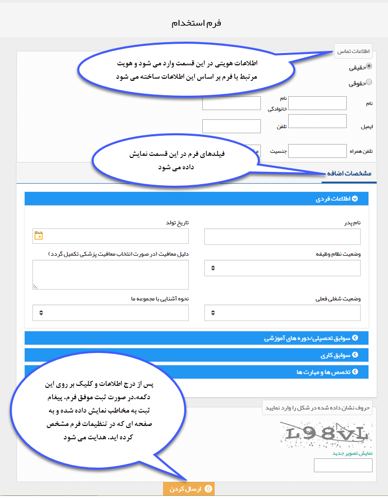

## مدیریت فرم ها

از این صفحه می توانید فرم جدیدی را تنظیم و فرم های ساخته شده را ویرایش نمایید. فرم یک قالب خام در نرم افزار پیام گستر است که این امکان را برای شما فراهم می سازد تا کلیه فرم های سازمان را در نرم افزار پیاده سازی نمایید، فرم هایی مانند رضایت سنجی، دریافت فکس، فرم ثبت سفارش، فرم مرخصی و غیره.
 
 لطفا ابتدا قسمت[ اطلاعات کلی ](https://github.com/1stco/PayamGostarDocs/blob/master/help%202.5.4/Settings/Personalization-crm/Overview/General-information/General-information.md) را در این خصوص مطالعه فرمایید.

### فرم جدید

با ایجاد یک فرم جدید علاوه بر[ تنظیمات مشترک آیتم های سیستم  ](https://github.com/1stco/PayamGostarDocs/blob/master/help%202.5.4/Settings/Personalization-crm/Overview/General-information/Shared-information-of-system%20items/Shared-information-of-system%20items.md)می توانید تنظیماتی اعمال کنید که این فرم توسط مخاطبان شما ثبت شود، ثبت فرم توسط مخاطبان می تواند از طریق فرم عمومی یا دریافت پیام از طریق رسانه های مختلف (پیام کوتاه، ایمیل و فکس) باشد.

1. فرم عمومی: به فرم ساخته شده آدرسی اختصاص می دهد و شما می توانید از این آدرس فرم در سایت خود (یا ارسال آدرس برای مخاطبان) استفاده کنید تا مخاطبانتان دسترسی ایجاد این نوع فرم را داشته باشند. توجه داشته باشید با ثبت یک فرم عمومی، یک پروفایل جدید نیز در بانک اطلاعاتی شما نیز ذخیره خواهد شد. بنابراین این ویژگی از فرم مناسب کاربردهایی است که هنوز هویت مرتبط با آن در نرم افزار ایجاد نشده باشد (مانند فرم استخدام، فرم درخواست نمایندگی و ...) ، برای ثبت فرم توسط مشتریان و ذخیره آن در پروفایل های موجود در بانک اطلاعاتی (مانند فرم نظرسنجی، نارضایتی و ...) می توانید از [باشگاه مشتریان](https://github.com/1stco/PayamGostarDocs/blob/master/help%202.5.4/Supplementary-modules/customer-club/customer-club.md) استفاده کنید.

برای ایجاد فرم حتما باید فرم ایجاد شده در مدیریت فرم ها یکبار ذخیره شود تا به آن آدرس تعلق گیرد.

A. مسیر ذخیره هویت های حقیقی: در این قسمت مشخص کنید که در صورت ثبت فرم توسط یک شخص حقیقی، پروفایل متناظر با این شخص در چه مسیری از بانک اطلاعاتی ذخیره شود.

B. مسیر ذخیره هویت های حقوقی: در این قسمت مشخص کنید که در صورت ثبت فرم توسط یک هویت حقوقی، پروفایل متناظر با این هویت در چه مسیری از بانک اطلاعاتی ذخیره شود.

C. نوع اشخاص حقیقی: نوع هویت حقیقی ذخیره شده توسط سیستم برای پروفایل مرتبط با ثبت کننده فرم را از بین زیرنوع های ایجاد شده در شخصی سازی، مشخص کنید.

D. نوع اشخاص حقوقی: نوع هویت حقوقی ذخیره شده توسط سیستم برای پروفایل مرتبط با ثبت کننده فرم را از بین زیرنوع های ایجاد شده در شخصی سازی، مشخص کنید.

E. آدرس فرم: آدرسی که از طریق آن می توان یک فرم جدید ایجاد و ارسال کرد را نشان می دهد.

F. لینک صفحه بعد از ثبت فرم: می توانید تعیین کنید که مخاطب پس از ثبت فرم به یک صفحه دلخواه هدایت (redirect) شود.

G. پیغام ثبت: می توانید در این قسمت متنی را جهت نمایش به مخاطب پس از ثبت موفق فرم، تنظیم کنید.

H. خالی کردن فرم پس از ثبت: در صورت فعال بودن این گزینه، پس از ثبت موفق فرم، مقادیر وارد شده در فیلدهای آن خالی می شوند تا بتوانید فرم جدیدی ثبت کنید. توجه داشته باشید برای استفاده از این قابلیت، باید "لینک صفحه بعد از ثبت فرم"را خالی بگذارید. در غیر این صورت پس از ثبت فرم، به لینک تعیین شده هدایت می شوید و امکان ثبت فرم جدید وجود ندارد.

> نکته 1: توجه داشته باشید در صورت فعال بودن چرخه کاری روی فرم، در هنگام ثبت، فیلدهایی که در وضعیت (کارتابل یا فعالیت) اولیه فرایند، روی حالت نمایش تنظیم شده اند، به مخاطب نمایش داده خواهند شد.

> نکته 2: توجه داشته باشید در صورتی که از قسمت[ تنظیمات کلی ](https://github.com/1stco/PayamGostarDocs/blob/master/help%202.5.4/Settings/General-settings/system/system.md)جلوگیری از ایجاد هویت با اطلاعات تماسی تکراری را فعال کرده باشید، مخاطب در صورت وارد نمودن اطلاعات تماسی یکی از هویت های موجود در بانک اطلاعاتی، قادر به ثبت فرم نیست.

5. ایجاد فرم از طریق ایمیل، پیام کوتاه، فکس و پیام کوتاه شبکه اجتماعی: در صورت تیک دار شدن هر یک از موارد و مشخص شدن خط دریافتی، با دریافت هر ایمیل، فکس و یا پیام کوتاه بر روی خط مورد نظر  فرم مربوطه در پروفایل شخص ایجاد می گردد. همچنین باید فیلدی برای ذخیره محتوای ایمیل، فکس و یا پیام کوتاه ارسال شده انتخاب کرد.

برای ذخیره محتوای فکس در یک فیلد، نوع فیلد باید فایل انتخاب شود.

برای ذخیره محتوای ایمیل در یک فیلد، نوع فیلد باید Html انتخاب شود.

برای ذخیره محتوای پیام کوتاه یا پیام کوتاه شبکه اجتماعی در یک فیلد، نوع فیلد باید متن انتخاب شود.

> نکته: در صورتی که مشخصات ارسال کننده مانند شماره فکس، ایمیل و یا موبایل آن در پروفایل ثبت نشده باشد، هیچ فرمی فعال نخواهد شد و تنها از طریق لیست های دریافت قابل پیگیری خواهد بود. امادر صورتی که ماژول مخاطبان ناشناس را تهیه نموده باشید و از قسمت تنظیمات، تنظیمات کلی، مخاطبان ناشناس آن را فعال نموده باشید (برای اطلاعات بیشتر به لینک مخاطبان ناشناس  مراجعه نمایید.). دریافت های ایمیل، فکس و پیام کوتاه که از شماره ناشناس صورت گرفته شده باشد به صورت یک مخاطب، در دسته بندی مشخص شده در تنظیمات[ مخاطبان ناشناس ](https://github.com/1stco/PayamGostarDocs/blob/master/help%202.5.4/Settings/General-settings/Anonymous-audience/Anonymous-audience.md)ثبت می شوند و فرمی در آن مخاطب ایجاد می گردد.

