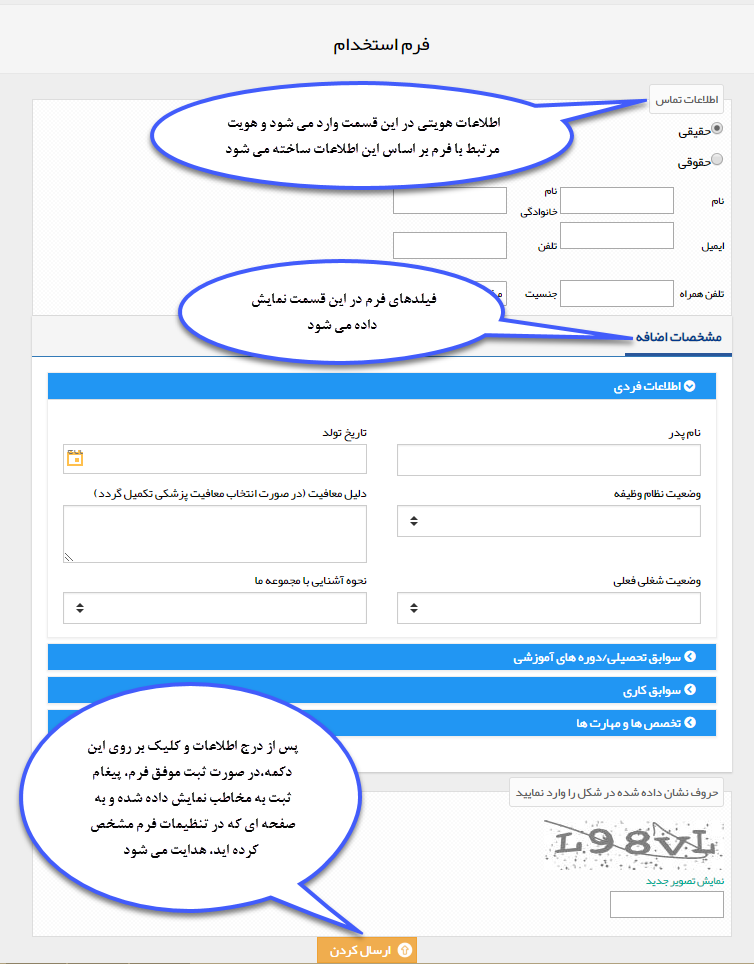

## تنظیم فرم عمومی

>  مسیر دسترسی:  **تنظیمات** >**شخصی سازی crm** > **مدیریت فرم‌ها** > **ویرایش  نوع/افزودن زیر نوع** > **فرم عمومی** 

با فعال کردن چک باکس "فرم عمومی"، به این نوع فرم آدرسی اختصاص داده می‌شود. می‌توان از این آدرس در سایت خود(یا ارسال آدرس برای مخاطبان) استفاده کرد، تا مخاطبان دسترسی ایجاد این نوع فرم را داشته باشند.

> لازم به ذکر است با ایجاد ثبت یک فرم عمومی یک پروفایل جدید در بانک اطلاعاتی ایجاد خواهد شد.

> بنابراین این ویژگی مناسب کاربردهایی است که هنوز هویت مرتبط با آن در نرم  افزار ایجاد نشده باشد (مانند فرم استخدام، فرم درخواست نمایندگی و ...) ، برای ثبت فرم توسط مشتریان و ذخیره آن در پروفایل های موجود در بانک اطلاعاتی (مانند فرم نظرسنجی، نارضایتی و ...) می توانید از [باشگاه مشتریان ](https://github.com/1stco/PayamGostarDocs/blob/master/help%202.5.4/Supplementary-modules/customer-club/customer-club.md)استفاده کنید

برای ایجاد فرم حتما باید فرم ایجاد شده در مدیریت فرم ها یکبار ذخیره شود تا به آن آدرس تعلق گیرد.

A. مسیر ذخیره هویت های حقیقی: در این قسمت مشخص کنید که در صورت ثبت فرم توسط یک شخص حقیقی، پروفایل متناظر با این شخص در چه مسیری از بانک اطلاعاتی ذخیره شود.

B. مسیر ذخیره هویت های حقوقی: در این قسمت مشخص کنید که در صورت ثبت فرم توسط یک هویت حقوقی، پروفایل متناظر با این هویت در چه مسیری از بانک اطلاعاتی ذخیره شود.

C. نوع اشخاص حقیقی: نوع هویت حقیقی ذخیره شده توسط سیستم برای پروفایل مرتبط با ثبت کننده فرم را از بین زیرنوع های ایجاد شده در شخصی سازی، مشخص کنید.

D. نوع اشخاص حقوقی: نوع هویت حقوقی ذخیره شده توسط سیستم برای پروفایل مرتبط با ثبت کننده فرم را از بین زیرنوع های ایجاد شده در شخصی سازی، مشخص کنید.

E. آدرس فرم: آدرسی که از طریق آن می توان یک فرم جدید ایجاد و ارسال کرد را نشان می دهد.

F. لینک صفحه بعد از ثبت فرم: می توانید تعیین کنید که مخاطب پس از ثبت فرم به یک صفحه دلخواه هدایت (redirect) شود.

G. پیغام ثبت: می توانید در این قسمت متنی را جهت نمایش به مخاطب پس از ثبت موفق فرم، تنظیم کنید.

H. خالی کردن فرم پس از ثبت: در صورت فعال بودن این گزینه، پس از ثبت موفق فرم، مقادیر وارد شده در فیلدهای آن خالی می شوند تا بتوانید فرم جدیدی ثبت کنید. توجه داشته باشید برای استفاده از این قابلیت، باید "لینک صفحه بعد از ثبت فرم"را خالی بگذارید. در غیر این صورت پس از ثبت فرم، به لینک تعیین شده هدایت می شوید و امکان ثبت فرم جدید وجود ندارد.

> نکته 1: توجه داشته باشید در صورت فعال بودن چرخه کاری روی فرم، در هنگام ثبت، فیلدهایی که در وضعیت (کارتابل یا فعالیت) اولیه فرایند، روی حالت نمایش تنظیم شده اند، به مخاطب نمایش داده خواهند شد.

> نکته 2: توجه داشته باشید در صورتی که از قسمت تنظیمات کلی جلوگیری از ایجاد هویت با اطلاعات تماسی تکراری را فعال کرده باشید، مخاطب در صورت وارد نمودن اطلاعات تماسی یکی از هویت های موجود در بانک اطلاعاتی، قادر به ثبت فرم نیست.

