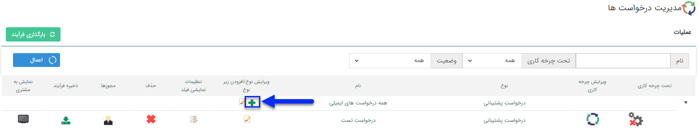
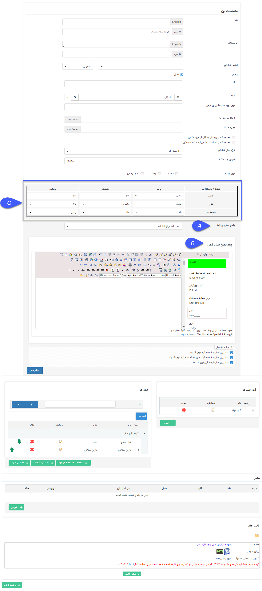

## مدیریت درخواست ها

از این صفحه می توانید سیستم درخواست (Ticketing) جدیدی را تنظیم و درخواست های  ساخته شده را ویرایش و یا حذف نمایید.

لطفا<a href="file%3A%2F%2F%2FC%3A%5CUsers%5CH.abasi%5CDesktop%5Chelp%5Cmd%20help%5CSettings%5CPersonalization-crm%5COverview%5CGeneral-information%5CGeneral-information.md" target="_blank"> ابتدا اطلاعات کلی</a> را در این خصوص مطالعه فرمایید.

درخواست در واقع پاسخ دهی به ایمیل ها بر روی یک خط خاص و مدیریت ایمیل های آن خط محسوب می شود، به طوری که که هر ایمیل ارسال شده بر روی آن خط شماره ای به صورت خودکار دریافت می کند و ارسال کننده ایمیل می توانند ایمیل را از طریق شماره آن پیگیری نماید.

با کلیک بر روی آیکون + می توانید یک نوع درخواست پشتیبانی جدید را ایجاد نمایید.

برای تنظیمات عمومی درخواست پشتیبانی به <a href="file%3A%2F%2F%2FC%3A%5CUsers%5CH.abasi%5CDesktop%5Chelp%5Cmd%20help%5CSettings%5CPersonalization-crm%5COverview%5CGeneral-information%5CShared-information-of-system%20items%5CShared-information-of-system%20items.md" target="_blank">تنظیمات مشترک آیتم های سیستم </a>مراجعه کنید.

A. پاسخ دهی روی خط: در واقع مشخص می کند این درخواست بر روی کدام خط ایمیل فعال می شود. (در واقع ایمیل های دریافتی روی کدام خط به صورت خودکار پاسخ داده شود و شماره پیگیری دریافت نمایند.)

B. پیام پاسخ پیش فرض: در صورت دریافت هر ایمیل بر روی خط مشخص شده، این پیام تنظیم شده به صورت خودکار برای فرستنده ایمیل ارسال می شود.

C. ماتریس اولویت : برای تعریف اولویت درخواست ها شما می توانید از طریق ماتریس اولویت اقدام کنید، در ماتریس اولویت در سطر اول مقادیر فیلد تاثیر گذاری و در ستون اول مقادیر فیلد شدت  نمایش داده می شود . شما می توانید  به ازای هر مقدار شدت و تاثیر گذاری یک اولویت را تعیین کنید.

برای نمونه : طبق تصویر اگر شدت درخواست ،در وضعیت جزئی  و تاثیرگذاری درخواست در وضعیت پایین باشد طبق تعریف انجام شده در این بخش، اولویت آن درخواست  پایین در نظر گرفته می شود . 

مقدار فیلدهای شدت،تاثیرگذاری و اولویت در مدیریت آیتم های سیستم قابل مشاهده می باشد.

