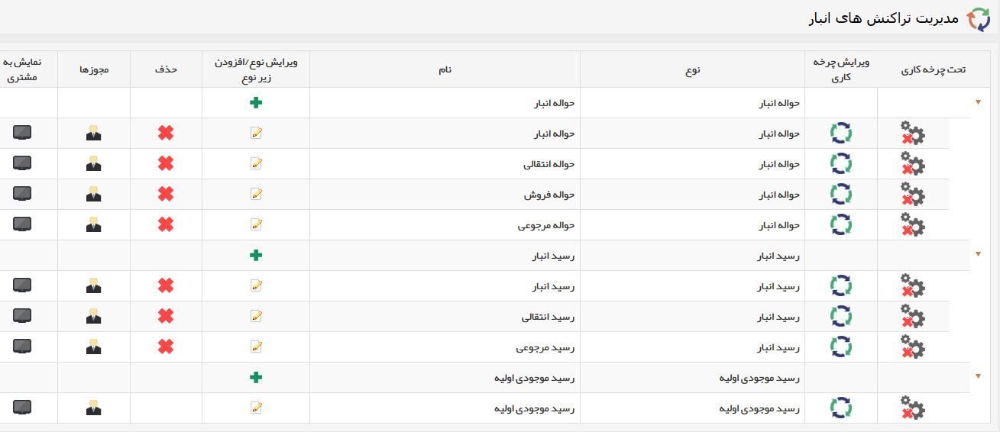
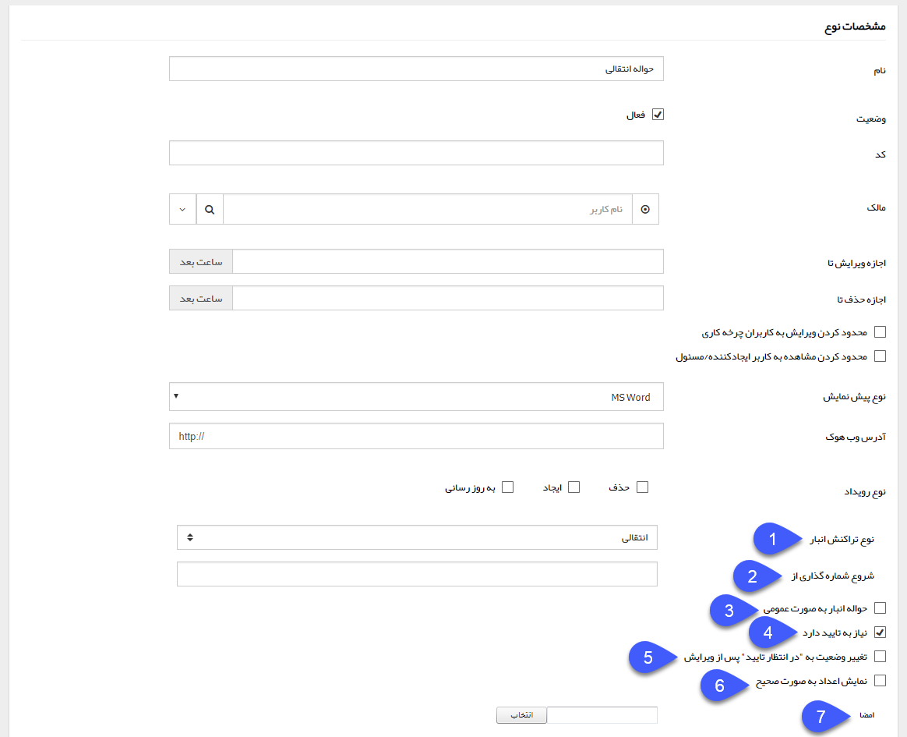

## مدیریت تراکنش های انبار

در صورت دارا بودن ماژول سیستم انبارداری، از این قسمت می توانید تنظیمات مرتبط با حواله ها و رسید های انبار را انجام دهید.

حتما از هر نوع حواله و رسید (انتقالی، فروش، معمولی، مرجوعی) یک نوع ایجاد کنید. برای آشنایی با انواع تراکنش های انبار قسمت انبار ها  را مطالعه کنید.

در صورت نیاز می توانید از حواله ها و رسید های مختلف برای انبارهای مختلف استفاده کنید.

تنظیمات مشترک تراکنش های انبار به صورت زیر می باشد:

> نکته: لطفا ابتدا  تنظیمات مشترک آیتم های سیستم  را در این خصوص مطالعه فرمایید.

1. نوع تراکنش انبار: سه نوع رسید انبار (معمولی، انتقالی و مرجوعی) و چهار نوع حواله انبار (معمولی، انتقالی، فروش و مرجوعی) وجود دارد. نوع تراکنش را در این قسمت مشخص کنید. در تنظیمات رسید موجودی اولیه این تنظیمات وجود ندارد، زیرا انواع مختلف ندارد. برای آشنایی با کاربرد هریک از انواع تراکنش انبار، به قسمت انبار ها مراجعه کنید.

2. شروع شماره گذاری: در این قسمت می توانید مشخص کنید که شماره گذاری این تراکنش انبار از چه عددی شروع شود، در صورت خالی بودن این فیلد، شروع شماره گذاری از 1 خواهد بود.

3. حواله/رسید به صورت عمومی: شماره تمامی حواله/رسیدهایی که این گزینه برای آنها فعال باشد، از یکدیگر پیروی می کنند. برای مثال اگر این گزینه برای رسیدهای الف و ب فعال باشد. اگر بالاترین شماره یکی از این رسیدها به 1500 برسد، اولین رسید صادر شده یکی از این دو نوع شماره1501 را دریافت خواهد کرد. به عبارت دیگر حواله/رسیدهای عمومی نمی توانند شماره یکسان داشته باشند و منبع شماره آن ها یکسان است.

4. الزام به تایید شدن: در صورت فعال بودن این گزینه، تراکنش های انبار پس از ثبت، وارد کارتابل کابرانی که مجوز تایید آن را دارند خواهد شد و پس از تایید توسط یکی از کاربران، شماره دریافت خواهد کرد و امضا در قالب چاپی آن نمایش داده خواهد شد. و در صورت غیرفعال بودن آن، به محض ثبت، تایید و شماره گذاری خواهد شد.

> نکته 1: توجه داشته باشید تراکنش ها قبل از قیمت گذاری باید تایید شوند.

> نکته 2: توجه داشته باشید موجودی نمایش داده شده برای محصولات بر اساس تراکنش های تایید شده می باشد و همچنین گزارشات انبار نیز، تنها تراکنش های تایید شده را لحاظ خواهد کرد. 

> نکته3: توجه داشته باشید برای تایید یک تراکنش انبار، باید مجوز تایید آن در انبار مربوطه (مجوزهای انبار در قسمت مدیریت انبارها) و همچنین مجوز تایید آن نوع از تراکنش انبار (تعریف مجوزها در قسمت دسترسی موجودیت ها) را داشته باشید.

5. تغییر وضعیت به "در انتظار تایید" پس از ویرایش: با فعال کردن این گزینه، اگر این آیتم پس از تایید، توسط کاربری که دارای مجوز "ویرایش پس از تایید" باشد ویرایش شود، دوباره به حالت در انتظار برمی گردد و باید توسط یکی از کاربرانی که مجوز مربوطه را دارد، تایید و شماره گذاری شود. 

6. نمایش اعداد به صورت صحیح: با فعال بودن این گزینه تمامی اعداد موجود در تراکنش انبار به صورت صحیح و در صورت غیرفعال بودن آن، با دو رقم اعشار نمایش داده خواهند شد.

7. امضاء: می توانید تصویر امضای خود را در سیستم قرار دهید و در قالب چاپ از آن استفاده کنید. این امضا پس از تایید آیتم، در پیش نمایش آیتم درج خواهد شد. برای اطلاعات از چگونگی قرار دادن تصویر امضا در پیش نمایش به تنظیم قالب چاپ مراجعه کنید.

