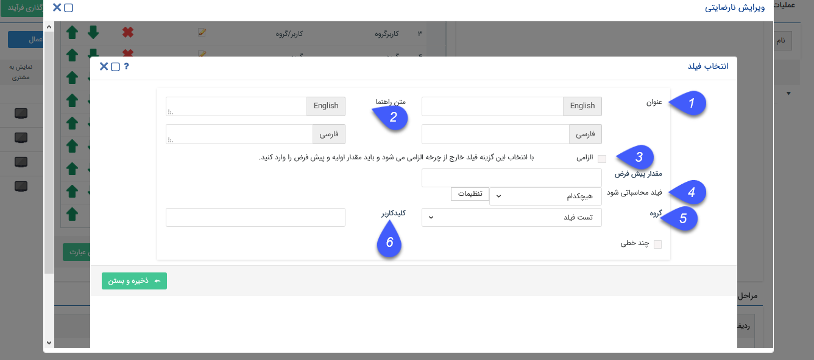
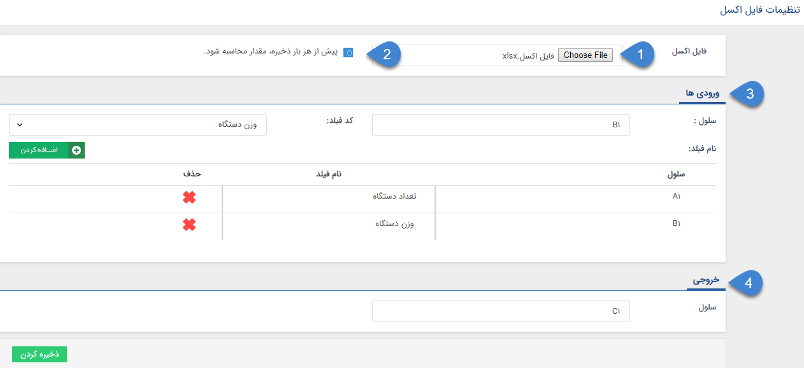

## تنظیمات مشترک فیلدها

پیش از بررسی تنظیماتی که به صورت مشترک در همه فیلدها وجود دارند ابتدا نحوه<a href="file%3A%2F%2F%2FC%3A%5CUsers%5CH.abasi%5CDesktop%5Chelp%5Cmd%20help%5CSettings%5CPersonalization-crm%5COverview%5CGeneral-information%5CAdd-features%5CAdd-features.md" target="_blank"> افزدن مشخصه</a>  را مطالعه کنید.

1. عنوان : انتخاب نام برای فیلد الزامی می باشد.

2. متن راهنما : انتخاب متن راهنما برای فیلد این امکان را فراهم می کند تا برای فیلد مورد نظر راهنمایی تعریف نمود که با قراردادن ماوس روی فیلد این راهنما نمایش داده میشود .

3. الزامی: با استفاده از این بخش برای برخی فیلد ها قابلیت الزامی شدن وجود دارد .

هنگام الزامی کردن فیلد چنانچه از قبل آیتم هایی در سیستم وجود داشته باشند که مقدار آن فیلد در آنها خالی باشد،  در هنگام ذخیره فیلد، ثبت مقدار پیش فرض برای آن الزامی میگردد،در غیر این صورت نیازی به ثبت مقدار پیش فرض نیست.

> نکته : در صورتی که یک فیلد  الزامی تعریف شده است و تمام  آیتم های دارای آن فیلد با مقدار پیش فرض آن، مقدار دهی شدند، میتوانید در صورت نیاز فیلد را  ویرایش و مقدار پیش فرض آن را پاک کرد.

> نکته :  وقتی یک فیلد  الزامی میشود  همیشه و تحت هر شرایطی در چرخه و خارج از چرخه الزامی میگردد.

> نکته : چنانچه یک فیلد مقدار پیش فرض داشته باشد، مقادیر پیش فرض  فیلد های اضافه فقط بعد از ذخیره شدن آیتم نمایش داده میشود.

4. فیلدمحاسباتی شود : قابلیت ورود اکسل محاسباتی و یا اینکه فیلد را به فیلدی از نوع وب سرویس تبدیل کنیم

5. گروه : گروه فیلدی که فیلد مورد نظر در اون نمایش داده می شود.

6. کلید کاربر: برای وب سرویس تعریف و استفاده می شود .

فایل اکسل : در صورت انتخاب فیلد به صورت فایل اکسل، وارد قسمت تنظیمات شوید.

1. ابتدا فایل اکسلی که حاوی فرمول مورد نظرتان هست را پیوست کنید.

2. می توانید تعیین کنید که قبل از هر ذخیره یکبار این محاسبه انجام شود.

3. در این قسمت می توانید سلول های ورودی را تعریف کنید.

4. در این قسمت می توانید سلول خروجی را تعریف کنید.

برای مثال در تصویر بالا یک فایل اکسل که در آن سلول C1 با فرمول A1*B1 پر شده است، قرار داده شده است.

در سلول های ورودی A1  را برای تعداد دستگاه و B1 را برای وزن دستگاه در نظر گرفته ایم.

در سلول خروجی هم عبارت C1 وارد شده است تا نرم افزار نتیجه محاسبه فرمول را بتواند تشخیص دهد.

نمونه فیلد :

وب سرویس: این فیلد توانایی گرفتن مقدار خود از یک برنامه یا وب سرویس دیگر را دارد. (قابل استفاده توسط برنامه نویسان)

برای مثال میتواند هزینه را از یک وب سرویس دیگر دریافت کند و در این فیلد قرار دهد.

برای این کار آدرس وب سرویس مورد نظر را در فیلد "آدرس سرویس" وارد کنید.

 
 
 

