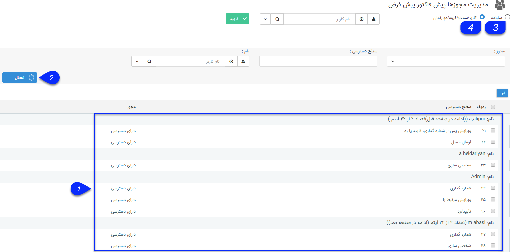

## مجوزهای آیتم

در این قسمت می توانید مجوز های تعیین شده برای آیتم (مجوز های کاربران/گروه ها/سمت ها/دپارتمان ها) را مشاهده کنید و در صورت نیاز این مجوزها را تغییر دهید. در واقع در قسمت <a href="file%3A%2F%2F%2FC%3A%5CUsers%5CH.abasi%5CDesktop%5Chelp%5Cmd%20help%5CSettings%5CManage-groups-and-users%5Cpermissions%5CAvailability-of-entities%5CAvailability-of-entities.md" target="_blank">دسترسی های موجودیت ها</a>  می توانید مجوزهای یک کاربر/گروه/سمت را برای تمامی موجودیت های crm تعیین کنید و در این قسمت می توانید مجوزهای تمامی کاربران/گروه ها/سمت ها را برای یک موجودیت تعیین کنید.

> نکته: توجه داشته باشید که اعمال مجوز از روش های مختلف به صورت یکپارچه عمل می کند. برای مشاهده چگونگی تاثیر مجوزهای اعمال شده از روش های مختلف به یک کاربر، از قسمت  <a href="file%3A%2F%2F%2FC%3A%5CUsers%5CH.abasi%5CDesktop%5Chelp%5Cmd%20help%5CSettings%5CManage-groups-and-users%5CManage-groups-and-users.md" target="_blank">تاًثیر مجوزها</a> اقدام کنید.

علاوه بر امکان تعیین مجوزهای این آیتم برای کاربران مختلف، می توانید مجوزهای سازنده (ایجاد کننده) آیتم را نیز تعیین کنید (به طور مثال اگر بخواهید هر کاربری که این آیتم را ایجاد می کند، فقط خودش قابلیت حذف آن را داشته باشد و سوابق ثبت شده توسط سایر کاربران قابل حذف نباشد، باید از این قسمت اقدام کنید)

1  در این قسمت لیست مجوزهای تعریف شده برای این آیتم از روش های مختلف را به تفکیک کاربر/گروه/سمت/دپارتمان گیرنده مجوز مشاهده می کنید.

2 . می توانید با استفاده از فیلتر های موجود، لیست مجوزهای مورد نظر خود که برای این آیتم تعیین شده است را بیابید (نمایش تمامی مجوزهای یک کاربر خاص یا می توان براساس پارامتر سطح دسترسی ، مشاهده کرد که مثلا مجوز مشاهده لیست را چه کاربرانی دارند )

3 . با انتخاب این گزینه و کلیک بر روی دکمه تایید می توانید مجوزهای مربوط به سازنده این آیتم را مشاهده و ویرایش کنید.

4 . برای مشاهده و ویرایش مجوزها و سطح دسترسی یک کاربر/گروه/سمت/دپارتمان مشخص به این آیتم، نام کاربر/گروه/سمت/دپارتمان مورد نظر خود را وارد کرده و روی دکمه تایید کلیک کنید.

> نکته: برای اطلاع از معنی هریک از مجوزها برای موجودیت های مختلف، قسمت دسترسی های موجودیت ها را مطالعه نمایید.

