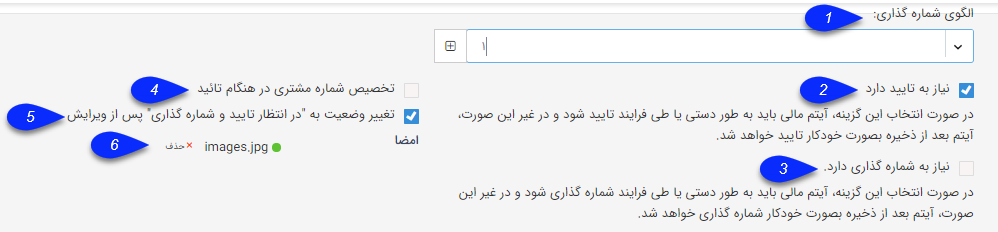

## آیتم های حقوقی/مالی

موارد زیر به طور مشترک برای آیتم های دریافت/پرداخت، پیش فاکتور/فاکتور/فاکتور برگشتی و قرارداد وجود دارند.

1. الگوی  شماره گذاری: در این قسمت امکان انتخاب قالب شماره دهی برای این آیتم از الگو های تعریف شده  در بخشالگوشماره گذاری وجود دارد و همچنین امکان تعریف قالب شماره دهی جدید در این قسمت وجود دارد که برای مطالعه بیشتر به<a href="file%3A%2F%2F%2FC%3A%5CUsers%5CH.abasi%5CDesktop%5Chelp%5Cmd%20help%5CSettings%5CNumbering-template%5CNumbering-template.md" target="_blank"> الگو شماره گذاری </a>مراجعه کنید.

2. الزام به تایید شدن: در صورتی که در روال کاری شرکت شما،  آیتم مربوطه پس از ثبت شدن توسط کارشناسان باید به تایید شخص دیگری برسد (با ورود به کارتابل مربوطه)،می توانید از این گزینه استفاده کنید. با انتخاب این گزینه، پیش نمایش آیتم مربوطه تا زمان تایید شدن امضا نخواهد داشت و در محاسبات مالی نرم افزار لحاظ نخواهد شد (مشتری را بدهکار/بستانکار نخواهد کرد). در صورت غیر فعال بودن این گزینه، این آیتم به محض ثبت تایید خواهد شد.

3. الزام به شماره گذاری: در صورتی که می خواهید آیتم مربوطه پس از ثبت شدن توسط کارشناسان برای شماره گذاری وارد کارتابل کاربرانی که مجوز شماره گذاری آن را دارند گردد،می توانید از این گزینه استفاده کنید. در صورت غیر فعال بودن این گزینه، این آیتم به محض ثبت، شماره گذاری خواهد شد.

4. تخصیص شماره مشتری در هنگام تایید: در صورت فعال بودن این گزینه، در صورتی که هویت مرتبط با آیتم شماره مشتری نداشته باشد، به محض تایید شدن آیتم مربوطه  سیستم به صورت خودکار به این هویت، شماره مشتری اختصاص خواهد داد. (به طور مثال اگر می خواهید مخاطبان شما، پس از تایید شدن اولین فاکتور فروش صادر شده برای آن ها، شماره مشتری دریافت کنند، می توانید در تنظیمات فاکتور فروش این گزینه را فعال کنید)

5. تغییر وضعیت به "در انتظار تایید و شماره گذاری" پس از ویرایش: با فعال کردن این گزینه، اگر این آیتم پس از تایید، توسط کاربری که دارای مجوز "ویرایش پس از تایید" باشد ویرایش شود، دوباره به حالت در انتظار برمی گردد و باید توسط یکی از کاربرانی که مجوز مربوطه را دارد، تایید و شماره گذاری شود. 

6. امضا: می توانید تصویر امضای خود را در سیستم قرار دهید و در قالب چاپ از آن استفاده کنید. این امضا پس از تایید آیتم، در پیش نمایش آیتم درج خواهد شد. برای اطلاعات از چگونگی قرار دادن تصویر امضا در پیش نمایش به<a href="file%3A%2F%2F%2FC%3A%5CUsers%5CH.abasi%5CDesktop%5Chelp%5Cmd%20help%5CSettings%5CPersonalization-crm%5COverview%5CGeneral-information%5CSet%20the-print-template%5CSet%20the-print-template.md" target="_blank">  تنظیم قالب چاپ</a> مراجعه کنید.

> نکته: برای تایید کردن آیتم مربوطه و شماره گذاری آن ها، شخص دارنده مجوز مربوطه می تواند از مسیر کارتابل من می تواند آیتم مورد نظر برای مثال فاکتور و یا قرار داد  را مشاهده و موارد موجود در آن را تایید یا رد نماید.

> نکته: در صورتیکه بر روی این آیتم ها چرخه کاری فعال شود، آیتم مذکور در کارتابل مربوطه جهت تایید نمایش داده نخواهد شد و باید چگونگی تایید/رد آن را با استفاده از چرخه کاری تعیین کنید.

