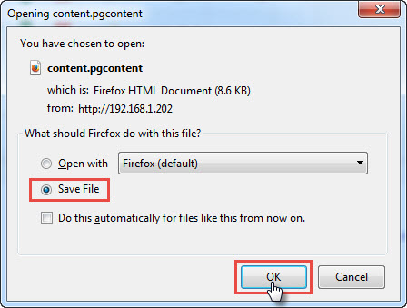

## تنظیم قالب چاپ

برای طراحی قالب چاپی آیتم بر روی لینک آبی " جهت ویرایش متن اینجا کلیک نمایید " کلیک کنید تا بتوانید قالب را به سلیقه خود طراحی نمایید. می توانید پارامترها را جابه جا نمایید و یا پارامترهایی را بسته به نیاز خود به صفحه اضافه کنید. همچنین می توانید لوگو و یا سربرگ خود را نیز به صفحه قالب اضافه کنید.

>  نکته : تنظیم قالب چاپی با استفاده از ابزار webclient tool انجام می شود، در صورتی که برای اولین بار می خواهید قالب چاپی یک آیتم را در نرم افزار تنظیم کنید، از لینک قرمز برای نصب این ابزار استفاده کنید.

> نکته: تنظیم این قالب چاپ نیاز به نرم افزار MS-Word دارد.

> نکته: بر روی سیستم هایی که برای طراحی قالب چاپ و یا ارسال فکس/چاپ استفاده می شوند، این ابزار را باید نصب و راه اندازی کنید.

1. قالب: برای انتخاب یک قالب چاپ از  قالب های تعریف شده در[ بخش مدیریت قالب پیام ](https://github.com/1stco/PayamGostarDocs/blob/master/help%202.5.4/Basic-Information/Model-message-management/Model-message-management.md)ها  و یا تعریف یک قالب جدید با آپلود یک فایل برای قرارگیری در قالب چاپی، می توانید از این گزینه استفاده کنید.

2. محتوا: جهت ویرایش متن (تنظیم قالب چاپ) از این گزینه استفاده کنید.

3. پیش نمایش:  از این بخش میتوانید پیش نمایش قالب طراحی شده را در قالب فایل ورد یا تصویر مشاهده کنید.

4. آخرین بروز رسانی محتوا: در صورتی که در ابزار طراحی قالب چاپ، دکمه ذخیره و ارسال به سرور را بزنید، شمارنده این قسمت شروع به شمارش می کند. توجه کنید که اگر دکمه ذخیره را در این قسمت نزنید، طراحی که انجام داده اید ذخیره نخواهد شد.

5. بازخوانی قالب پیش فرض: برای برخی از آیتم های (مانند پیش فاکتور یا فاکتور فروش) یک قالب چاپی پیشفرض در نرم افزار پیام گستر طراحی شده است، با استفاده از این دکمه می توان قالب پیشفرض نرم افزار را جایگزین قالب چاپ فعلی کرد.

ابتدا فایل محتوای پیام گستر (با پسوند pgcontent) را ذخیره کنید و سپس آن را باز کنید.

در مرحله بعد فایل ورد را باز کنید.

A. فایل: با استفاده از این گزینه می توانید یک قالب (با فرمت ورد) را ذخیره و یا بازخوانی کرد.

B. پارامترهای هوشمند: می توانید از تمامی پارامترهای هوشمند نرم افزار که شامل تمامی اطلاعات مرتبط با مخاطب یا فیلدهای هویتی (مانند نام، نام خانوادگی، شماره موبایل و ... ) و فیلدهای آیتمی که در حال طراحی قالب چاپی آن هستید می باشد، در متن قالب چاپ استفاده کنید. با دوبار کلیک کردن بر روی هر پارامتر، آن پارامتر در متن در حال ویرایش وارد می شود. علاوه بر پارامترهای موجود در سیستم، تمامی پارامترهای اضافه شده به آیتم نیز در این قسمت اضافه می شود و قابل استفاده است.

> نکته: به ازای هر فیلد ساخته شده از نوع تاریخ، دو پارامتر در سمت راست اضافه می شود. 1. تاریخ نام فیلد و 2. تاریخ نام فیلد برعکس.

> نکته: برای پارامترهای فاکتور مانند مبلغ کل، مبلغ تخفیف و مبلغ مالیات علاوه بر پارامتر عددی آنها، پارامتر به حروف آنها نیز قابل استفاده است. (برای مثال "مبلغ کل صحیح به حروف")

C. ابزار ورد: در این قسمت شما می توانید از تمامی ابزارهای ورد برای ویرایش قالب چاپی آیتم استفاده کنید.

D. ذخیره و ارسال به سرور: پس از اتمام ویرایش، برای ارسال قالب آماده شده به سرور نرم افزار از این گزینه استفاده کنید. بعد از طراحی قالب و ذخیره آن، دکمه ذخیره کردن صفحه اصلی تنظیمات آیتم را نیز انتخاب کنید.

نکته: برای ویرایش قالب چاپ پیش فرض فاکتور و پیش فاکتور باید به نکات زیر توجه کنید.

فونت، شکل جداول، اندازه خانه ها، لوگو و همه چیز کاملاً قابل تغییر می باشد.
در جدول محصولات ردیف، نام محصول، تعداد، قیمت واحد و قیمت کل نمایش داده شده است. این جدول به طور کامل از پارامترهای هوشمند تشکیل شده است و به طور هوشمند به تعداد محصولات انتخاب شده برای یک فاکتور در پیش نمایش فاکتور و پرینت آن، سطر ایجاد می کند.
سایر پارامترهای هوشمند مانند مبلغ کل، تخفیف، مالیات و ... را در صورت نیاز می توانید جابه جا و یا حذف نمایید.

اضافه کردن امضا:

برای اضافه کردن امضا به قالب چاپ آیتم هایی که می توانند نیاز به تایید داشته باشند (مانند فاکتور، پرداخت، قرارداد و ...)، ابتدا فایل تصویر امضای مورد نظر را در[  آیتم های حقوقی/مالی ](https://github.com/1stco/PayamGostarDocs/blob/master/help%202.5.4/Settings/Personalization-crm/Overview/General-information/Legal%20-financial-items/Legal%20-financial-items.md) اضافه و ذخیره کنید و سپس به ترتیب زیر عمل کنید.

1. ابتدا یک Text Box ساده ایجادکنید.

2. پس از تنظیم کردن مکان و اندازه Text Box، بر روی آن راست کلیک کرده و سپس Format Shape را انتخاب کنید.

3. در تب Alt Text در قسمت توضیحات (Description) کلمه ای "sign" را تایپ کنید.

4. پس از ذخیره کردن و ارسال به سرور، فایل تصویری که در تنظیمات این آیتم به عنوان امضا وارد شده است، پس از تایید آیتم در پیش نمایش آن درج خواهد شد.

