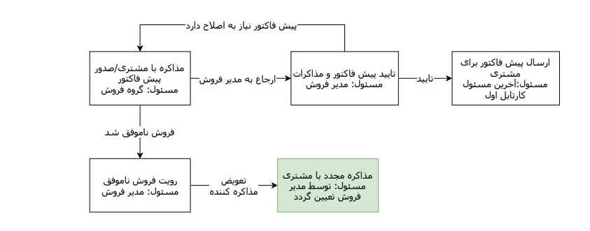

## آشنایی با چرخه‌کاری در پیام‌گستر

سیستم مدیریت فرآیندهای کاری نرم افزار پیام گستر، یک ابزار  قدرتمند برای پیاده سازی و طراحی تمام جریان های کاری شرکت ها و کسب و کارها می باشد. 

 هر چرخه و فرآیند کاری متشکل از یک سری کارتابل، فعالیت و اقدام می‌باشد. 
 
بخشی از فرآیند سازمان که نیازمند انجام کار توسط نیروی انسانی می باشد در پیام گستر با مفهومی بعنوان کارتابل تعریف می شود و فعالیت ها مراحلی از فرآیند می باشند که  بصورت خودکار توسط سیستم انجام می پذیرند، هرکدام از این کارتابل‌ها و فعالیت‌ها یک مرحله از فرآیند را تشکیل می‌دهند.

چرخه کاری می تواند بر روی هر کدام از موجودیت ها ( آیتم های) CRM فعال شود. برای درک بهتر چرخه کاری به مثال فاکتور توجه نمایید.

مثال : میتوانید چرخه کاری را بر روی آیتم فاکتور فعال نمایید. پس مذاکره با یک مشتری، فاکتور توسط کارشناسان فروش ثبت می شود و به کارتابل مدیر فروش جهت تایید ارسال می شود. بعد از این مرحله به کارتابل مالی برای دریافت هزینه فاکتور و ثبت و تایید آن ارسال می شود و سپس فاکتور  پرداخت شده به بخش انبارداری برای ارسال محصول به مشتری ارجاع داده می شود. برای طراحی  فرآیند در نرم افزار پیام گستر بخش ایجاد چرخه‌کاری را مطالعه کنید. 

چرخه کاری در نرم افزار پیام‌گستر دارای 3 مفهوم اساسی می‌باشد:

1)	کارتابل: هر کارتابل یک مرحله از انجام کار( فرآیند) است که شامل اقدام هایی می‌باشد که توسط نیروی انسانی (کاربران نرم افزار) انجام می شود.

هر کارتابل بایستی دارای مسئول باشد که این مسئول می‌تواند کاربر نرم افزار، گروهی از کاربران و یا سمت‌های تعریف شده و ... باشد.

2)	اقدام: خروجی کارتابل برای ارتباط با سایر مراحل چرخه یک اقدام نامیده میشود، در واقع اقدام عبارتست از کارهایی که مسئول کارتابل در آن مرحله از گردش کار بایستی انجام دهد و در صورت انجام آن ها فرایند به مرحله دیگر منتقل می‍شود.

 هر کارتابل می تواند چندین اقدام داشته باشد که بر اساس شرایط آن مرحله از کار و حالت های ممکن، تعریف می‌گردند.
 
3)	فعالیت: مراحلی از گردش کار می‌باشد که به صورت خودکار توسط سیستم انجام می شود، برای مثال فعالیت هایی مانند ارسال پیام کوتاه، ایمیل، تصمیم گیری سیستمی ... که طی فرآیند در مراحل تعریف شده انجام می‌شود.
تصویر زیر نمونه‌ای از فرآیند طراحی شده می‌باشد:

