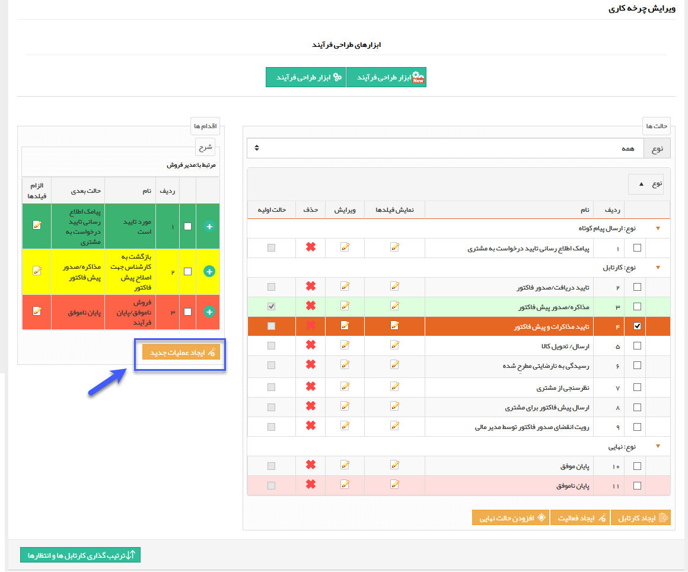
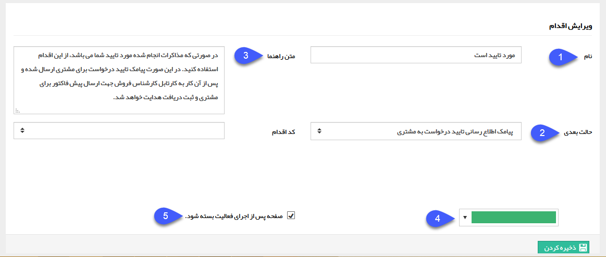
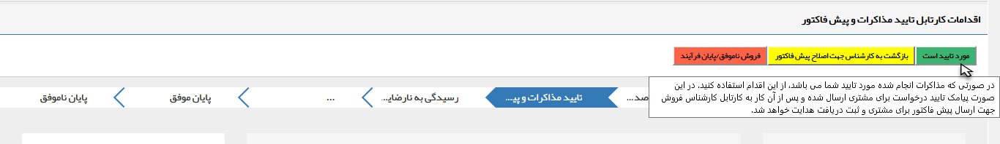

## اقدام 

> مسیر دسترسی:  **تنظیمات** >**شخصی سازی crm** > **نمای کلی** > **کلید ویرایش چرخه کاری در هر موجودیت** > **ایجاد عملیات جدید** 

برای ساخت یک اقدام جدید، کارتابل مربوطه را انتخاب کرده و روی دکمه ایجاد عملیات جدید کلیک کنید.

با کلیک بر روی این دکمه، پنجره زیر را مشاهده خواهید کرد.

1. نام اقدام: یک نام مناسب برای اقدام برگزینید. از آنجایی که هر اقدام به صورت یک دکمه به کاربر نمایش داده می شود، این نام را به نحوی انتخاب کنید که کاربر معنی این اقدام را بداند. زیرا کاربران اطلاعی از جزئیات فرآیند پیاده سازی شده ندارند و صرفاً نام اقدام ها (و متن راهنمایی که برای اقدام ها می گذارید) مبنای تصمیم گیری آن ها برای انتخاب اقدام مناسب می باشد.

2. حالت بعدی: مرحله ی بعدی گردش کار در صورت انتخاب این اقدام را تعیین کنید. یعنی مشخص کنید که در صورت استفاده از این اقدام توسط کاربر، فرآیند به کدام مرحله هدایت شود.

3. متن راهنما: می توانید توضیحاتی را در ارتباط با این اقدام برای راهنمایی کاربر وارد کنید، این توضیحات در صورت نگه داشتن نشانگر بر روی اقدام، به صورت متن راهنما (Tooltip) به کاربر نمایش داده خواهد شد.

4. رنگ اقدام: می توانید یک رنگ به اقدام تخصیص دهید. رنگ بندی اقدام ها می تواند کاربران را برای انتخاب اقدام مناسب راهنمایی کند. به طور مثال برای کارتابل تایید پیش فاکتور و مذاکرات (شکل بالا)، اقدام تایید با رنگ سبز، اقدام اصلاح با رنگ زرد و اقدام عدم تایید با رنگ قرمز مشخص شده اند.

5. در صورت فعال بودن این گزینه، پس از کلیک بر روی اقدام توسط کاربر، صفحه آیتم مربوطه به صورت خودکار بسته خواهد شد. 

* نحوه نمایش اقدام ها و متون راهنمای تنظیم شده به صورت زیر می باشد:

