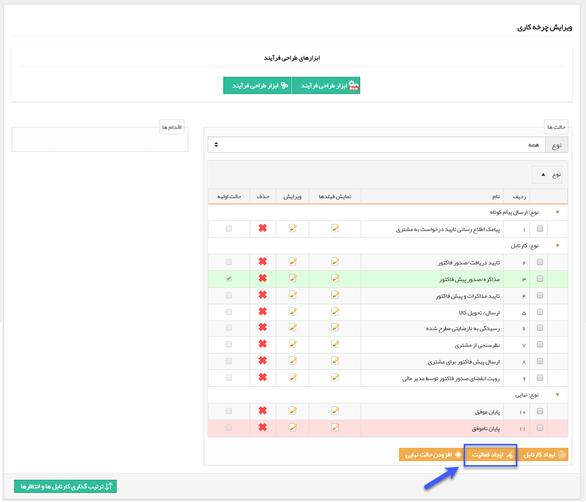

## فعالیت

فعالیت ها مراحلی از گردش کار هستند که به صورت خودکار توسط سیستم انجام می شوند. مثل ارسال پیام کوتاه به مشتری جهت اطلاع رسانی در مراحل مختلف انجام کار. در واقع بین مراحلی که توسط کاربران انجام می شوند، می توانید با استفاده از فعالیت ها اقداماتی مانند ارسال پیام، بررسی یک معیار و هدایت فرآیند بر اساس آن، ثبت وظیفه برای یک کاربر، ایجاد لینک پرداخت برای مشتری و ... را به سیستم واگذار کنید.

با انتخاب هر کدام از فعالیت ها، باید تنظیمات مربوط به آن را تعیین کرده و مشخص کنیم که فرآیند بعد از انجام عملیات، به چه مرحله ای هدایت شود ( حالت بعدی ).

با کلیک بر روی دکمه ایجاد فعالیت، می توانید یک فعالیت جدید به فرآیند خود اضافه کنید. لیست انواع فعالیت ها به شرح زیر می باشند:

[1.  تصمیم](Decision%2FDecision.md)

[2.  ارسال پیام کوتاه](Send%20SMS%2C%20email%2Fsend-sms%2Fsend-sms.md)

[3.  ارسال ایمیل](Send%20SMS%2C%20email%2Fsend-email%2Fsend-email.md)

[4.  ارسال فکس](Send%20SMS%2C%20email%2Fsend-fax%2Fsend-fax.md)

[5.  چاپ](Send%20SMS%2C%20email%2Fprint-send%2Fprint-send.md)

[6. مالی - تایید آیتم](taid-rad-item%2Ftaid-rad-item.md)

[7. تخصیص مقدار](Allocate-the-amount%2FAllocate-the-amount.md)

[8. تعیین مرحله](Determining-the-stage%2FDetermining-the-stage.md)

[9. مالی - رد آیتم](taid-rad-item%2Ftaid-rad-item.md)

[10. فراخوانی سرویس](Call-service%2FCall-service.md)

[11. تایید تراکنش انبار](taid-rad-anbar%2Ftaid-rad-anbar.md)

[12. رد تراکنش انبار](taid-rad-anbar%2Ftaid-rad-anbar.md)

[13. انتظار](Waiting%2FWaiting.md)

[14. ثبت پیگیری](Keep-trackof-tracking%2FKeep-trackof-tracking.md)

[15. ثبت وظیفه](Job-registration%2FJob-registration.md)

[16. ایجاد کاربر](Create-a-user%2FCreate-a-user.md)

[17. عضویت](Membership%2FMembership.md)

[18. شرط](Membership%2FMembership.md)

[19. شروع فرآیند](Start-the-process%2FStart-the-process.md)

[20. افزودن به لیست سیاه](Ad-%20to-blacklist%2FAd-%20to-blacklist.md)

[21. به روز رسانی فیلدهای محاسباتی](Computer-field-update%2FComputer-field-update.md)

[22. ثبت فرصت](Register-Opportunity%2FRegister-Opportunity.md)

[23. تبدیل نوع](Convert-type%2FConvert-type.md)

[24. ایجاد قرار ملاقات](Make-appointments%2FMake-appointments.md)

[25. تخصیص شماره به مشتری](Allocation-of-customer-number%2FAllocation-of-customer-number.md)

[26. ایجاد لینک پرداخت](ijad-link-pardakht%2Fijad-link-pardakht.md)

[27. چند شرطی](Conditional-decision%2FConditional-decision.md) 

[28. فراخوانی رویداد](Call-the-event%2FCall-the-event.md)