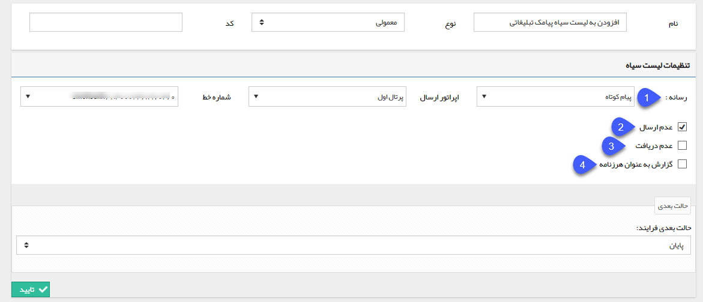

## افزودن به لیست سیاه

> مسیر دسترسی:  **تنظیمات** >**شخصی سازی crm** > **نمای کلی** > **کلید ویرایش چرخه کاری در هر موجودیت** > **ایجاد فعالیت** > **افزودن به لیست سیاه**

با استفاده از این فعالیت می توانید هویت مرتبط با آیتم تحت چرخه را در لیست سیاه ارسال/دریافت یکی از رسانه ها قرار دهید یا ایمیل های این هویت را به قسمت هرزنامه بفرستید، به طور مثال فرض کنید مشتری از تعدد پیامک های تبلیغاتی که از طرف سازمان دریافت میکند نارضایتی دارد، می توان در فرایند فرم رسیدگی به شکایات با استفاده از این فعالیت مشتری را در لیست سیاه ارسال پیام کوتاه قرار داد تا از این پس، مشتری پیام های تبلیغاتی را دریافت نکند.

برای ایجاد این فعالیت، پس از تعیین نام و نوع فعالیت و همچنین حالت بعدی فرآیند، سایر تنظیمات را مطابق با توضیحات زیر انجام دهید.

1. نوع رسانه مورد نظر که قصد افزودن هویت مرتبط با آیتم تحت چرخه به لیست سیاه ارسال/دریافت پیام های آن را دارید انتخاب کرده و پس از آن خط مورد نظر خود را نیز از بین خطوط تنظیم شده در نرم افزار تعیین کنید. یعنی مشخص کنید که هویت در لیست سیاه کدام خط قرار گیرد.

2. در صورت فعال بودن این گزینه، هویت مرتبط با آیتم تحت چرخه در لیست سیاه ارسال خط تعیین شده قرار می گیرد و ازین پس، پیام های ارسالی از این خط در نرم افزار پیام گستر، به این هویت ارسال نخواهد شد.

3. در صورت فعال بودن این گزینه، هویت مرتبط با آیتم تحت چرخه در لیست سیاه دریافت خط تعیین شده قرار می گیرد و ازین پس، پیام های دریافتی از این هویت روی این خط، در لیست پیام های دریافتی در نرم افزار پیام گستر نمایش داده نخواهد شد.

4. در صورت فعال بودن این گزینه، پیام های دریافتی این هویت روی خط مشخص شده، به عنوان هرزنامه (Spam) شناسایی خواهد شد.

