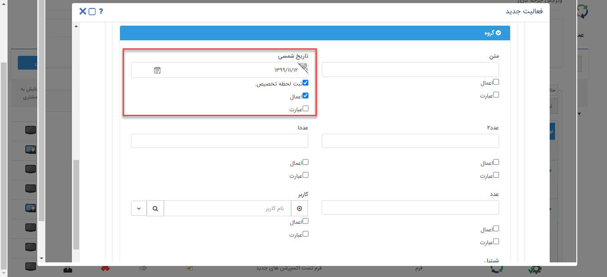

## فعالیت تخصیص مقدار 

> مسیر دسترسی:  **تنظیمات** >**شخصی سازیcrm** > **ویرایش چرخه کاری(در هر آیتم)** > **ایجاد فعالیت** >**فعالیت تخصیص مقدار**

با استفاده از این فعالیت می توانید یک مقدار دلخواه را به یکی از فیلدهای آیتم تحت چرخه اختصاص دهید ( این فیلدها میتوانند فیلدهای پیشفرض و یا فیلدهای اضافه شده از قسمت شخصی سازی باشند)

به طور مثال فرض کنید یک چرخه کاری روی آیتم فرم درخواست مرخصی طراحی کرده اید و می خواهید پس از ثبت درخواست، فرم به کارتابل مدیر دپارتمان مربوط به شخص درخواست دهنده برای رویت و بررسی ارجاع شود. میتوانید با ساختن یک فیلد از نوع لیست برای انتخاب دپارتمان مربوطه، یک فیلد از نوع لیست کاربر برای مدیر مربوطه و فعالیت های تصمیم و تخصیص مقدار این کار را انجام دهید، نحوه عملکرد به این صورت است که شخص درخواست دهنده دپارتمان خود را مشخص میکند و با استفاده از فعالیت های تصمیم و قرار دادن یک فعالیت تخصیص مقدار پس از هرکدام از تصمیم ها، فیلد مدیر مربوطه را به مدیر دپارتمان مربوط به شخص درخواست دهنده اختصاص می دهد. (فلوچارت این قسمت از فرآیند در صورتی که سه دپارتمان استقرار، پشتیبانی و فروش داشته باشیم به صورت زیر خواهد بود)
 
 

**تخصیص مقدار فیلدها از دو طریق انجام می‌شود:**

1)	با فعال کردن چک باکس اعمال و تعیین مقدار موردنظر، آن فیلد طی این فرآیند مقداردهی می‌شود.

2)	در صورتیکه بخواهید مقدار دهی فیلدها از بانک اطلاعاتی پیام‌گستر انجام شود، باید چک باکس  عبارت هم فعال شود و کوئری موردنظر برای دریافت اطلاعات نوشته شود.(نحوه مقداردهی فیلدها از طریق نوشتن Custom Expression در بخش Expression توضیح داده شده است.)

> **نکته:** اگر برای یکی از فیلدها مقداری وارد نکنید و چک باکس "اعمال" را برای آن فعال کرده باشید، فیلد با اجرای این فعالیت خالی خواهد شد.

علاوه بر این، فعالیت تخصیص مقدار قابلیت "ثبت لحظه تخصیص" در فیلد از نوع تاریخ و ساعت را نیز داراست، به طور مثال فرض کنید بخواهید در فرآیند فرصت فروش، تاریخ دقیق هریک از مراحل فروش (صدور پیش فاکتور، تایید پیش فاکتور، تایید دریافت، ارسال کالا، نظرسنجی و ...) را داشته باشید، به راحتی می توانید با استفاده از ساختن فیلدهای تاریخی مربوطه و استفاده از فعالیت تخصیص پس از هریک از مراحل فروش و تخصیص خودکار لحظه ورود به هریک از مراحل توسط سیستم، این کار را انجام دهید.

برای ثبت لحظه تخصیص کافی است چک باکس های "اعمال" و "ثبت لحظه تخصیص" را برای فیلد مربوطه فعال کنید. (به صورت زیر)

> **نکته:** امکان استفاده از عبارت برای مقداردهی فیلدها در حال حاضر فقط بر روی آیتم‌هایی از نوع فرم، هویت، وظیفه، درخواست پشتیبانی و انواع فاکتور، پیش فاکتور و فاکتورهای برگشت از خرید و فروش قابل استفاده می باشد.

> **نکته:** نوع فیلدی که برای مقدار دهی انتخاب می‌شود باید با نوع آن در فیلدی که به عنوان مبدا می‌باشد، یکسان باشد. نوع فیلد¬های پیش فرض نرم افزار در جداول پیوست شماره 3 آورده شده اند.

**لیست فیلدهای قابل پشتیبانی:**

•	Html

•	پول

•	تاریخ شمسی

•	تاریخ میلادی

•	چک باکس

•	ساعت 

•	عدد

•	کاربر

•	گروه

•	لینک

•	متن 

•	شرکت/شخص
