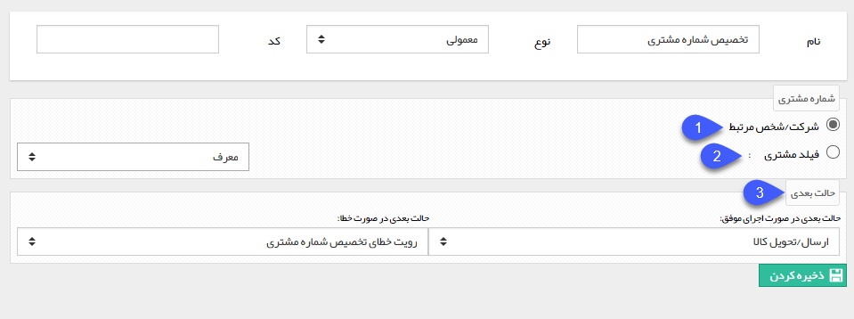

## تخصیص شماره مشتری

با استفاده از این فعالیت می توانید در فرایند به صورت خودکار به هویت مرتبط با این آیتم تحت چرخه شماره مشتری اختصاص دهید، به طور مثال در فرایند فرصت فروش میخواهید پس از تایید فاکتور و دریافت مرتبط با فرصت، در صورت جدید بودن مشتری، شماره مشتری به او تخصیص داده شود. شماره مشتری هم می تواند به هویت مرتبط با آیتم و هم به هویت های متصل شده به فیلدهای از نوع شرکت/شخص تعریف شده در آیتم اختصاص داده شود.

برای ایجاد این فعالیت، پس از تعیین نام و نوع فعالیت، سایر تنظیمات را مطابق با توضیحات زیر انجام دهید.

1. در صورت فعال بودن این گزینه، به هویت مرتبط با آیتم تحت چرخه شماره مشتری اختصاص داده خواهد شد.

2. در صورت فعال بودن این گزینه، می توانید به هویتی که در یکی از فیلدهای از نوع شرکت/شخص آیتم تحت چرخه وارد می شود، شماره مشتری اختصاص دهید، به طور مثال در فرآیند فرصت فروش، به شخص/شرکتی که به عنوان معرف در یکی از فیلدهای فرصت فروش وارد می شود، شماره مشتری اختصاص دهید.

3. حالت بعدی فرآیند در صورت اجرای موفق این فعالیت (تخصیص موفق شماره مشتری) و حالت بعدی در صورت بروز خطا را تعیین کنید
