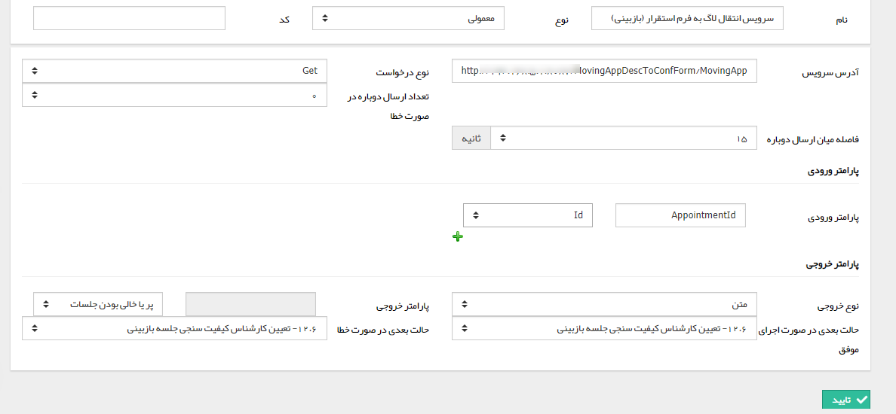

## فراخوانی سرویس

فعالیت وب سرویس تنها فعالیتی است که می تواند به منابعی خارج از پیام گستر متصل شده و درواقع پلی بین پیام گستر و منبع خارجی مانند نرم افزار های دیگر باشد. همچنین زمانی که نتوانیم تمام نیازها را در قالب ماژول ها و فعالیت های موجود در فرآیند پیش ببریم می توانیم به راحتی از این فعالیت استفاده نماییم. پیش نیاز عملکرد این فعالیت، ایجاد وب سرویس و نوشتن آن توسط برنامه نویس، تعریف کلیدهای کاربر برای فیلدها و آیتم های مورد استفاده در وب سرویس ها می باشد. در نظر بگیرید زمانی که بخواهیم فرمی پس از رسیدن به مرحله ای فرم جدیدی را نیز ایجاد نموده و برخی از این فیلدهای فرم اول به داخل فرم دوم انتقال یابد. در این صورت پس از تعریف کردن کلیدهای کاربری و نوشتن سرویس مربوطه، این سرویس برروی آدرسی تحت عنوان آدرس سرویس پیاده سازی شده و این آدرس علاوه بر پارامترهای ورودی (فیلدها و فرم های درگیر در این سرویس) در فعالیت فراخوانی وب سرویس تعریف می گردند.

در تنظیمات این فعالیت باید آدرس سرویس نوشته شده، نوع سرویس (Get یا Post) ، پارامترهای ورودی (مقادیری که از این آیتم به وب سرویس معرفی می شوند) و پارامترهای خروجی (مقادیری که به عنوان خروجی سرویس وارد فیلدهای آیتم می شوند) را وارد کرده و در انتها مشخص کنید که حالت بعدی فرآیند در صورت اجرای موفق وب سرویس و در صورت خطا کدام وضعیت ها باشد.

آدرس سرویس : آدرس سرویس مورد نظر برای فرآخوانی(تبادل اطلاعات) را وارد کنید .

نوع درخواست : پروتکل ارسال دیتا را انتخاب کنید .

تعداد ارسال دوباره در صورت خطا : می توان مشخص نمود در صورت چند بار خطا فراخوانی مجدد انجام شود .

فاصله میان ارسال دوباره : بر حسب ثانیه فاصله میان فراخوانی ها، در صورت بروز خطا را می توان انتخاب کرد.

پارامتر ورودی : اطلاعاتی که می خواهیم به سرویس مورد نظر ارسال کنیم در این قسمت انتخاب می شود  ، این اطلاعات می تواند از فیلد های اضافه شده، Id  ( Id موجودیتی که تحت چرخه است در دیتا بیس) و یا یک مقدار اختیاری باشد .

نوع خروجی : در این قسمت می توان انتخاب کرد خروجی با چه فرمتی برگشت داده شود .

پارامتر خروجی : فیلد اضافه شده ی مورد نظر برای قرار گیری خروجی در آن، در این قسمت انتخاب می شود .

حالت بعدی در صورت اجرای موفق : در این قسمت می توان انتخاب کرد فعالیت در صورت اجرای موفق به کدام مرحله منتقل شود .

حالت بعدی در صورت خطا : در این قسمت می توان انتخاب کرد فعالیت در صورت اجرای ناموفق به کدام مرحله منتقل شود .