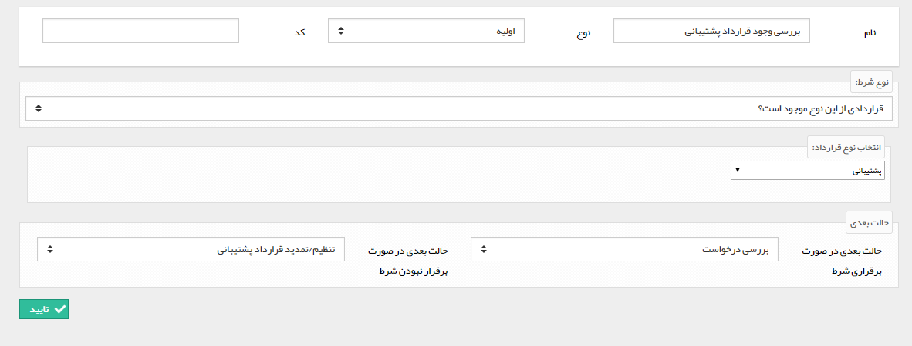
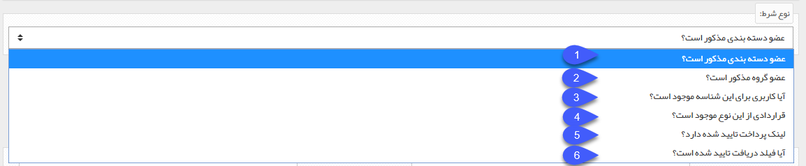

## شرط

میتوانید با استفاده از این فعالیت بر اساس یک شرط (6 شرط ثابت و از پیش تعیین شده در سیستم )،  فرایند را به دو مسیر متفاوت هدایت کنید.

 به طور مثال فرض کنید یک فرایند روی آیتم درخواست پشتیبانی طراحی کرده اید و برای ارائه خدمات پشتیبانی باید قرارداد پشتیبانی در سوابق مشتری موجود باشد. در این صورت میتوانید وجود یا عدم وجود این قرارداد در سوابق مشتری را در ابتدای فرایند با استفاده از فعالیت شرط بررسی کنید و درصورتی که قرارداد موجود نباشد میتوانید فرایند را به کارتابل تنظیم و صدور قرارداد هدایت کنید.

برای ایجاد این فعالیت، پس از تعیین نام و نوع فعالیت، شرط مورد نظر خود را تنظیم کرده و مشخص کنید که حالت بعدی در صورت برقراری و عدم برقراری شرط کدامیک از مراحل فرآیند باشد

انواع شرط

1 . این شرط، عضویت، هویت مرتبط با آیتم تحت چرخه را در  یک دسته بندی بانک اطلاعاتی را مورد بررسی قرار می دهد که آیا هویت در دسته بندی انتخاب شده وجود دارد یا خیر . در صورت انتخاب این شرط، دسته بندی مورد نظر خود را تعیین کنید.

2 . این شرط، عضویت هویت مرتبط با آیتم تحت چرخه در یک گروه هدف را مورد بررسی قرار می دهد. در صورت انتخاب این شرط، گروه مورد نظر خود را تعیین کنید.

3 . با این شرط می توانید بررسی کنید که برای هویت مرتبط با آیتم تحت چرخه، کاربری باشگاه مشتریان ایجاد شده است یا خیر.

4 . با استفاده از این شرط، می توانید وجود یک نوع از قرارداد در سوابق هویت مرتبط با آیتم تحت چرخه را مورد بررسی قرار دهید. در صورت انتخاب این شرط، نوع قرارداد مورد نظر خود را مشخص کنید.

5 . با استفاده از این شرط می توانید بررسی کنید که هویت مرتبط با آیتم تحت چرخه، لینک پرداخت تایید شده (لینک پرداختی که مبلغ آن توسط مشتری پرداخت شده باشد) دارد یا خیر.

6 . با استفاده از این شرط می توانید بررسی کنید که آیا دریافت متصل شده به فیلد دریافت موجود در  آیتم تحت چرخه، تایید شده است یا خیر. در صورت انتخاب این شرط، فیلد دریافت مورد نظر خود را نیز تعیین کنید.