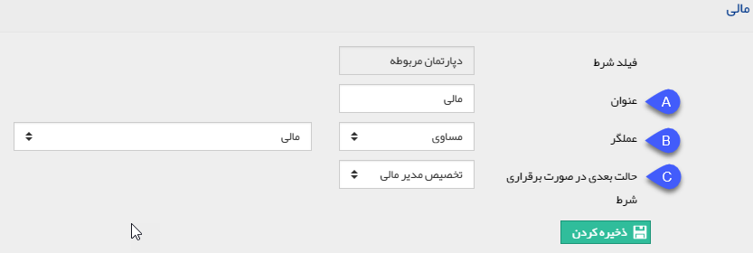

## تصمیم چند شرطی

در صورتی که به ازای مقادیر وارد شده در یک فیلد، فرآیند باید به بیش از دو مسیر هدایت شود، به جای استفاده از فعالیت های تصمیم پی در پی، می توانید از یک فعالیت تصمیم چند شرطی استفاده کنید .

به طور مثال در فلوچارت زیر، می توان دو فعالیت تصمیم را با استفاده از یک تصمیم چند شرطی ادغام نمود.

 
 
 توجه داشته باشید که شرط های این فعالیت باید روی یک فیلد باشد.

تنظیمات این فعالیت به شرح زیر می باشد:

1. فیلد شرط را تعیین کنید. توجه داشته باشید که پس از تعیین یک شرط، این فیلد غیرفعال خواهد شد (به این معنی که تمامی شرط ها باید روی یک فیلد باشد).

2.  در این قسمت تمامی شرط های تعریف شده نمایش داده می شوند.

3. برای تعریف شرط جدید روی این گزینه کلیک کنید.

 . A عنوانی برای این شرط برگزینید.

 . B عملگر شرط را تعیین کنید. در واقع در این قسمت مقدار فیلد برای این شرط تعیین می شود.

 . C حالت بعدی فرآیند در صورت برقرار بودن این شرط را  مشخص کنید.

 .4در صورتی که هیچ یک از شرط ها برقرار نباشند (مقداری غیر از مقادیر تعیین شده در شرط ها در فیلد شرط وارد شود) فرآیند به این حالت هدایت می شود.

 .5حالت بعدی در صورت بروز خطا را مشخص کنید.
 

