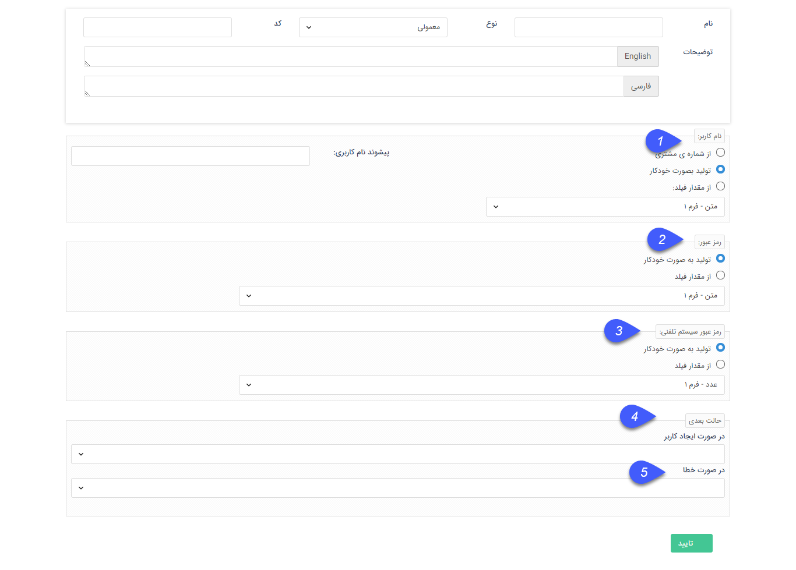

## ایجاد کاربر

با استفاده از این فعالیت میتوانید برای هویت مرتبط با آیتم تحت چرخه یک کاربری باشگاه مشتریان ایجاد کنید،

 به طور مثال فرض کنید میخواهید در انتهای فرایند فرصت فروش در صورت جدید بودن مشتری و موفق شدن فرصت، یک کاربری برای این مشتری ایجاد شود.

تنظیمات این فعالیت به شرح زیر می باشد

ابتدا نام و نوع فعالیت را مشخص کنید.

1. نام کاربری: در این قسمت مشخص کنید نام کاربری ایجاد شده برای مشتری به چه صورت باشد، نام کاربری می تواند از شماره مشتری هویت مرتبط، از یکی از فیلدهای از نوع متن موجود در  آیتم تحت چرخه و یا بصورت خودکار ایجاد گردد. می توانید یک پیشوند دلخواه نیز برای نام کاربری ها تعریف کنید، این پیشوند در هر سه حالت تعریف نام کاربری اعمال میشود.

2. رمز عبور: در این قسمت مشخص کنید رمز عبور کاربری ایجاد شده به چه صورت باشد، رمز عبور می تواند از یکی از فیلدهای متنی آیتم تحت چرخه و یا بصورت خودکار ایجاد گردد.

3. رمز عبور سیستم تلفنی : در این قسمت می توان مشخص کرد رمز سیستم تلفنی کاربر ایجاد شده به چه صورتی باشد،رمز عبور میتواند بصورت خودکار و یا از یکی از فیلد های عددی آیتم تحت چرخه ایجاد شود 

4. حالت بعدی : حالت بعدی فرآیند در صورت ایجاد موفق کاربر را تعیین نمایید .

5. در صورت خطا : در این قسمت مشخص کنید در صورت بروز خطا و عدم ایجاد کاربر چرخه به کدام مرحله منتقل شود .

> توجه داشته باشید در صورتی که تنظیمات ایجاد نام کاربری یا رمز عبور روی فیلد باشد و فیلد مربوطه خالی باشد و یا ایجاد نام کاربری از روی شماره مشتری باشد و هویت مرتبط شماره مشتری نداشته باشد، فعالیت ایجاد کاربر با خطا مواجه خواهد شد.

 
 