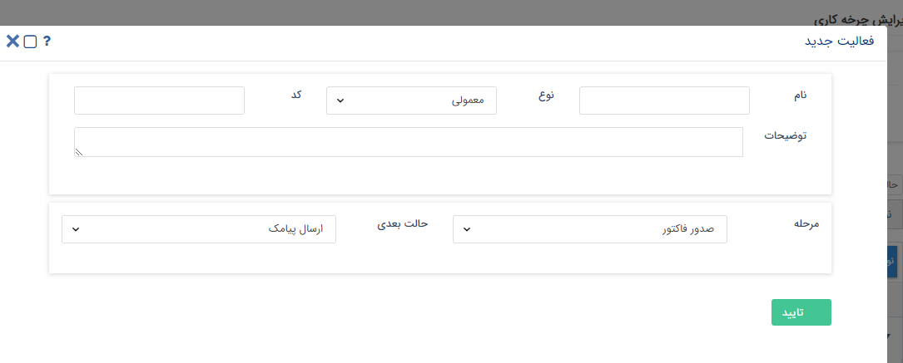

## تعیین مرحله 

این فعالیت تنها در فرایندهای طراحی شده روی آیتم هایی کاربرد دارد که در شخصی سازی آن آیتم مراحلی تعریف شده باشد و یا آیتم فرصت که شامل مراحل فروش می باشد. با استفاده از این

 فعالیت میتوانید فرایند را به صورتی طراحی کنید که در طی اجرای فرایند، مراحل تعریف شده به صورت خودکار توسط سیستم تغییر کند.
 
 > نکته : برای آیتم هایی که تحت چرخه هستن و مراحلی برای آن ها تعریف شده است و آیتم فرصت ،تغییر مرحله تنها از طریق این فعالیت امکان پذیر است .

برای مثال فرض کنید که یک مرحله فروش به نام پیش فاکتور در فرصت تعریف کرده اید، می توانید در طراحی فرایند قبل از کارتابل صدور پیش فاکتور، فعالیت تعیین مرحله فروش را قرار

 دهید تا بتوانید پراکندگی فرصت های باز در این مرحله را به صورت دقیق در اختیار داشته باشید. قبل از هدایت چرخه به حالت نهایی با استفاده از فعالیت های تعیین مرحله و یا  تعیین فرصت

 های موفق و ناموفق آمار دقیقی از فرصت های از دست رفته و محقق شده داشته باشید.

تنظیمات این فعالیت به صورت زیر می باشد. کافیست نام فعالیت ، نوع و حالت بعدی فرآیند را تعیین کرده و مشخص کنید فیلد مرحله فروش به کدام مرحله تغییر کند.

> نکته : برای تعریف و یا  ویرایش مراحل به قسمت به بخش مرحله بندی آیتم ها مراجعه کنید .

