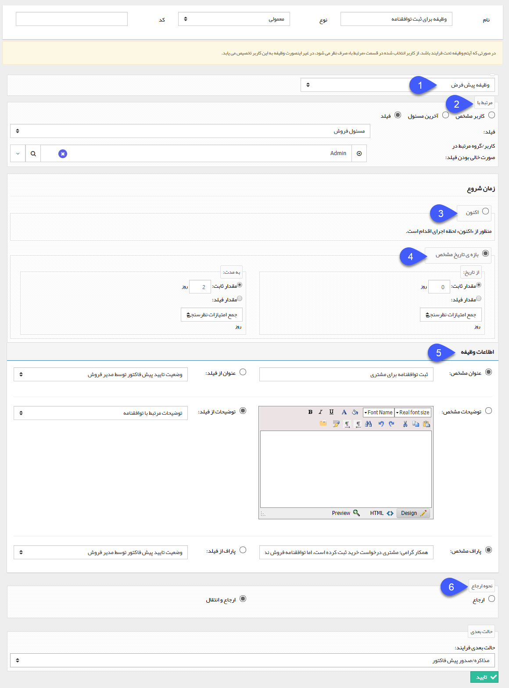

## ثبت وظیفه 

با استفاده از این فعالیت می توانید یک وظیفه به صورت خودکار توسط سیستم ایجاد کنید و به یکی از کاربرها ارجاع دهید.

به طور مثال فرض کنید که برای فروش محصول به مشتری وجود توافقنامه در سوابق آن الزامی است، میتوانید یک فعالیت ثبت وظیفه در فرایند ایجاد کنید که کاربر در صورت نبود توافقنامه برای مشتری، فرایند را به این فعالیت هدایت کند و یک وظیفه برای کاربر مسئول ثبت توافقنامه ایجاد شود. مزیت استفاده از این فعالیت نسبت به ثبت وظیفه به صورت دستی این است که میتوانید عنوان، توضیحات و پاراف وظیفه را از یکی از فیلدهای همین آیتم وارد کنید.

برای ایجاد این فعالیت، پس از تعیین نام، نوع و حالت بعدی فرآیند، سایر تنظیمات را مطابق توضیحات زیر انجام دهید : 

1. نوع وظیفه: از لیست انواع وظایف ایجاد شده در شخصی سازی، نوع وظیفه مورد نظر خود را انتخاب کنید.

نکته مهم: توجه داشته باشید در صورتی که نوع وظیفه که انتخاب میکنید تحت چرخه کاری فعال باشد، از کاربری که در قسمت بعد به عنوان گیرنده وظیفه انتخاب میکنید، صرف نظر خواهد شد و گردش کار آن وظیفه بر اساس فرآیند آن، پیش خواهد رفت.

2. مرتبط با: کاربری که باید این وظیفه به او ارجاع داده شود را تعیین کنید. دریافت کننده وظیفه می تواند یک کاربر مشخص، آخرین مسئول یکی از کارتابل های فرآیند یا یک فیلد از نوع لیست کاربر/گروه آیتم تحت چرخه باشد، در صورتی که گزینه فیلد را انتخاب کنید می توانید یک کاربر/گروه را به عنوان دریافت کننده وظیفه در صورت خالی بودن فیلد مربوطه در نظر بگیرید.

3. اکنون: در صورتی که این گزینه را انتخاب کنید، زمان شروع و موعد مقرر وظیفه ایجاد شده، روز اجرای فعالیت (روزی که فرآیند وارد این مرحله شود) خواهد بود.

4. بازه ی تاریخ: در صورت انتخاب این گزینه میتوانید تاریخ شروع و موعد مقرر وظیفه ایجاد شده را مدت زمانی پس از اجرای فعالیت در نظر بگیرید. به دو صورت می توان این زمان را تعیین کرد. اول به صورت یک مقدار ثابت، و راه دوم انتخاب یک فیلد عددی ایجاد شده در آیتم تحت چرخه است. به طور مثال در شکل بالا، تاریخ شروع وظیفه، روز اجرای فعالیت و موعد مقرر، دو روز بعد از آن خواهد بود.

5. اطلاعات وظیفه: عنوان، توضیحات و پاراف وظیفه ارسال شده را می توان به صورت یک مقدار ثابت و یا انتخاب از یک فیلد متنی آیتم تحت چرخه انتخاب کرد.

6. نحوه ارجاع وظیفه: در صورتی که با استفاده از این فعالیت یک وظیفه ایجاد شود، ایجاد کننده وظیفه، مسئول آخرین کارتابل قبل از این فعالیت خواهد بود. در صورتی که گزینه ارجاع را انتخاب کنید وظیفه در کارتابل وظایف کاربر ایجاد کننده نیز قابل مشاهده خواهد بود و در صورت انتخاب گزینه ارجاع و انتقال، وظیفه فقط در کارتابل کاربر انتخاب شده در قسمت "مرتبط با" مشاهده خواهد شد.

