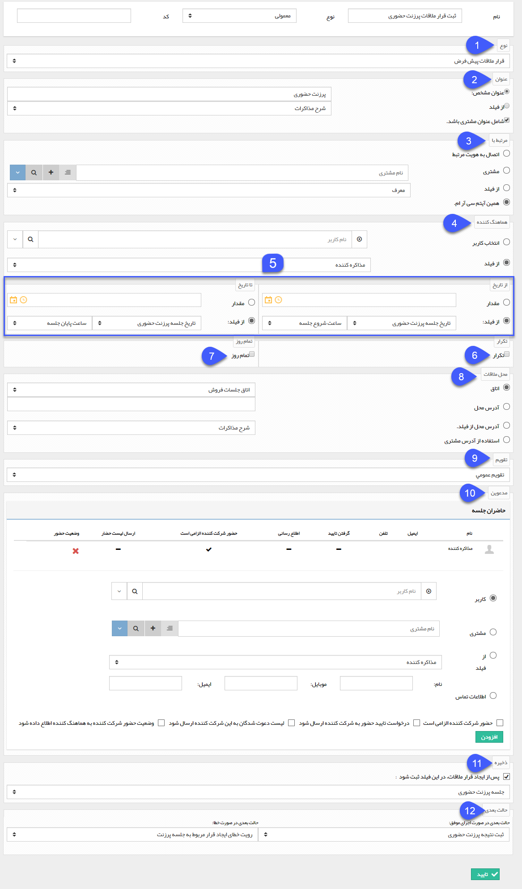

## ایجاد قرارملاقات

می توانید با استفاده از این فعالیت یک قرار ملاقات در سوابق هویت مرتبط با آیتم تحت چرخه یا یک هویت دیگر ایجاد کنید، به طور مثال فرض کنید در فرایند فرصت فروش، برای بعضی از مشتریان نیاز به جلسه پرزنت محصول احساس می شود، در این صورت می توانید با استفاده از این فعالیت، قرار ملاقات مرتبط با جلسه پرزنت فروش را به صورت خودکار توسط سیستم ایجاد کنید. توجه داشته باشید در صورتی که این نوع قرار ملاقات چرخه کاری فعال داشته باشد، با ایجاد قرار ملاقات چرخه کاری مربوط به آن نیز فعال خواهد شد.

  برای ایجاد این فعالیت، پس از تعیین نام و نوع فعالیت، سایر تنظیمات را مطابق با توضیحات زیر انجام دهید.
  
  
  
1. نوع قرار ملاقاتی که قصد ثبت آن با استفاده از این فعالیت دارید را از بین انواع قرار ملاقات های تعریف شده در شخصی سازی انتخاب کنید.

2. عنوان قرار ملاقات را تعیین کنید. این عنوان می تواند یک مقدار مشخص یا مقدار وارد شده در یکی از فیلدهای از نوع متن آیتم تحت چرخه باشد. همانطور که مشاهده می کنید قابلیت اضافه شدن نام مشتری (هویت مرتبط با آیتم تحت چرخه) به عنوان قرار ملاقات نیز وجود دارد.

3. هویت مرتبط با قرار ملاقات ایجاد شده را مشخص کنید. 4 روش برای تعیین این هویت وجود دارد:

اتصال به هویت مرتبط: این قرار ملاقات به هویت مرتبط با آیتم تحت چرخه متصل خواهد شد.
مشتری: می توانید یک هویت دلخواه (ثابت برای تمامی قرارهای ایجاد شده از طریق این فعالیت) را از بانک اطلاعاتی انتخاب کنید.

فیلد: در صورتی که فیلد از نوع شرکت/شخص در آیتم تحت چرخه داشته باشید، می توانید این قرار را به هویتی که نامش در این فیلد وارد می شود متصل کنید.

همین آیتم سی آر ام: قرار ملاقات را در سوابق آیتم تحت چرخه ثبت می کند. به طور مثال در شکل بالا قرار ملاقات پرزنت حضوری در سوابق فرصت فروش ایجاد خواهد شد.

4. هماهنگ کننده قرار ملاقات را مشخص کنید، هماهنگ کننده قرار می تواند یک کاربر مشخص و یا کاربر وارد شده در یکی از فیلدهای از نوع لیست کاربر آیتم تحت چرخه باشد .

5. زمان شروع و پایان قرار ملاقات را مشخص کنید. این زمان ها می توانند یک مقدار مشخص و یا مقدار وارد شده در فیلدهای از نوع تاریخ و از نوع ساعت آیتم تحت چرخه باشند .

6. در صورتی که می خواهید قرار ملاقات ثبت شده یک الگوی تکرار داشته باشد این گزینه را فعال کرده و پس از آن نحوه تکرار را مشخص کنید .

 7. در صورتی که می خواهید یک روز کامل (24 ساعت) به این قرار تخصیص داده شود، این گزینه را فعال کنید.

8. محل قرار ملاقات را مشخص کنید. برای تعیین محل قرار 4 روش وجود دارد:

اتاق: می توانید یکی از اتاق های تعریف شده در قسمت مدیریت اتاق ها را انتخاب کنید.
آدرس محل: یک آدرس مشخص (ثابت برای تمامی قرارهای ایجاد شده از طریق این فعالیت) وارد کنید.

فیلد: می توانید مقدار وارد شده در یکی از فیلدهای از نوع متن آیتم تحت چرخه را به عنوان محل قرار تعیین کنید.

آدرس مشتری: آدرسی که در پروفایل هویت مرتبط با آیتم تحت چرخه وارد شده است به عنوان محل قرار تعیین می گردد.

9. مشخص کنید که این قرار در چه تقویمی ثبت شود. برای اضافه کردن یا ویرایش انواع تقویم های کاری به<a href="file%3A%2F%2F%2FC%3A%5CUsers%5CH.abasi%5CDesktop%5Chelp%5Cmd%20help%5CBasic-Information%5CCalendar-management%5CCalendar-management.md" target="_blank"> مدیریت تقویم ها</a> مراجعه کنید.

10. در این قسمت مدعوین جلسه را وارد کنید. برای اضافه کردن مدعوین 4 روش وجود دارد:

انتخاب از بین کاربران نرم افزار

انتخاب از بین هویت های بانک اطلاعاتی

انتخاب از فیلدهای از نوع لیست کاربر و شرکت/شخص آیتم تحت چرخه

وارد کردن اطلاعات تماسی (برای مدعوینی که کاربر سیستم یا هویت ذخیره شده در بانک اطلاعاتی نیستند)

11. در صورتی که در آیتم تحت چرخه فیلدی از نوع قرار ملاقات داشته باشید، می توانید با فعال کردن این گزینه، قرار ملاقات ثبت شده از طریق این فعالیت را به فیلد مربوطه متصل کنید.

12. حالت بعدی فرآیند در صورت موفقیت اجرای این فعالیت (ثبت موفق قرار ملاقات) و حالت بعدی در صورت بروز خطا در ثبت قرارملاقات را تعیین کنید.

> نکته: توجه داشته باشید ثبت قرار ملاقات از طریق فعالیت به دلایل مختلفی(مانند خالی بودن فیلدهای انتخاب شده برای موارد ضروری ثبت قرار) ممکن است با خطا مواجه شود.

