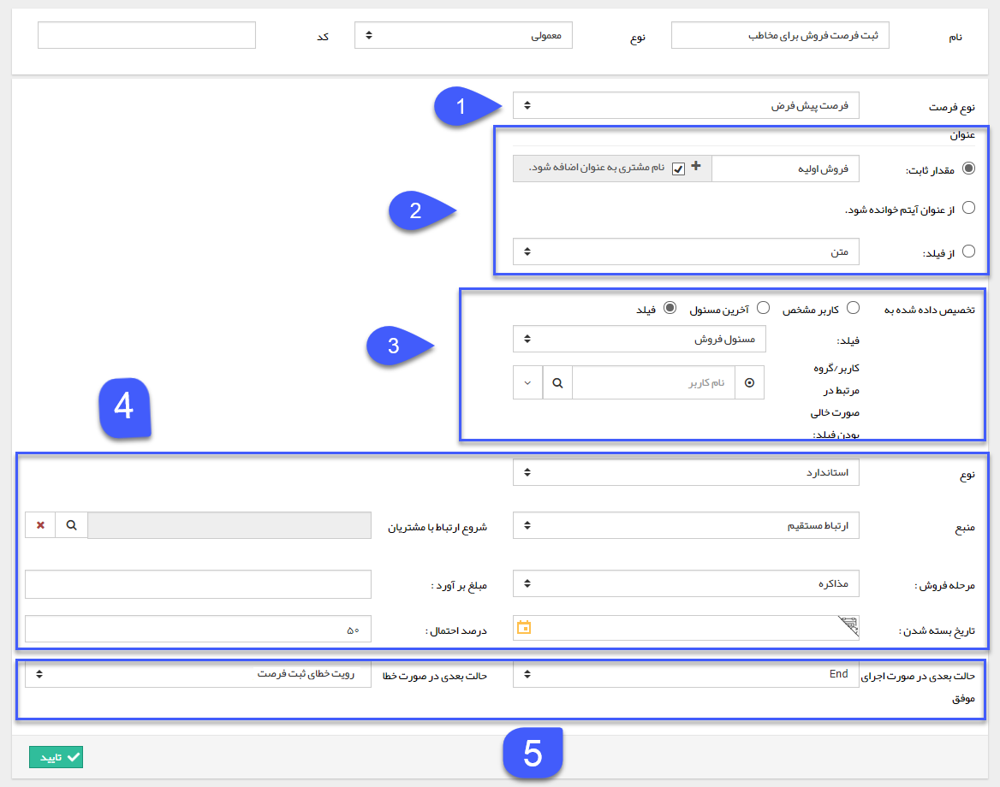

## ثبت فرصت 

> مسیر دسترسی:  **تنظیمات** >**شخصی سازی crm** > **نمای کلی** > **کلید ویرایش چرخه کاری در هر موجودیت** > **ایجاد فعالیت** > **ثبت فرصت**

با استفاده از این فعالیت میتوانید یک فرصت برای هویت مرتبط با این آیتم ثبت کنید، به طور مثال فرض کنید یک فرایند روی آیتم سرنخ ایجاد کرده اید و میخواهید پس از تبدیل این سرنخ به مخاطب، یک فرصت هم به صورت خودکار توسط سیستم برای مشتری ثبت گردد. توجه داشته باشید در صورتی که برای آیتم فرصت چرخه طراحی کرده باشید، چرخه کاری آن نیز با ثبت فرصت فعال خواهد شد. مزیت استفاده از این فعالیت نسبت به ثبت دستی فرصت اینست که می توانید عنوان فرصت را از فیلدهای متنی آیتم تحت چرخه انتخاب کنید و همچنین فرصت را به یکی از فیلدهای از نوع لیست کاربر و یا آخرین مسئول یکی از کارتابل ها اختصاص دهید.

برای ایجاد این فعالیت، پس از تعیین نام و نوع فعالیت، سایر تنظیمات را مطابق با توضیحات زیر انجام دهید.

1.  نوع فرصت مورد نظر که می خواهید با استفاده از این فعالیت برای هویت مرتبط با این آیتم ایجاد شود ، از بین لیست انواع فرصت های تعریف شده در شخصی سازی، انتخاب کنید.

2. عنوان فرصت را مشخص کنید. این عنوان می تواند یک مقدار مشخص (که قابلیت اضافه شدن نام مشتری به آن نیز وجود دارد)، عنوان آیتم تحت چرخه، یا مقدار وارد شده در یکی از فیلدهای از نوع متن آیتم تحت چرخه باشد.

3. در این بخش می توان مشخص کرد فرصت ایجاد شده به چه کاربری مرتبط شود و یا به بیان دیگر کدام کاربر مسئول این فرصت باشد این کاربر می تواند یک کاربر مشخص، آخرین مسئول یکی از کارتابل ها یا مقدار وارد شده در یکی از فیلدهای از نوع لیست کاربر،فیلد سمت و یا فیلد دپارتمان موجود در آیتم تحت چرخه (یا مسئول فروش، پشتیبانی و متفرقه هویت مرتبط با آیتم تحت چرخه) باشد. در صورت انتخاب فیلد می توانید یک کاربر را جهت تخصیص فرصت در صورت خالی بودن فیلد مربوطه انتخاب کنید.

4. مقدار مورد نظر برای فیلدهای پیشفرض فرصت را تعیین کنید. توجه داشته باشید فیلدهای نوع، منبع و مرحله  برای ثبت فرصت ضروری هستند و حتما باید تکمیل گردند.
 
5. حالت بعدی فرآیند در صورت اجرای موفق فعالیت (ثبت موفق فرصت) و حالت بعدی در صورت بروز خطا ( عدم ثبت فرصت) در ثبت فرصت را مشخص کنید.