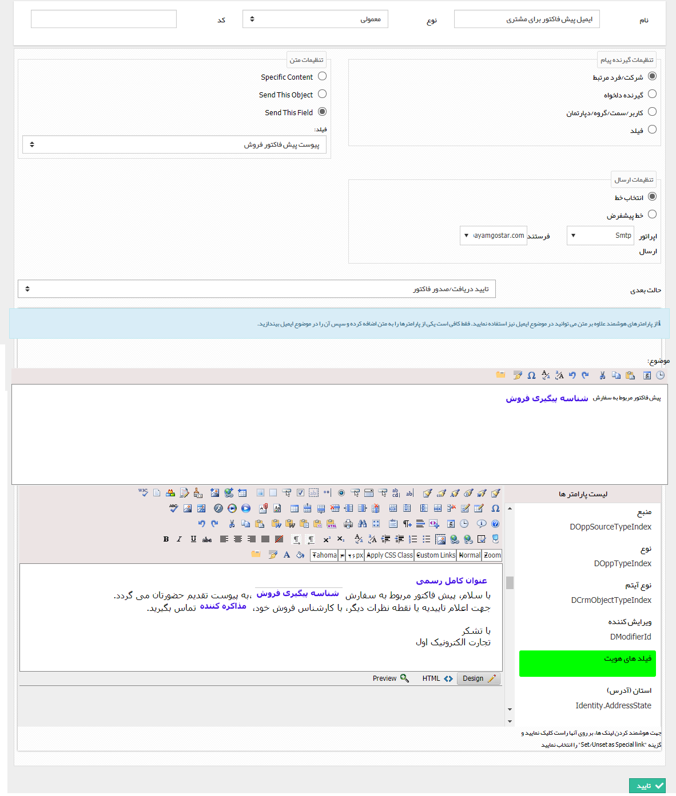

## ارسال ایمیل 

لطفا ابتدا قسمت <a href="file%3A%2F%2F%2FC%3A%5CUsers%5CH.abasi%5CDesktop%5Chelp%5Cmd%20help%5CSettings%5CPersonalization-crm%5COverview%5CProcess-design%5CCreate-a-work-cycle%5CActivity%5CSend%20SMS%2C%20email%5CSend%20SMS%2C%20email.md" target="_blank">ارسال پیامک-ایمیل-فکس-چاپ </a>را مطالعه کنید.

با انتخاب این فعالیت می توانید یک متن مشخص، پیش نمایش آیتم تحت چرخه یا پیش نمایش یک از فیلدهای وابسته به آن را از طریق ایمیل ارسال کنید.

> نکته مهم:  برای این کار یک خط SMTP باید به عنوان خط ارسال ایمیل در نرم افزار تعریف شود. در صورت انتخاب قالب چاپ این آیتم (Send This Object) و یا قالب چاپ یک فیلد وابسته (Send This Field) به عنوان محتوای ارسال قالب چاپ آیتم به عنوان یک فایل به ایمیل ارسالی پیوست میشود. ( برای تنظیم ایمیل به ایمیل و برای تعیین خط ارسال ایمیل های سیستمی به خطوط پیش فرض در تنظیمات کلی  مراجعه کنید.)

> نکته: برای اطلاع از نحوه تنظیم کردن یک ایمیل به تنظیم محتوای ایمیل مراجعه کنید.

به طور مثال فرض کنید می خواهید پیش نمایش پیش فاکتور مشتری، در فرآیند فرصت فروش از طریق ایمیل برای او ارسال شود. کافی است در قسمت تنظیمات متن، گزینه Send this  Field را انتخاب کرده و پس از آن فیلد پیش فاکتور را انتخاب کنید.

