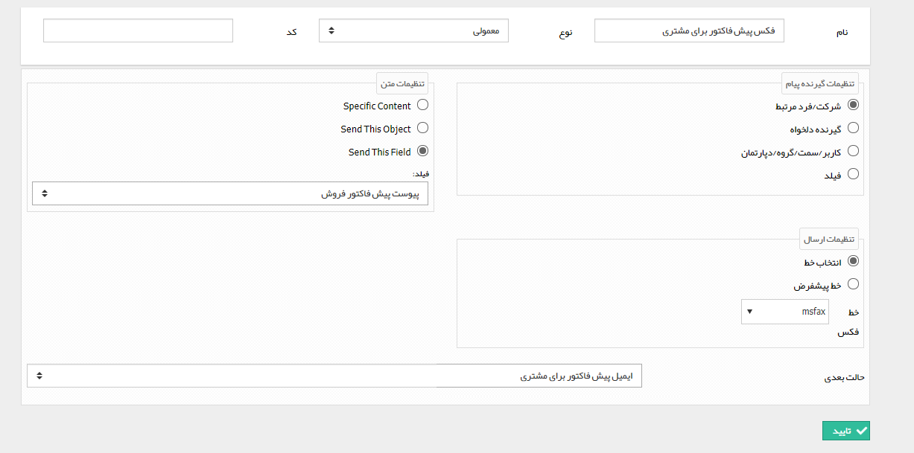

## ارسال فکس

لطفا ابتدا قسمت<a href="file%3A%2F%2F%2FC%3A%5CUsers%5CH.abasi%5CDesktop%5Chelp%5Cmd%20help%5CSettings%5CPersonalization-crm%5COverview%5CProcess-design%5CCreate-a-work-cycle%5CActivity%5CSend%20SMS%2C%20email%5CSend%20SMS%2C%20email.md" target="_blank"> ارسال پیامک-ایمیل-فکس-چاپ </a>را مطالعه کنید.

با انتخاب این فعالیت می توانید یک متن مشخص، پیش نمایش آیتم تحت چرخه یا پیش نمایش یک از فیلدهای وابسته به آن را از طریق فکس ارسال کنید.

> نکته مهم: در صورت انتخاب قالب چاپ این آیتم (Send This Object) و یا قالب چاپ یک فیلد وابسته (Send This Field) به عنوان محتوای ارسال، قالب چاپی آیتم از طریق فکس ارسال می شود.

به طور مثال فرض کنید می خواهید پیش نمایش پیش فاکتور مشتری، در فرآیند فرصت فروش از طریق فکس برای او ارسال شود. کافی است در قسمت تنظیمات متن، گزینه Send this  Field را انتخاب کرده و پس از آن فیلد پیش فاکتور را انتخاب کنید.

نکته: در صورتی که گزینه Specific Content را انتخاب کنید، باید متن ارسالی را از طریق ابزار WebClientTool تنظیم کنید. برای اطلاع در خصوص تنظیم محتوای یک فکس به قسمت تنظیم متن مراجعه کنید.

