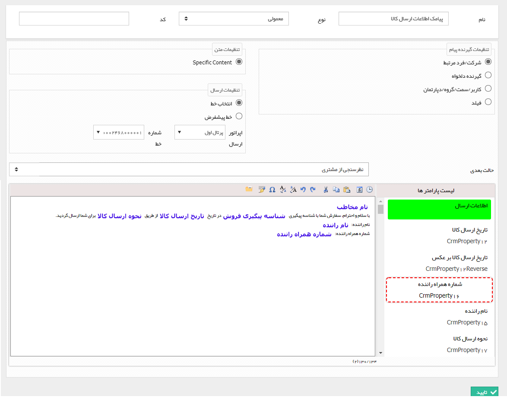

## ارسال پیام کوتاه

لطفا ابتدا قسمت ارسال<a href="file%3A%2F%2F%2FC%3A%5CUsers%5CH.abasi%5CDesktop%5Chelp%5Cmd%20help%5CSettings%5CPersonalization-crm%5COverview%5CProcess-design%5CCreate-a-work-cycle%5CActivity%5CSend%20SMS%2C%20email%5CSend%20SMS%2C%20email.md" target="_blank"> پیامک-ایمیل-فکس-چاپ  </a>را مطالعه کنید.

با استفاده از این فعالیت می توانید یک متن را برای ارسال از طریق پیام کوتاه تنظیم کنید.

به طور مثال فرض کنید می خواهید در فرآیند فرصت فروش، پس از ارسال کالا برای مشتری، اطلاعات ارسال برای او پیامک شود.

> نکته مهم: درارسال پیامک امکان فرستادن قالب چاپ این آیتم (Send This Object) و فرستادن قالب چاپ یک فیلد وابسته (Send This Field) موجود نیست.

