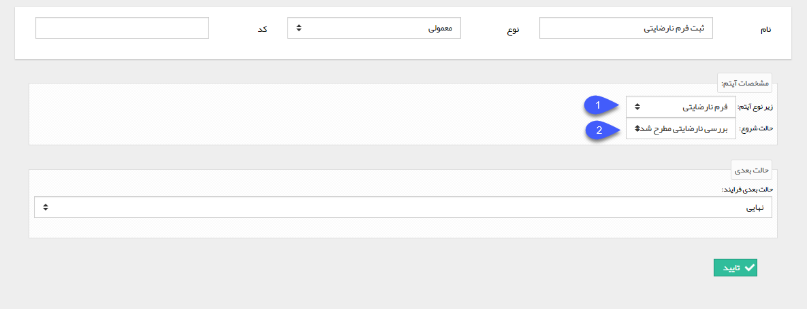

## شروع فرآیند

با استفاده از این فعالیت می توانید یک فرم برای هویت مرتبط، با این آیتم ثبت کنید، ینابراین زمانی که فرم مورد نظر چرخه فعال دارد، فرآیند مرتبط با آن نیز آغاز خواهد شد، همچنین می توانید حالت شروع این فرایند را مشخص کنید (یعنی فرآیند این فرم از حالت اولیه شروع نشود و از یک کارتابل یا فعالیت دلخواه شما شروع شود)، توجه داشته باشید که این فرم با فیلدهای خالی ثبت خواهد شد و هیچ مقداری را نمی توان به فیلدهای آن تخصیص داد

در اصل با استفاده از این فعالیت این امکان فراهم می شود که در دل یک فرایند ، فرآیند دیگری آغاز گردد .

به طور مثال فرض کنید که در فرایند طراحی شده روی آیتم تماس تلفنی، یک فعالیت شروع فرایند فرم نارضایتی مشتری را قرار دهیم، در این صورت کاربر مسئول میتواند در صورت دریافت شکایت از مشتری با استفاده از یک اقدام به راحتی فرایند فرم نارضایتی را فعال کند تا پیگیری مربوط به آن انجام شود.

برای ایجاد این فعالیت، پس از مشخص کردن نام و نوع فعالیت و همچنین تعیین حالت بعدی فرآیند، کافیست نوع فرم مورد نظر و حالت شروع فرآیند مربوط به آن فرم را مشخص کنید

1. در این قسمت، از لیست انواع فرم های ایجاد شده در قسمت [مدیریت فرم ها](https://github.com/1stco/PayamGostarDocs/blob/master/help%202.5.4/Settings/Personalization-crm/Form-management/Form-management.md) نوع فرم مورد نظر خود که قصد ایجاد آن با استفاده از این فعالیت را دارید، انتخاب کنید.

2. در صورتی که فرم انتخاب شده در مرحله قبل چرخه کاری فعال داشته باشد، در این قسمت لیست وضعیت های فرآیند آن (کارتابل ها و فعالیت ها) را مشاهده می کنید و می توانید وضعیت مورد نظر خود را انتخاب کنید. توجه داشته باشید غیر فعال بودن این فیلد به معنی نداشتن چرخه کاری فعال برای فرم مربوطه می باشد.