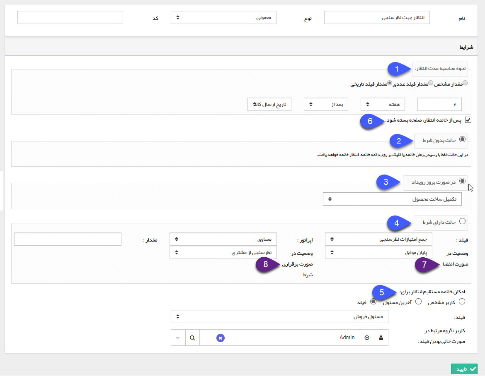
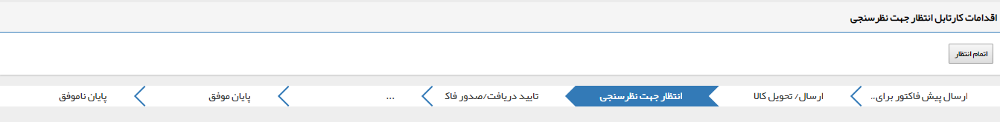

## انتظار

با استفاده از این فعالیت می توانید چرخه ی کاری را برای مدت زمان مشخصی  از کارتابل ها خارج و   به انتظار بفرستید(در چرخه کاری وقفه ایجاد کنید)، به طور کلی یک فرایند در جریان می تواند در یکی از کارتابل ها یا انتظارها باشد (در واقع انتظار تنها فعالیتی است که چرخه کاری بعد از ورود به آن بلافاصله به مرحله بعدی وارد نمیشود و طبق مدت زمان مشخص شده در تنظیمات فعالیت انتظار، چرخه را متوقف می کند)

این فعالیت میتواند کاربردهای متفاوتی داشته باشد، به طور مثال فرض کنید میخواهیم در انتهای فرایند فرصت فروش یک نظرسنجی از مشتری داشته باشیم، میتوانیم قبل از ورود فرایند به کارتابل نظرسنجی با استفاده از یک فعالیت انتظار، در زمان مناسبی کار را وارد کارتابل نظرسنجی کنیم(به طور مثال در تنظیمات این فعالیت مشخص کنیم که تا دو هفته بعد از تاریخ ارسال کالا چرخه در حالت انتظار قرار گیرد). 

تنظیمات این فعالیت به صورت زیر می باشد :

1. مدت انتظار: در این قسمت مدت زمان انتظار را مشخص کنید، مدت انتظار می تواند یک مقدار مشخص یا متغیر (بر اساس فیلدهای از نوع عدد و تاریخ باشد که روی آیتم تحت چرخه هستند) باشد. در صورتی که مقدار متغیر برای مدت انتظار در نظر بگیرید در واقع مدت انتظار با توجه به مقادیری که در فیلدها توسط کاربران وارد می شود، مشخص می گردد. به طور مثال در شکل بالا مدت انتظار تا 2 هفته بعد از تاریخی است که در فیلد تاریخ ارسال کالا وارد گردد.

2. حالت بدون شرط: در صورتی که این گزینه را انتخاب کنید، انتظار تنها با فرا رسیدن زمانی که در مرحله قبل مشخص کرده اید، به پایان خواهد رسید و به مرحله ای که در قسمت وضعیت در صورت انقضا مشخص کردید،  منتقل می گردد.(به استثناء خاتمه مستقیم انتظار)

3. در صورت بروز رویداد: در صورت انتخاب این گزینه،می توانید شرط شکستن این انتظار را فراخوانی رویداد در یک فرآیند دیگر تعیین کنید. برای اطلاعات بیشتر فعالیت فرخوانی رویداد را مطالعه فرمایید.

4. حالت دارای شرط: در صورتی که این گزینه را انتخاب کنید، علاوه بر مدت مشخص شده در مرحله قبل، می توانید یک شرط نیز برای به پایان رسیدن انتظار بر اساس یکی از فیلدهای از نوع عدد آیتم تحت چرخه در نظر بگیرید. توجه داشته باشید که حالت بعدی فرآیند در صورت انقضای انتظار (فرار رسیدن زمان مشخص شده) و بر قراری شرط می تواند متفاوت باشد.

> نکته: در صورت برقراری شرط ممکن است که حداکثر تا یک ساعت برای عملکرد این شرط زمان نیاز باشد.

5.  خاتمه مستقیم انتظار: در این قسمت می توانید یک کاربر/گروه و یا سمت را به عنوان مالک انتظار مشخص کنید، مالک انتظار می تواند قبل از فرا رسیدن مدت انقضای انتظار یا برقراری شرط، انتظار را به صورت دستی به پایان برساند (انتظار را بشکند) مالک انتظار می تواند یک کاربر مشخص، آخرین مسئول یکی از کارتابل های فرآیند یا یک فیلد از نوع لیست کاربر/گروه آیتم تحت چرخه باشد، در صورتی که گزینه فیلد را انتخاب کنید می توانید یک کاربر/گروه و یا مسئول پروفایل ها را به عنوان مالک انتظار در صورت خالی بودن فیلد مربوطه در نظر بگیرید.

6. در صورتی که این گزینه فعال باشد، پس از اتمام دستی انتظار توسط کاربر مالک انتظار، صفحه آیتم مربوطه بسته خواهد شد.

**حالت های بعدی انتظار**

انتظار می تواند دو حالت بعدی داشته باشد، حالتی که با پایان رسیدن مدت مشخص شده و حالتی که در صورت برقراری شرط یا شکستن انتظار، فرآیند به آن وارد می گردد می توانند متفاوت باشند.

7. وضعیت در صورت انقضا: مرحله ای که گردش کار در صورت انقضای مدت زمان انتظار(حالت بدون شرط) باید به آن وارد شود را تعیین کنید.

8. وضعیت در صورت برقراری شرط: مرحله ای که در صورت برقراری شرط یا شکستن انتظار، گردش کار باید به آن وارد شود را تعیین کنید.

