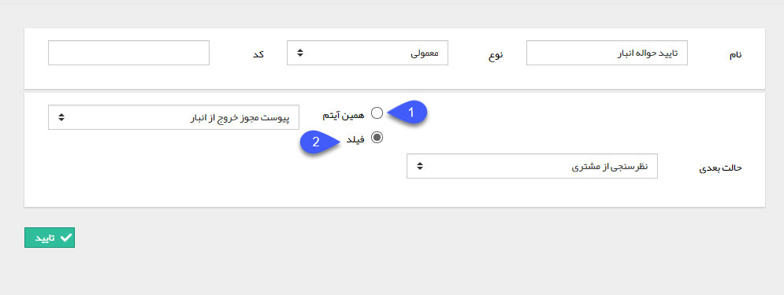

## تایید/رد تراکنش انبار

> مسیر دسترسی:  **تنظیمات** >**شخصی سازی crm** > **نمای کلی** > **کلید ویرایش چرخه کاری در هر موجودیت** > **ایجاد فعالیت** > **تایید/رد تراکنش‌هیا انبار**

با استفاده از این فعالیت می توانید یک تراکنش انبار (حواله/رسید) را تایید یا رد کنید

به طور مثال فرض کنید در چرخه کاری آیتم فرصت فروش، حواله انبار توسط یکی از کارشناسان صادر می شود و پس از آن در کارتابل تحویل کالا به رویت و تایید انباردار می رسد. اگر بخواهید پس از کارتابل تحویل کالا به مشتری که به معنی خروج قطعی کالا از انبار می باشد، حواله انبار به صورت خودکار توسط سیستم تایید شود و انباردار برای تایید آن به کارتابل خود رجوع نکند، می توانید از فعالیت تایید تراکنش انبار استفاده کنید

پس از تعیین آیتمی که قصد تایید/رد آن را دارید، نام، نوع و حالت بعدی فعالیت را تعیین کرده و روی دکمه تایید کلیک کنید

1. همین آیتم: در صورتی که چرخه کاری بر روی آیتم از نوع تراکنش انبار پیاده سازی شده است و قصد تایید/رد آن را دارید، این گزینه را انتخاب کنید.

2. فیلد: یک فیلد وابسته از نوع رسید/حواله انبار را میتوانید برای تایید و یا رد شدن انتخاب کنید. در صورت انتخاب این گزینه فیلد مورد نظر خود را از لیست انتخاب کنید.

> نکته مهم: در صورتی که چرخه کاری فعال روی تراکنش های انبار داشته باشید، این آیتم ها پس از صدور، برای تایید در کارتابل تراکنش های در انتظار نمایش داده نخواهند شد و باید با استفاده از فرآیند و این فعالیت ها، نحوه تایید/رد آن ها را تعیین کنید. 

