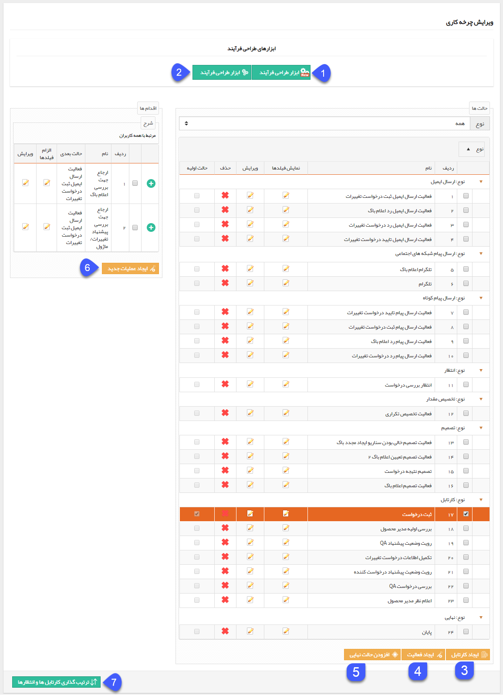

## ساخت چرخه (Workflow) در نرم افزار:

برای ساخت چرخه در نرم افزار 3 مفهوم اساسی وجود دارد: کارتابل، اقدام، فعالیت.

کارتابل: هر کارتابل یک مرحله از انجام کار( فرآیند) است که شامل اقدام های تعریف شده بر روی آن است که توسط نیروی انسانی (کاربران نرم افزار) انجام می شود. هر کارتابل باید یک

 مسئول داشته باشد.

اقدام: خروجی کارتابل برای ارتباط با سایر مراحل چرخه یک اقدام نامیده میشود در واقع اقدام عبارتست از مسئولیت (های) مسئول کارتابل در آن مرحله از گردش کار بایستی انجام گیرد و در

 صورت انجام آن ها فرایند به مرحله دیگر میرود. هر کارتابل می تواند چندین اقدام داشته باشد که بر اساس شرایط آن مرحله از کار و حالت های ممکن، ایجاد می گردند.

فعالیت: مراحلی از گردش کار که به صورت خودکار توسط سیستم انجام می شوند. برای مثال فعالیت هایی مانند ارسال پیام کوتاه، ایمیل، تصمیم گیری سیستمی .....

1. ابزار طراحی فرآیند جدید: به [ ابزار طراحی فرآیند به صورت شماتیک با ابزار پیام گستر](https://github.com/1stco/PayamGostarDocs/blob/master/help%202.5.4/Settings/Personalization-crm/Overview/Process-design/abzar-tarahi/abzar-tarahi.md) مراجعه کنید.

2. ابزار طراحی فرآیند: به  ابزار طراحی فرآیند به صورت شماتیک با ابزار گوگل مراجعه کنید .

3. افزودن کارتابل: به [ کارتابل ](https://github.com/1stco/PayamGostarDocs/blob/master/help%202.5.4/Settings/Personalization-crm/Overview/Process-design/Create-a-work-cycle/Cardboard/Cardboard.md)مراجعه کنید.

4. افزودن فعالیت: به [ فعالیت ](https://github.com/1stco/PayamGostarDocs/blob/master/help%202.5.4/Settings/Personalization-crm/Overview/Process-design/Create-a-work-cycle/Activity/Activity.md)مراجعه کنید.

5. افزودن حالت نهایی: می توانید حالت نهایی چرخه کاری را ایجاد کنید. به[ حالت نهایی](https://github.com/1stco/PayamGostarDocs/blob/master/help%202.5.4/Settings/Personalization-crm/Overview/Process-design/Create-a-work-cycle/Final-mode/Final-mode.md) مراجعه کنید.

6. افزودن عملیات جدید: با انتخاب یکی از کارتابل ها و کلیک روی این دکمه می توانید یک[ اقدام](https://github.com/1stco/PayamGostarDocs/blob/master/help%202.5.4/Settings/Personalization-crm/Overview/Process-design/Create-a-work-cycle/Action/Action.md) جدید برای کارتابل مربوطه ایجاد کنید.

7. ترتیب گذاری کارتابل ها و انتظارها: به [ترتیب گذاری کارتابل ها و انتظارها  ](https://github.com/1stco/PayamGostarDocs/blob/master/help%202.5.4/Settings/Personalization-crm/Overview/Process-design/tartibgozari-cartable/tartibgozari-cartable.md)مراجعه کنید.

