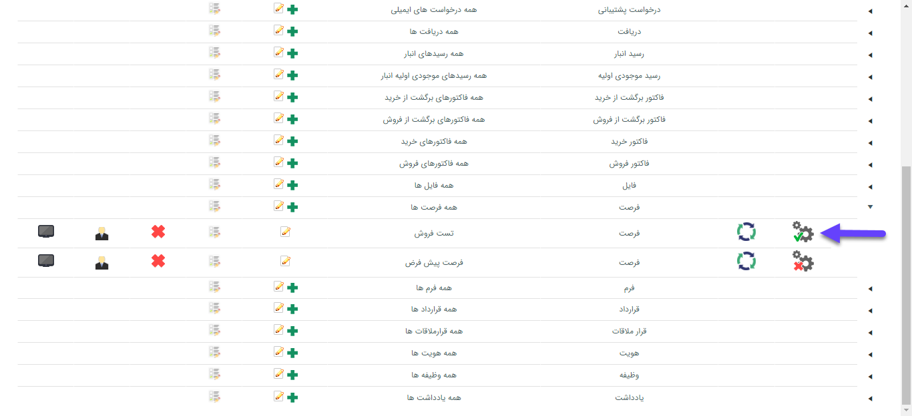

## فعالسازی فرآیند

> مسیر دسترسی:  **تنظیمات** >**شخصی سازی crm** > **نمای کلی** > **فعال کردن کلید "تحت چرخه کاری"**

فعالسازی فرآیند استقرار داده شده بر روی هر موجودیت باید از مسیر ذکر شده انجام شود. تا موجودیت پس از ذخیره در چرخه این فرآیند قرار گیرد.

