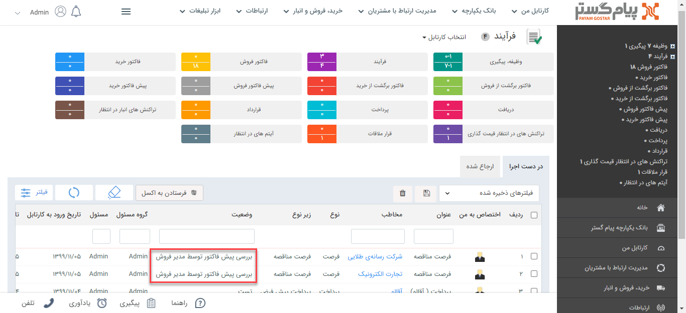
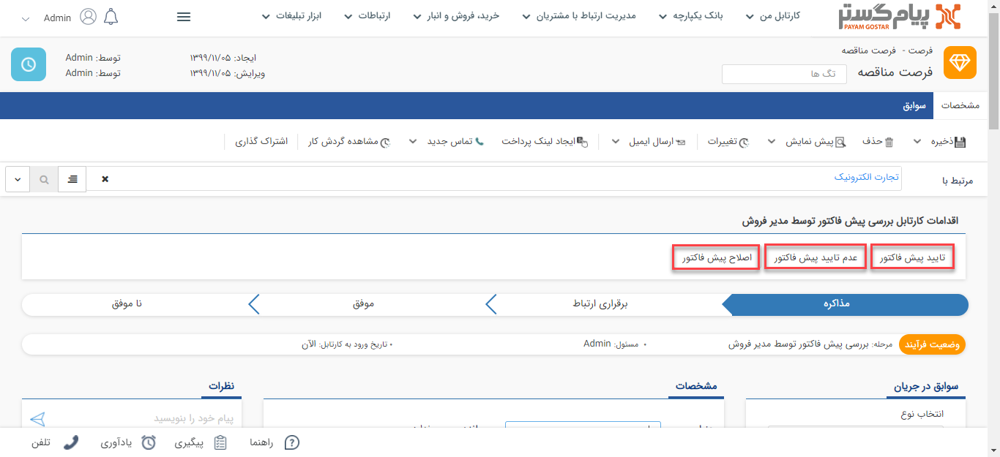

## استفاده از فرایند

آیتم تحت فرآیند پس از ذخیره وارد مراحل تعریف شده (کارتابل‌ها، فعالیت‌ها) خواهد شد.

در صورتی که آیتم وارد کارتابل شود، آن آیتم برای مسئول آن کارتابل ارسال خواهد شد.(برای مطالعه بیشتر به بخش کارتابل مراجعه کنید.) سپس کاربر مسئول می‌تواند آن فرآیند را در کارتابل فرآیند‌های خود  مشاهده کند و بر اساس اقدام‌های تعریف شده بر روی آن کارتابل، فرآیند را به مسیر موردنظر هدایت کند.

> مسیر دسترسی به کارتابل فرآیند:  **صفحه‌ی خانه** >**کارتابل من** > **فرآیند**

برای نمونه فرصت مناقصه‌ی ثبت شده، در مرحله‌ی بررسی پیش فاکتور توسط مدیر فروش میباشد.  این پیش فاکتور در این مرحله در کارتابل فرآیند‌های ادمین مقابل مشاهده است زیرا مسئول این مرحله ادمین می‌باشد.

همچنین اقدام‌های تعریف شده برای این مرحله توسط ادمین قابل مشاهده و انجام می‌باشد.

 مراحل فرآیند می‌تواند کارتابل باشد که باید توسط کاربران بررسی و به مراحل دیگر منتقل گردد و یا فعالیت باشد که بصورت خودکار توسط سیستم انجام می شود و پس از انجام به مراحل تعیین شده پس از آن منتقل می‌گردد. 
 
آیتم با همین روال تمامی مراحل را طی می‌کند و در مرحله‌ی پایانی فرآیند به اتمام می‌رسد.
