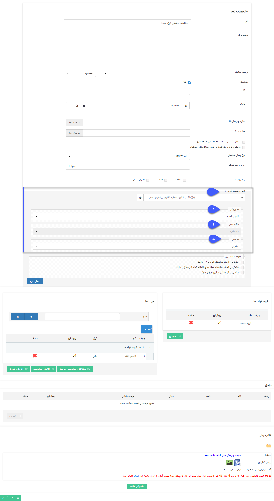

## شخصی سازی هویت‌ها

از این قسمت می‌توانید تنظیمات مرتبط با هویت‌ها را مشخص نمایید.

لطفا ابتدا [تنظیمات مشترک آیتم‌های سیستم](https://github.com/1stco/PayamGostarDocs/blob/master/help%202.5.4/Settings/Personalization-crm/Overview/General-information/Shared-information-of-system%20items/Shared-information-of-system%20items.md) را مطالعه کنید.

علاوه بر تنظیمات عمومی، تنظیمات اختصاصی هویت‌ها به شرح زیر می باشد.

1. **الگوی شماره گذاری:** الگوی شماره مشتری را از بین الگوهایی که قبلا ساخته شده اند انتخاب کنید یا الگوی جدیدی به آن اختصاص دهید.(برای مطالعه بیشتر به بخش [الگو شماره گذاری](https://github.com/1stco/PayamGostarDocs/blob/master/help%202.5.4/Settings/Numbering-template/Numbering-template.md) مراجعه کنید.)

2. **انواع پروفایل:** به منظور آشنایی با این قسمت، بخش [انواع پروفایل](https://github.com/1stco/PayamGostarDocs/blob/master/help%202.5.4/Integrated-bank/Database/mafahim/anva-hoviat.md) ار مطالعه کنید.

3. **عملکرد هویت:** به منظور آشنایی با این قسمت، بخش [عملکرد هویت](https://github.com/1stco/PayamGostarDocs/blob/master/help%202.5.4/Integrated-bank/Database/mafahim/amalkard-hoviat.md) را مطالعه کنید.

4. **نوع هویت:** به منظور آشنایی با این قسمت، بخش [نوع هویت](https://github.com/1stco/PayamGostarDocs/blob/master/help%202.5.4/Integrated-bank/Database/mafahim/amalkard-hoviat.md) را مطالعه کنید.

