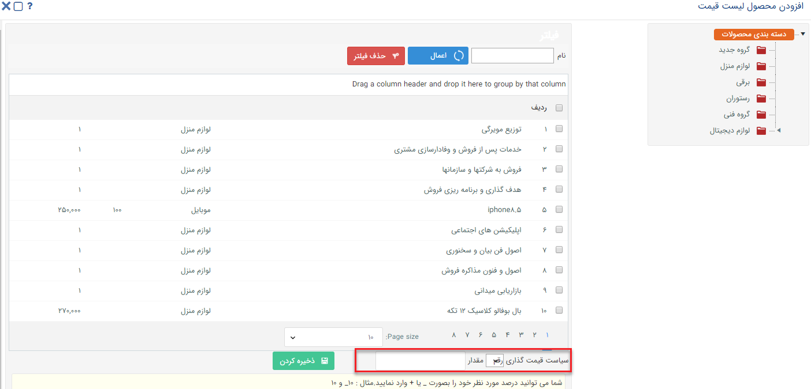
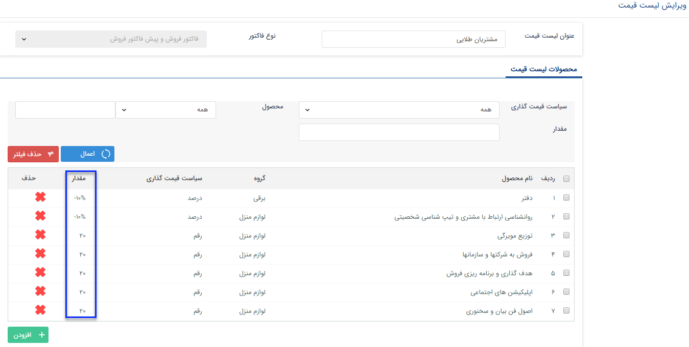

## مدیریت لیست قیمت ها

در این قسمت می توانید بر حسب نیاز خود لیست قیمت های مختلفی را برای انواع فاکتور و پیش فاکتور ایجاد کنید. در لیست قیمت های ایجاد شده می توانید درصد تخفیف یا قیمت مشخصی برای برخی از محصولات خود در نظر بگیرید و در زمان مناسب از آن استفاده کنید. علاوه بر این قابلیت اعمال خودکار لیست قیمت در صورت قرار گرفتن مشتری در یک کلاس مشخص نیز وجود دارد. برای اطلاعات بیشتر [مدیریت کلاس بندی مشتریان ](https://github.com/1stco/PayamGostarDocs/blob/master/help%202.5.4/Settings/Customer-classification-management/Customer-classification-management.md)را مطالعه کنید.

همان طور که مشاهده می کنید لیست قیمت های تعریف شده در این قسمت قابل مشاهده، ویرایش و حذف هستند. همچنین با کلیک بر روی دکمه اضافه کردن می توانید لیست قیمت جدیدی را ایجاد نمایید.

 

ابتدا عنوان دلخواهی برای لیست قیمت برگزینید و پس از آن مشخص کنید که این لیست قیمت برای کدام نوع از فاکتورها لحاظ گردد. پس از تعیین این موارد و ذخیره کردن لیست، می توانید با استفاده از کلید افزودن محصولات و سیاست قیمت گذاری آن ها در این لیست را تعریف کنید.

در این قسمت می توان  سیاست قیمت گذاری را به ازای هر محصول و یا برای یک دسته از محصول تعریف کنید .

دو سیاست برای قیمت گذاری محصولات وجود دارد :

سیاست قیمت گذاری براساس رقم : اگر سیاست قیمت گذاری برای محصولات رقم خاصی تعریف شود، در فاکتور و پیش فاکتورهایی که از این لیست قیمت استفاده می شود ، برای این محصول همین رقم تعیین شده  بعنوان قیمت واحد در نظر گرفته می شود .

سیاست قیمت گذاری براساس درصد : اگر سیاست قیمت گذاری برای محصولات درصد تعریف شود در فاکتور و پیش فاکتور هایی که از این لیست قیمت استفاده می گردد، این درصد تعریف شده در قیمت واحد محصول تاثیر می گذارد .

> نکته : اگر درصد تعریف شده برای قیمت گذاری منفی باشد ، قیمت واحد محصول براساس این درصد کاهش می یابد و اگر مثبت باشد قیمت واحد براساس درصد تعریف شده افزایش می یابد .

می توانید سیاست قیمت گذاری متفاوتی برای محصولات مختلف در یک لیست قیمت در نظر بگیرید.

