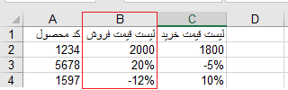

## ورود اطلاعات لیست قیمت‌ها از طریق اکسل

با قابلیت جدید ورود اطلاعات از طریق اکسل، می‌توانید لیست قیمت‌ها را در نرم‌افزار وارد کنید.

برای ورود اطلاعات می‌توانید در مدیریت لیست قیمت‌ها با استفاده از کلید ورود اطلاعات از اکسل اقدام کنید.

## 1.مراحل ورود اطلاعات 

**1)	گام اول ( بارگذاری فایل)**

در این مرحله می‌توانید فایل اکسل نمونه‌ای را برای ورود اطلاعات خود دانلود کنید.

در این مرحله فایل اکسل خود را انتخاب یا از طریق drag & drop آپلود کنید، با کلیک بر روی مرحله بعد وارد مرحله دوم شوید.

**2)	گام دوم (تنظیمات)**

انتخاب روش های ورود اطلاعات : 

1.	افزودن اطلاعات جدید:با انتخاب این روش لیست قیمت‌های جدید در فایل اکسل به نرم‌افزار اضافه می‌شوند.

می‌توانید مبنای شناسایی را نام لیست قیمت انتخاب کنید تا براساس آن جستجو انجام شود، در صورت تکراری نبودن نام لیست قیمت، آن لیست قیمت به نرم‌افزار اضافه می‌شود.

2.	ویرایش اطلاعات موجود: در این روش، براساس نام لیست قیمت جستجوی تکراری بودن انجام می‌شود و در صورت تکراری بودن، لیست قیمت‌ دارای این نام ویرایش می شود.

انتخاب نحوه ویرایش:

•	افزودن محصولات جدید به لیست قیمت موجود: در این روش تنها محصولاتی که در لیست قیمت موجود در نرم افزار، وجود ندارند را به لیست قیمت اضافه می‌کند.

•	بروز رسانی مقادیر محصولات موجود: با استفاده از این حالت تنها مقادیر رقم یا درصد تعریف شده برای محصولات موجود در لیست قیمت ویرایش می‌شوند.

•	حذف محصولات موجود در لیست قیمت با وارد کردن کاراکتر DL در سلول مقدار آن: با انتخاب این حالت و استفاده از کاراکتر DL در سلول مقدار برای محصول، آن محصول از لیست قیمت حذف می‌شود. 

3.	افزودن و ویرایش: در این روش با استفاده از نام لیست قیمت، جستجوی تکراری بودن انجام می¬شود. در صورت تکراری بودن نام لیست قیمت در نرم‌افزار، آن لیست ویرایش می‌شود و در غیر این صورت لیست قیمت جدید به نرم‌افزار اضافه می‌شود. 

نحوه‌ی ویرایش را با توجه به توضیحات مرحله دوم می‌توانید انتخاب کنید.

**3)	گام‌ سوم (نگاشت فیلدها)**
در این مرحله سرستون‌های فایل اکسل که نام لیست قیمت‌ها می‌باشد در بخش فیلدهای شما نمایش داده می شود و در بخش فیلدهای ماشین شما نوع فاکتورهایی که می‌خواهید این لیست قیمت‌ها برای آن ها تعریف شود نمایش داده می‌شود.

در هر بار ورود اطلاعات تنها یک لیست قیمت را می‌توانید به هر کدام از نوع فاکتورها اختصاص دهید.

**4)	گام چهارم (شروع بارگذاری)**

در صورت مشکل در بارگذاری اطلاعات، خطای مرتبط در این گام نمایش داده می‌شود و فایل اکسلی شامل لیست قیمت‌های دارای خطا قابل دریافت می‌باشد، که پس از اصلاح خطاها بارگذاری مجدد فایل انجام شود.

در منوی گزارش‌ها، بخش وضعیت عملیات انبوه می‌توان نتایج ورود اطلاعات را مشاهده کرد، همچنین در صورت بروز خطا فایل اکسلی شامل آیتم‌های دارای خطا و علت خطای رخ داده قابل دریافت می‌باشد.

## 2.نکات مربوط به ورود اطلاعات لیست قیمت‌ها

•	برای ویرایش لیست قیمت باید نام لیست قیمت تعریف شده در اکسل با نام لیست قیمت موجود کاملا یکسان باشد.

•	اگر میخواهید محصول تعریف شده در اکسل در برخی از لیست قیمت‌ها تعریف نشود یا در هنگام ویرایش لیست قیمت، ویرایش نشود و مقدار پیشین خود را داشته باشد، باید سلول مقدار آن  در لیست قیمت مورد نظر خالی باشد.

•	در هر فایل اکسل حداکثر می توان 4 لیست قیمت به ازای هر "نوع فاکتور" که در تنظیمات لیست قیمت موجود است، وارد نمود.

•	در فایل اکسل در ستون لیست قیمت¬ها، سیاست قیمت گذاری هم می تواند به صورت درصد و هم به صورت مقدار باشد. 

## 3.مجوز مورد نیاز برای ورود اطلاعات لیست قیمت‌ها

•	برای ورود اطلاعات لیست قیمت‌ها از طریق اکسل کاربر باید مجوز مدیریت محصولات را داشته باشد.

## 4.فرمت ورود اطلاعات لیست قیمت‌ها

•	ستون اول: کد محصولات 

•	ستون دوم: سیاست قیمت گذاری(درصد و رقم)

-حالت درصد:

گذاشتن علامت درصد در سلول مربوطه

 تعداد رقم اعشار مجاز درصد: 2 رقم 
 
-حالت رقم: 

تعداد رقم اعشار مجاز رقم: با توجه به تعداد تعیین شده در قسمت "تنظیمات ارز"

