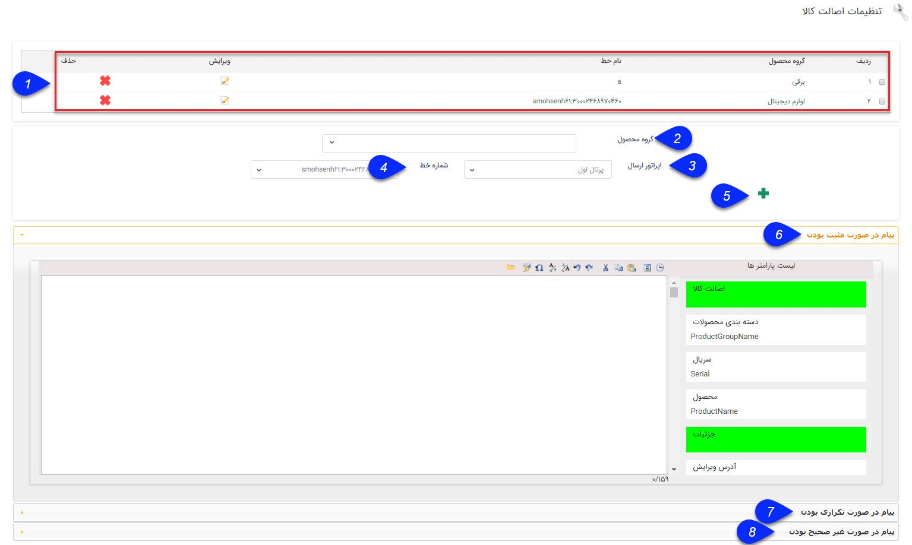

## مدیریت  اصالت کالا

از تنظمیات نرم‌افزار بخش مدیریت اصالت کالا، تنظمیات مرتبط با اصالت کالا انجام می شود. با استفاده از تنظیمات این صفحه نرم افزار قادر خواهد بود که پیامک حاوی سریال یک محصول را از طرف مشتری بر روی خط تنظیم شده دریافت نموده و پاسخ مناسب در خصوص اینکه آیا آن کالا از شما خریداری شده است یا خیر را ارسال کند.

> نکته : برای استفاده از این امکان باید کالاهایی که توسط رسیدهای مختلف به انبارها اضافه می شوند دارای سریال باشند.  همچنین حداقل یک خط پیامکی با قابلیت دریافت بر روی نرم افزار باید تعریف شده باشد.

1. لیست اصالت کالا: لیست گروه محصولاتی که پیام تشخیص اصالت کالا را برای آنها تنظیم کرده اید همراه با خط دریافت و ارسال پیام در این قسمت نمایش داده می شود، در صورت نیاز می توانید آنها را ویرایش یا حذف نمایید.

2. گروه محصول: گروهی از محصولاتی که می خواهید برای تشخیص اصالت کالا در نظر گرفته شوند را انتخاب نمایید.

3. اپراتور ارسال: اپراتوری که خط پیامک بر روی آن تنظیم شده است را انتخاب نمایید.

4. خط: خط پیامک را انتخاب نمایید. مخاطب باید شماره سریال محصول خریداری شده را به این شماره ارسال کند. (باید امکان دریافت بر روی این خط فراهم باشد.)

5.  اضافه کردن: برای اضافه کردن گروه محصول جدید به لیست اصالت کالا، پس از وارد کردن نام گروه محصول، اپراتور ارسال، خط و پیام های آن روی این گزینه بایستی کلیک کنید.

6. پیام در صورت مثبت بودن: در صورتی که پیامک ارسال شده توسط مخاطب حاوی شماره سریالی باشد که در انبار قبلا توسط رسید وارد شده باشد، نرم افزار یک پاسخ مثبت بایستی برای او ارسال کند که از این بخش  میتوان متن پیامک را در این قسمت تنظیم کرد.

7. پیام در صورت تکراری بودن: در صورتی که پیامک ارسال شده توسط مخاطب حاوی شماره سریالی باشد که قبلا ارسال شده است، نرم افزار یک پاسخ برای او ارسال خواهد کرد تا او را مطلع سازد که این سریال قبلا فعال شده است. متن پیامک را در این قسمت باید درج نمایید.

8. پیام در صورت غیر صحیح بودن: در صورتی که پیامک ارسال شده توسط مخاطب حاوی شماره سریالی باشد که در انبار وجود نداشته باشد، نرم افزار یک پاسخ برای او ارسال خواهد کرد. متن پیامک را در این قسمت باید درج نمایید.