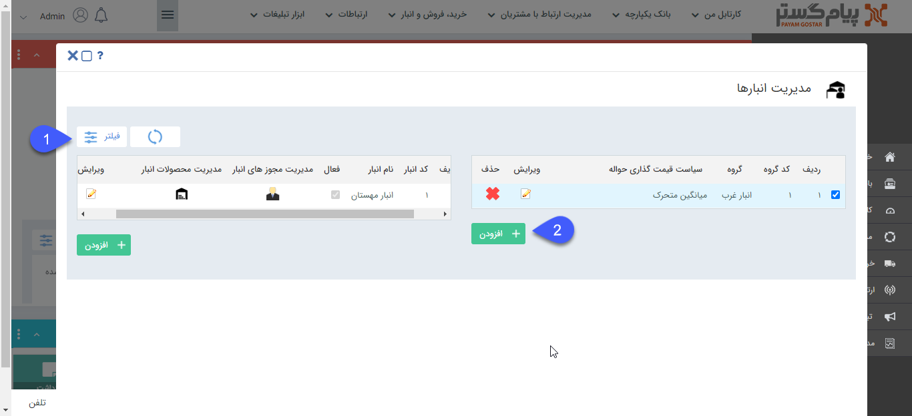
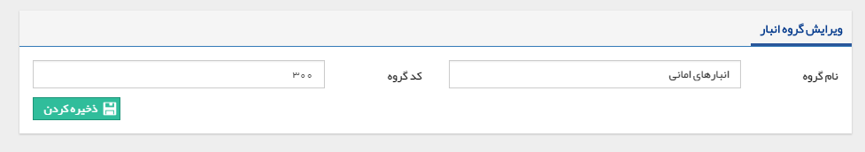
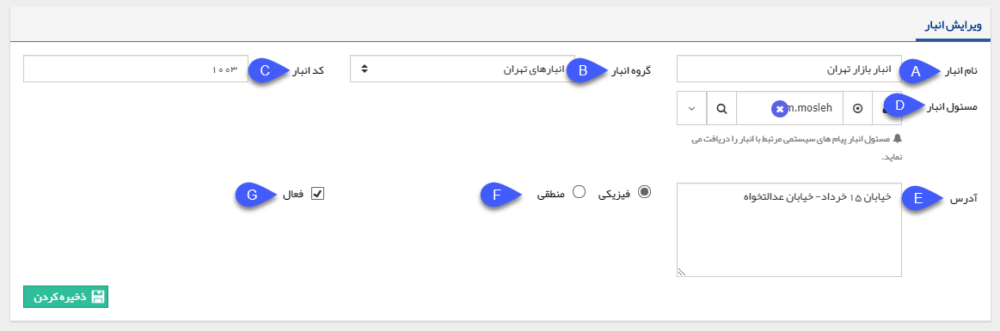
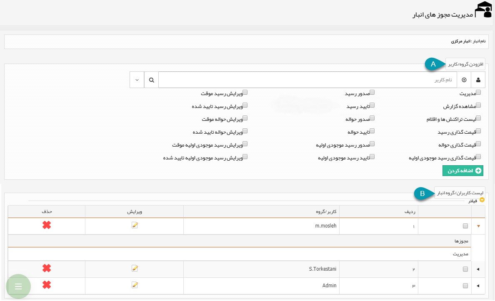
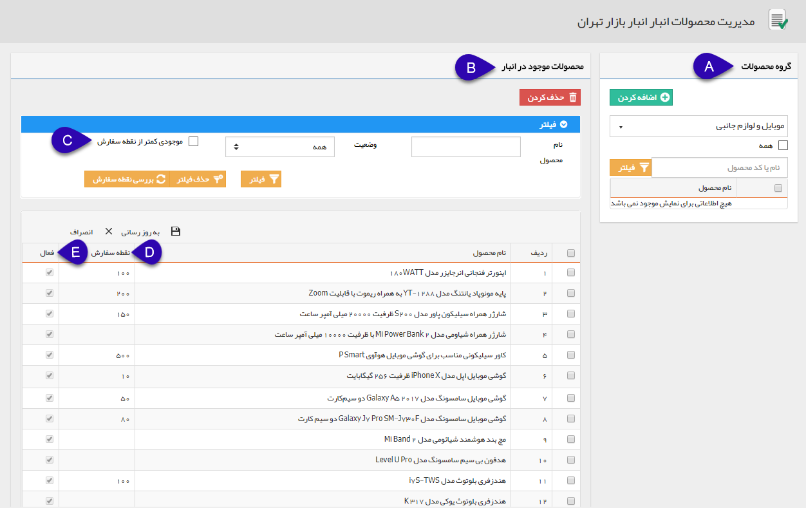

## مدیریت انبارها

در این صفحه می توانید گروه های انباری مختلف ایجاد و برای هر گروه انباری، انبارهای مختلفی را تعریف کنید. مجوز های هر انبار و محصولات مجاز در آن نیز در این قسمت تعیین می گردد.

> نکته: لطفا ابتدا محصولات خود را در قسمت[ مدیریت محصولات ](https://github.com/1stco/PayamGostarDocs/blob/master/help%202.5.4/Basic-Information/Product%20management/Product-management.md)دسته بندی و ایجاد کنید.

1. فیلتر: می توانید با استفاده از فیلترهای موجود انبار مورد نظر خود را بیابید.

2. گروه انبار جدید: می توانید یک گروه انباری جدید تعریف کنید، نام گروه انبار و کد دلخواه خود را وارد کرده و روی دکمه ذخیره کردن کلیک کنید.

3. انبار جدید: با کلیک بر روی این دکمه می توانید یک انبار جدید ایجاد کنید. 

A. نام انبار: نام انبار را تعیین کنید.

B. گروه انبار: گروه انبار مربوط به این انبار را از لیست گروه های انبار تعریف شده انتخاب کنید. 

C. کد انبار: کد انبار خود را تعیین کنید.

D. مسئول انبار: می توانید یک کاربر/گروه/سمت را به عنوان مسئول این انبار تعیین کنید، مسئول انبار پیام سیستمی مربوط به انبار (مانند پیام نقطه سفارش کالا) را دریافت می کند.

E. آدرس: نشانی انبار مورد نظر را می توان تعیین کرد.

F. انبار فیزیکی: به این معنی است که این انبار واقعا وجود دارد و محصولات به صورت فیزیکی به این انبار وارد و خارج می شوند.

   انبار منطقی: به این معنی است که انبار وجود فیزیکی ندارد و تنها به صورت فرضی ایجاد شده است.

مثال: انبار های مانند انباری که برای کالاهای امانی در نظر گرفته می شود از نوع منطقی اند، یعنی زمانی که کالا را برای امانت به فروشنده می دهند آن را از انبار اصلی خارج نمی کنند و تنها آن را به انبار امانی منتقل می کنند، اگر فروش رفت، حواله مرتبط با آن صادر می شود و اگر به فروش نرفت و برگشت خورد، از انبار امانی به انبار اصلی دوباره منتقل می شود.

G.  فعال: وضعیت فعال بودن انبار را تعیین کنید. ( در صورتی که به هر دلیل انبار به حالت تعلیق یا تعطیل کامل در آمد میتوانید آن را غیر فعال کنید.)

4. مدیریت مجوز های انبار: در این قسمت مجوزهای انبار را برای کاربران نرم افزار تعیین کنید.

> نکته مهم: توجه داشته باشید حتی مدیر سیستم مجوزهای انبار را ندارد و هر کاربری که بخواهد عملیات مرتبط با انبار مانند صدور، تایید یا قیمت گذاری تراکنش های انبار را انجام دهد، باید مجوز مربوطه را در آن انبار داشته باشد.

A. افزودن کاربر/گروه: برای تعریف مجوزهای این انبار برای یک کاربر/گروه جدید، ابتدا و یا گروه مورد نظر را انتخاب کنید، مجوز های مورد نظر را انتخاب کرده و آن را اضافه کنید.

> نکته: مجوز مدیریت شامل تمامی مجوز های آن انبار می شود.

B. لیست کاربران/گروه انبار: در این قسمت لیست کاربران و گروه های دارای مجوز در این انبار به همراه مجوزهای مربوط به هریک مشاهده می شود، درصورت نیاز می توانید آن ها را ویرایش و یا حذف کنید.

5. مدیریت محصولات انبار: در این قسمت محصولاتی که می توانند در آن انبار باشند ( مجاز هستند) را تعیین کنید. از بین تمامی محصولات تعریف شده در مدیریت محصولات تنها این محصولات در حواله ها و رسید های این انبار قابل انتخاب خواهند بود.

A. اضافه کردن محصول: از بین محصولات تعریف شده در ق[سمت مدیریت محصولات](https://github.com/1stco/PayamGostarDocs/blob/master/help%202.5.4/Basic-Information/Product%20management/Product-management.md)، محصول/محصولات مورد نظر خود که می خواهید به عنوان محصول مجاز این انبار تعیین گردد را انتخاب و به لیست اضافه کنید.

B. محصولات مجاز انبار: در این قسمت لیست محصولاتی که به عنوان محصول مجاز در این انبار تعیین شده اند به همراه جزئیاتی مانند نقطه سفارش هریک از محصولات در این انبار قابل مشاهده است، می توانید با استفاده از فیلترهای موجود محصول/محصولات مورد نظر خود را یافته و اطلاعات آن را ویرایش کنید.

C. موجودی کمتر از نقطه سفارش: با استفاده از این فیلتر می توانید لیست محصولاتی که موجودی فعلی آن ها در انبار کمتر از نقطه سفارش تعیین شده است را در اختیار داشته باشید. ابتدا با کلیک بر روی دکمه بررسی نقطه سفارش از بروز بودن وضعیت موجودی محصولات اطمینان حاصل کنید.

D. نقطه سفارش: در این ستون، نقطه سفارش هریک از محصولات در این انبار نمایش داده می شود، در صورت نیاز می توانید آن ها را ویرایش کنید.

E. فعال/غیرفعال: در صورتی که یک محصول در یکی از تراکنش های انبار وارد گردد، امکان حذف آن از محصولات مجاز انبار وجود ندارد، اما برای جلوگیری از ثبت آن در تراکنش های بعدی می توانید وضعیت آن را در انبار غیرفعال کنید.

 