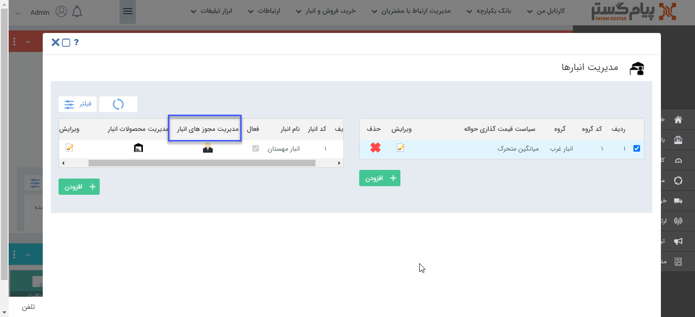
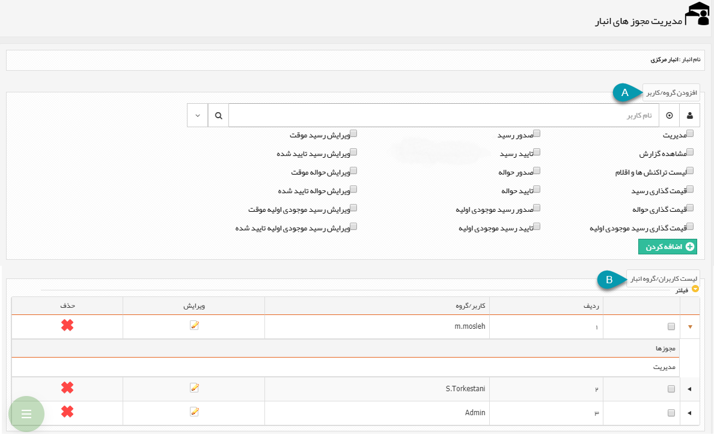

## مدیریت مجوزهای انبار 

> مسیر دسترسی:  **تنظیمات** >**مدیریت انبارها** > **انتخاب گروه انبار** > **برای هر انبار** > **مدیرت مجوزهای انبار** 

با استفاده از کلید مدیریت مجوزهای انبار می‌توان مجوزها کاربران در هر انبار را تعیین کرد.

**نکته مهم:** توجه داشته باشید حتی مدیر سیستم مجوزهای انبار را ندارد و هر کاربری که بخواهد عملیات مرتبط با انبار مانند صدور، تایید یا قیمت گذاری تراکنش های انبار را انجام دهد، باید مجوز مربوطه را در آن انبار داشته باشد.

A. افزودن کاربر/گروه: برای تعریف مجوزهای این انبار برای یک کاربر/گروه جدید، ابتدا و یا گروه مورد نظر را انتخاب کنید، مجوز های مورد نظر را انتخاب کرده و آن را اضافه کنید.

**نکته:** مجوز مدیریت شامل تمامی مجوز های آن انبار می شود.

B. لیست کاربران/گروه انبار: در این قسمت لیست کاربران و گروه های دارای مجوز در این انبار به همراه مجوزهای مربوط به هریک مشاهده می شود، درصورت نیاز می توانید آن ها را ویرایش و یا حذف کنید.

