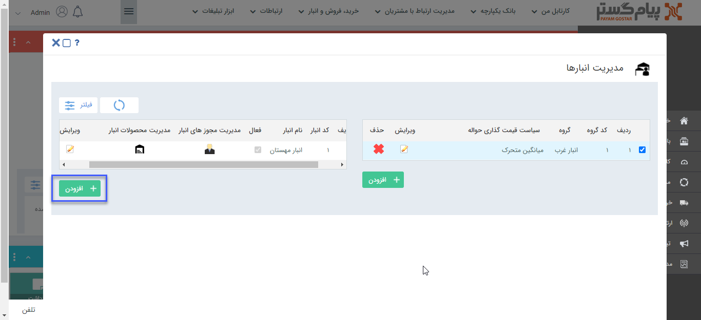

## تعریف انبار جدید

> مسیر دسترسی:  **تنظیمات** >**مدیریت انبارها** > **انتخاب گروه انبار** > **افزودن انبار** 

پس از ایجاد گروه انبار مورد نظر، می‌توان با استفاده از کلید افزودن در این بخش انبار جدیدی را ایجاد کرد.

با کلیک بر روی افزودن صفحه‌ی زیر برای تعریف انبار جدید مشاهده می‌شود.

A. نام انبار: نام انبار را تعیین کنید.

B. گروه انبار: گروه انبار مربوط به این انبار را از لیست گروه های انبار تعریف شده انتخاب کنید. 

C. کد انبار: کد انبار خود را تعیین کنید.

D. مسئول انبار: می توانید یک کاربر/گروه/سمت را به عنوان مسئول این انبار تعیین کنید، مسئول انبار پیام سیستمی مربوط به انبار (مانند پیام نقطه سفارش کالا) را دریافت می کند.

E. آدرس: نشانی انبار مورد نظر را می توان تعیین کرد.

**انبار فیزیکی:**  به این معنی است که این انبار واقعا وجود دارد و محصولات به صورت فیزیکی به این انبار وارد و خارج می شوند.

**انبار منطقی:** به این معنی است که انبار وجود فیزیکی ندارد و تنها به صورت فرضی ایجاد شده است.

مثال: انبار های مانند انباری که برای کالاهای امانی در نظر گرفته می شود از نوع منطقی اند، یعنی زمانی که کالا را برای امانت به فروشنده می دهند آن را از انبار اصلی خارج نمی کنند و تنها آن را به انبار امانی منتقل می کنند، اگر فروش رفت، حواله مرتبط با آن صادر می شود و اگر به فروش نرفت و برگشت خورد، از انبار امانی به انبار اصلی دوباره منتقل می شود.

G.  فعال: وضعیت فعال بودن انبار را تعیین کنید. ( در صورتی که به هر دلیل انبار به حالت تعلیق یا تعطیل کامل در آمد میتوانید آن را غیر فعال کنید.)

لازم به ذکر است در صورت غیر فعال بودن انبار امکان ثبت تراکنش جدید برای آن انبار وجود ندارد، همچنین در صورت اینکه تراکنشی برای این انبار از قبل ثبت شده باشد، امکان تایید آنها وجود ندارد.

> **نکته:** در هنگام صدور پیش فاکتور و فاکتور، وضعیت انبار( فعال / غیر فعال) در بخش موجودی انبار قابل مشاهده است.

