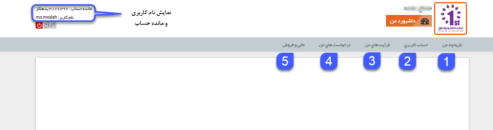
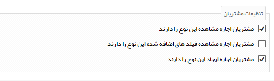
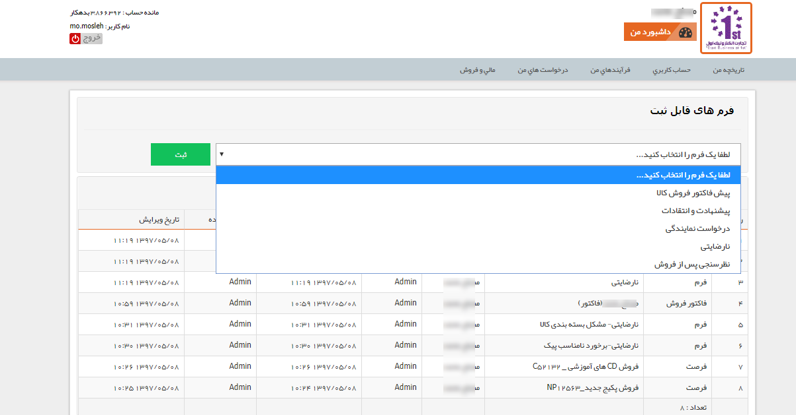
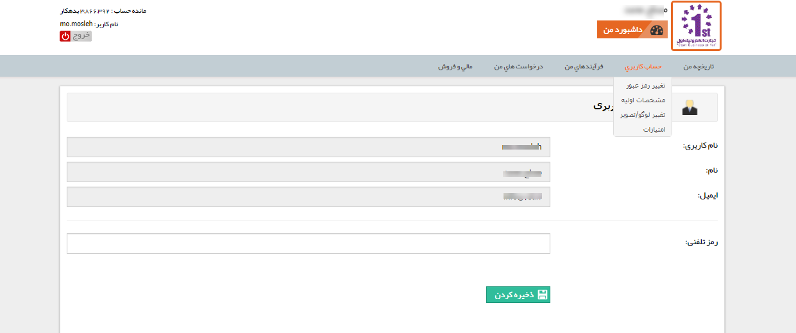
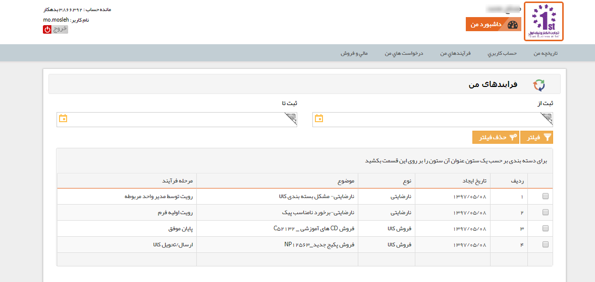
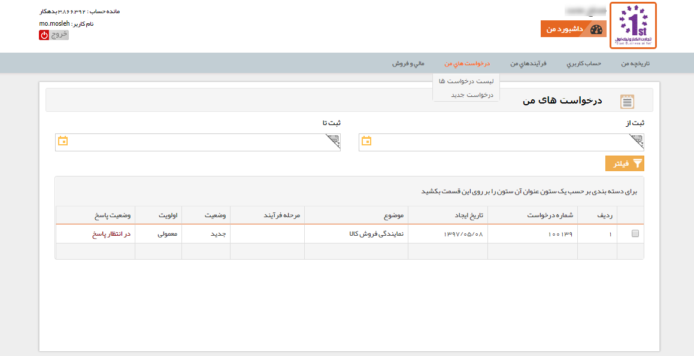
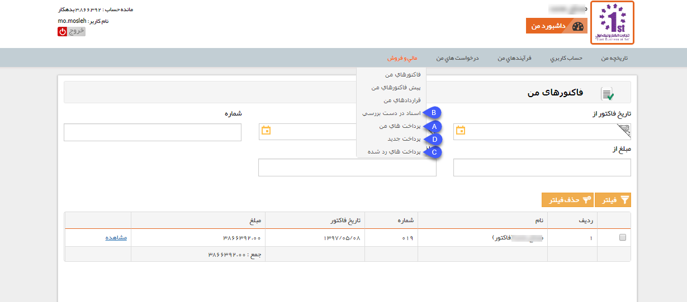
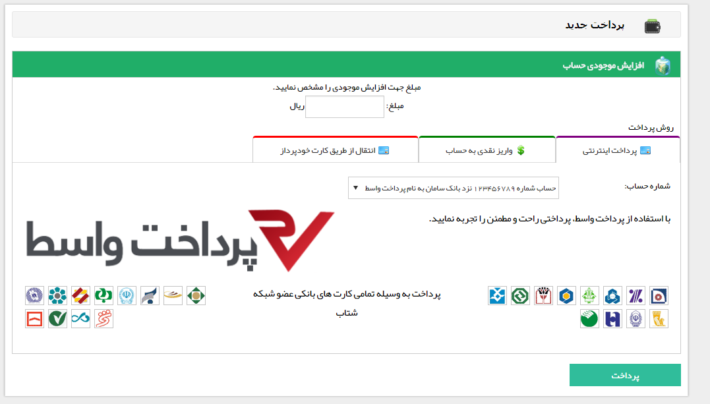
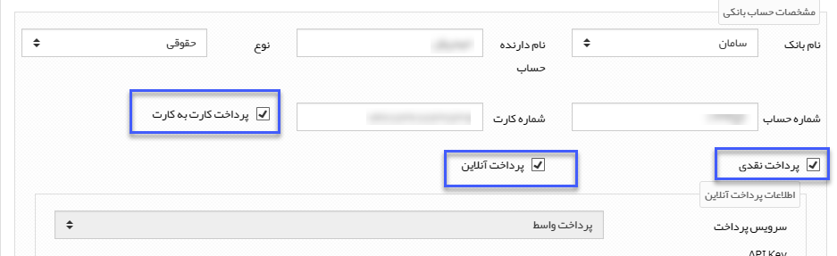

## داشبورد مشتریان

 مشتریان با نام کاربری و پسورد خود، وارد داشبورد پروفایل خود در باشگاه مشتریان می شوند، در این قسمت مشتریان می توانند اطلاعاتی مانند مانده حساب، سوابق ثبت شده (سوابقی که شما مجوز مشاهده توسط مشتریان را برای آن ها فعال کرده باشید) و وضعیت فرایند های در جریان مربوط به پروفایل خود را مشاهده کنند. همچنین امکان ثبت برخی از آیتم ها (آیتم هایی که شما مجوز ایجاد توسط مشتریان را برای آن ها فعال کرده باشید) و پرداخت آنلاین در این قسمت وجود دارد.
 
 
 
 1. تاریخچه من: در این قسمت مشتریان می توانند سوابق ثبت شده برای پروفایل خود را مشاهده نمایند. همچنین می توانند سوابق قابل ثبت را نیز برای خود ثبت نمایند.

>  نکته: توجه داشته باشید که مشاهده و ایجاد سوابق توسط مشتریان در باشگاه (در تمامی قسمت ها اعم از تاریخچه من، فرایندهای من، درخواست های من، مالی و فروش)، بر اساس تنظیمات اعمال شده توسط شما در شخصی سازی آیتم ها تعیین می گردد. 

آیتم هایی که در قسمت شخصی سازی گزینه اول برای آن ها فعال شده باشد، در این قسمت نمایش داده خواهند شد، مشاهده فیلدهای اضافه شده به آیتم منوط به فعال بودن گزینه دوم می باشد.

همچنین آیتم هایی که گزینه سوم برای آن ها فعال شده باشد، در لیست فرم های قابل ثبت نمایش داده خواهند شد. (توجه فرمایید که این آیتم ها محدود به فرم نمی شود و می تواند انواع موجودیت ها مانند فایل، درخواست، پیش فاکتور و ... را شامل ش

2. حساب کاربری: در این قسمت مشتریان می توانند اطلاعات حساب کاربری خود را مشاهده کنند و یا رمز عبور و لوگوی کاربری خود را تغییر دهند، همچنین در صورت فعال بودن ماژول سیستم امتیازدهی می توانند امتیازات خود را نیز مشاهده نمای

3. فرایندهای من: در صورتی که برای مشتری سابقه ای ثبت شده باشد و آن سابقه چرخه کاری فعال داشته باشد، در صورت فعال بودن مجوز مشاهده مشتریان برای آیتم مرتبط، مشتری می تواند در قسمت فرایندهای من، وضعیت فعلی چرخه کاری آیتم را مشاهده نماید و بدین صورت از نحوه رسیدگی به آن در سازمان شما مطلع گردد

4. درخواست های من: در صورتی که ماژول مدیریت درخواست ها را تهیه کرده باشید، مشتریان می توانند در این قسمت لیست درخواست های ثبت شده برای خود را مشاهده کرده (درخواست هایی که مجوز مشاهده مشتریان برای آن ها فعال شده باشد) و یا درخواست جدیدی ثبت نمایند (درخواست هایی که مجوز ایجاد توسط مشتریان برای آن ها فعال شده باشد).

5. مالی و فروش: در این قسمت فاکتورها، پیش فاکتورها، قراردادها و دریافت های مشتری قابل مشاهده است، همچنین مشتریان می توانند در صورت پرداخت نقدی، اطلاعات واریز را در این قسمت وارد کنند تا توسط شما مورد بررسی قرار گیرند، علاوه بر این در صورت فعال بودن ماژول پرداخت آنلاین می توانند از طریق درگاه پرداخت واسط حساب کاربری خود را به میزان دلخواه شارژ نمایند.

A. پرداخت های من: در این قسمت تمامی دریافت های ثبت شده برای مشتریان (دریافت هایی که مجوز مشاهده مشتری برای آن ها فعال شده باشد) نمایش داده می شود، این دریافت ها ممکن است تایید شده، رد شده یا در انتظار باشند. این دریافت ممکن است توسط خود مشتری یا توسط کاربران سیستم ثبت شده باشند.

B. اسناد در دست بررسی: در این قسمت تمامی دریافت های در انتظار تایید و دریافت های رد شده مشتری نمایش داده می شوند.

C. پرداخت های رد شده: در این قسمت تمامی دریافت های رد شده به مشتری نمایش داده خواهند شد.

D. پرداخت جدید: در این قسمت مشتریان می توانند اطلاعات واریز نقدی خود را وارد کرده و یا پرداخت آنلاین انجام دهند.

سه روش برای پرداخت در این قسمت وجود دارد، در قسمت پرداخت اینترنتی با وارد کردن مبلغ مورد نظر و کلیک روی دکمه پرداخت، مشتری به پنل پرداخت واسط هدایت می گردد تا پرداخت آنلاین انجام دهد و در قسمت واریز نقدی و انتقال از طریق کارت خودپرداز، صرفاً اطلاعات پرداخت توسط مشتری وارد می شود. پس از ثبت این اطلاعات توسط مشتری، یک دریافت در پروفایل او در پیام گستر ثبت می گردد تا توسط شما مورد بررسی و تایید قرار گ

> نکته: حساب های مجاز به انتخاب در هریک از روش های پرداخت بستگی به تنظیمات اعمال شده برای هریک از حساب ها در قسمت مدیریت حساب های مالی دارد.

