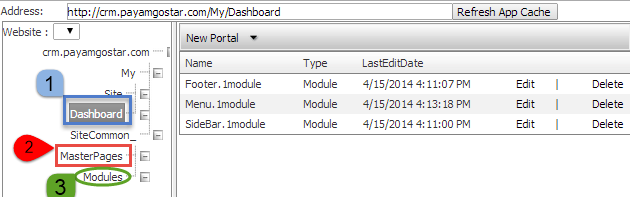
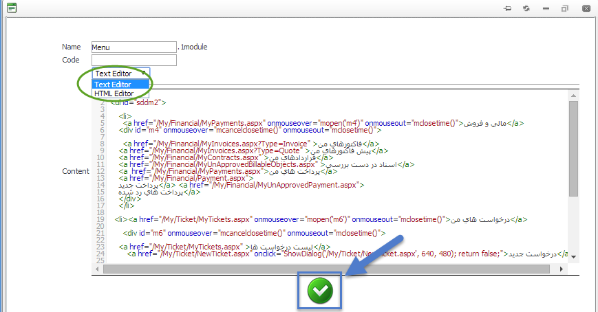
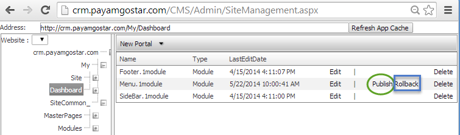
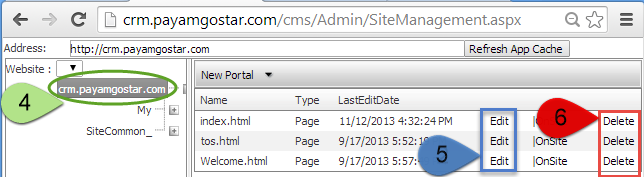
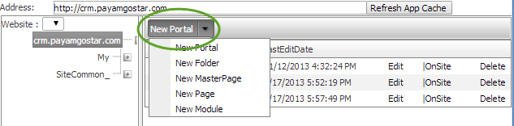

## ابزار سایت‌ساز

1. در این قسمت می توانید منوها و تنظیمات صفحه داشبورد من را تغییر دهید.

همانطور که می بینید می توانید با دو ابزار HTML Editor و Text Editor تغییرات خود را اعمال نمایید. پس ازاعمال تغییرات حتما دکمه تیک سبز رنگ در پایین صفحه را زده تا تغییرات موقتا ذخیره گردد و به صفحه تایید نهایی هدایت شوید.

 Text Editor

با زدن دکمه Publish تغییرات انجام شده در سایت اعمال می شود و با زدن دکمه Rollback تغییرات پاک شده و به حالت اولیه بر می گردد.

 

2. می توانید قالب اصلی سایت خود را در این قسمت  تنظیم نمایید.

3. در این قسمت می توانید لوگو خود را در سایت جایگذاری نمایید.

4. در این قسمت می توانید اطلاعات و محتوا سایت خود را تغییر دهید.

5.  برای تغییر در هر قسمت باید دکمه Edit را بزنید.

6. برای پاک کردن صفحه باید دکمه Delete  را بزنید.

برای اضافه کردن صفحات دیگر باید از قسمت New Portal وارد شوید و نوع آبجکت مورد نیاز خود را اضافه نمایید.

