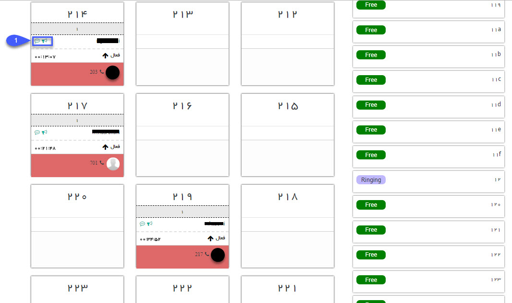

## داشبورد مرکز تماس 

> مسیر دسترسی:  **پنجره‌ها** >**انتخاب سیستم تلفنی مورنظر** 

در این بخش امکان مشاهده‌ی خطوط داخلی تعریف شده در نرم افزار وجود دارد، داخلی هایی که در حال مکالمه باشند از این قسمت مشخص است و می توان جزئیاتی مانند نام کاربر متناظر،  مدت زمان مکالمه و شماره‌ تماس را مشاهده کرد. 

در سمت راست لیست خطوط و سمت چپ لیست داخلی ها نمایش داده می شود.
