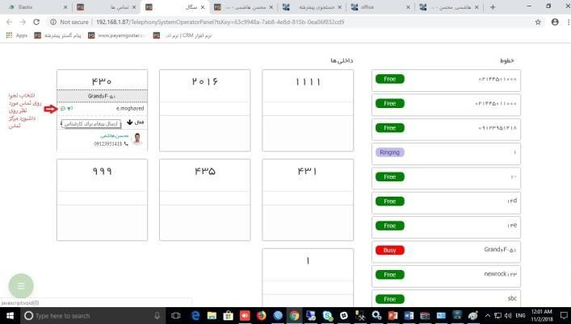
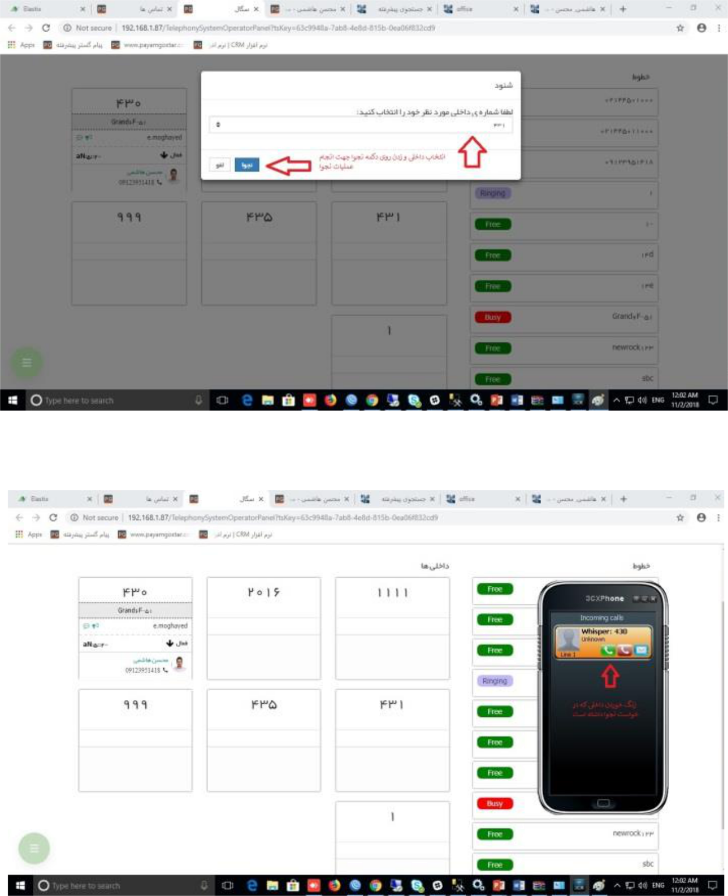

## شنود و نجوا

**شنود** قابلیتی است که در سیستم تلفنی ویپ قابل استفاده می باشد و با استفاده از آن می توان از طریق داشبورد مرکز تماس  روی یک داخلی، بدون اینکه داخلی مورد نظر متوجه شود، مکالمه آن را شنود کرد.به این صورت که در داشبورد مرکزتماس روی تماس مورد نظرگزینه شنود را کلیک کرده و بعد از اینکه داخلی که برای کاربرمان تنظیم کرده ایم نمایش داده شد، شنود را مجدد می زنیم و داخلیمان زنگ میخورد و روی آن SPY هم دیده میشود.در صورت جواب دادن عملیات شنود صورت میپذیرد.

**نجوا** قابلیتی است در سیستم تلفنی ویپ قابل استفاده می باشد، که با استفاده از آن می توان از طریق داشبورد مرکز تماس روی یک داخلی نجوا انجام داد و به یک کارشناس در حال صحبت با مشتری یا شخص دیگر بدون متوجه شدن شخص ثالث راهنمایی در هنگام مکالمه داد.
به این صورت که روی تماس مورد نظر در داشبورد مرکزتماس روی گزینه ارسال پیغام به کارشناس کلیک کرده و بعد از اینکه داخلی که برای کاربرمان تنظیم کرده ایم نمایش داده شد نجوا را مجدد می زنیم و داخلیمان زنگ میخورد و روی آن Wisper هم دیده میشود.در صورت جواب دادن عملیات نجوا صورت میپذیرد.

