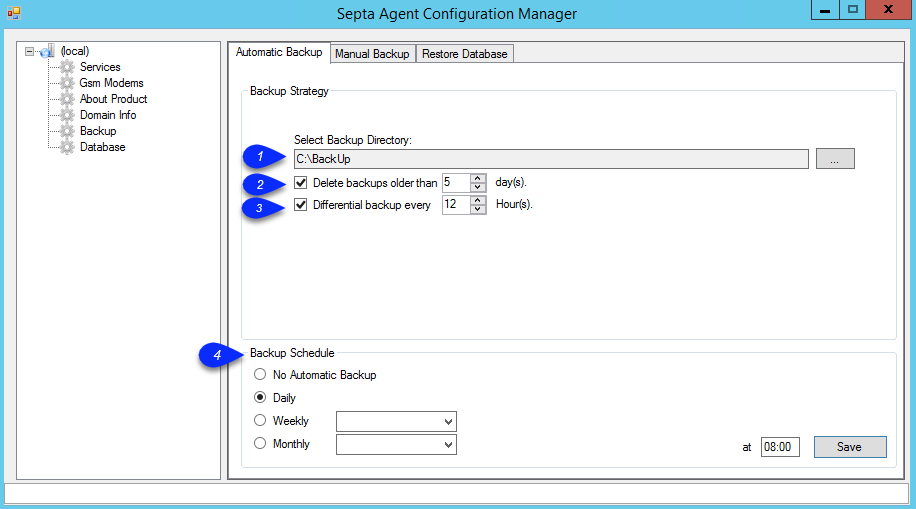
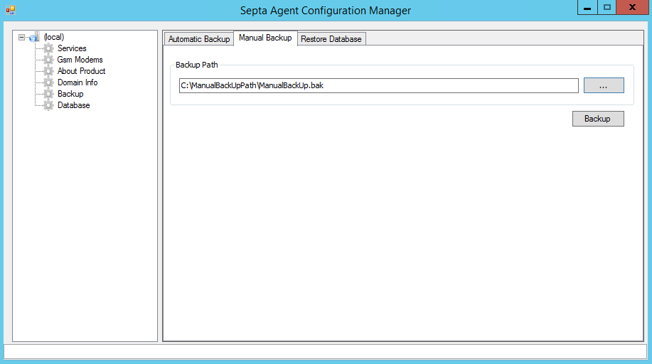
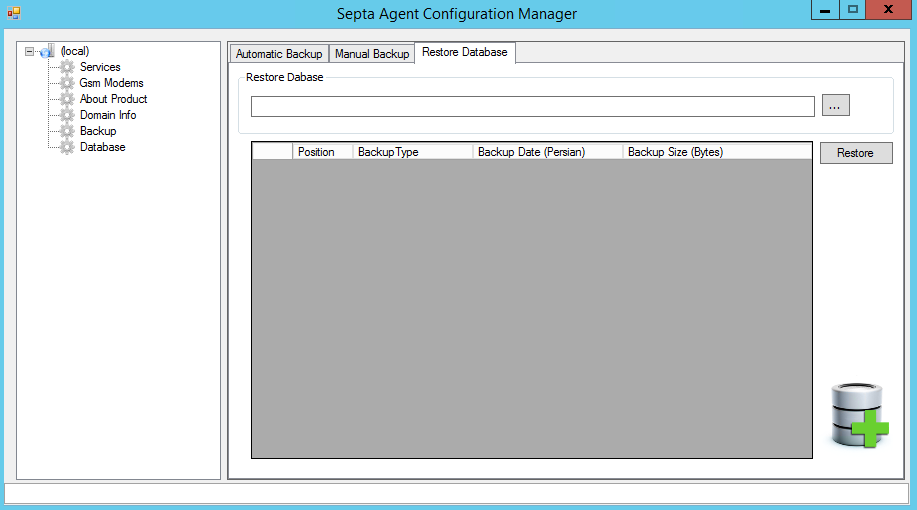

## Automatic Backup(پشتیبان گیری خودکار):

در این قسمت می توانید پشتیبان گیری را به دو صورت کامل (Full) و دیفرانسیلی (Differential) تنظیم کنید.

زمان بندی (Schedule) پشتیبان گیری را نیز می توانید تعیین کنید.

1. BackUp Directory: مسیر بک آپ گیری را انتخاب کنید.

2. Full Backup: در این حالت، در هر نوبت پشتیبان گیری، نرم افزار یک بار کل داده موجود در  پایگاه داده (Database) را پشتیبان گیری می کند. (آنچه اکنون موجود است به صورت کامل در یک فایل ذخیره می شود.) مسیر ذخیره فایل های پشتیبانی که ایجاد می شوند را انتخاب کنید.

در نظر داشته باشید که در هر نوبت پشتیبان گیری در این حالت یک فایل جداگانه با نامی که در آن زمان پشتیبان گیری نوشته شده است ذخیره می شود. بنابر این می توانید فایل های قدیمی تر را به صورت دستی حذف کنید یا می توانید زمان حذف خودکار را در نرم افزار تعیین نمایید(تیک Delete backups older than را فعال کنید و تعداد روز مورد نظر را در کادر روبروی آن وارد کنید.)

3. Differential Backup: در این حالت نرم افزار در نوبت اول پشتیبان گیری تمامی اطلاعات در دیتا بیس را ذخیره می کند اما در دفعات بعد تغییرات نسبت به نوبت قبل را ذخیره می کند. مسیر ذخیره فایل پشتیبان گیری شده را انتخاب کنید. همچنین مشخص کنید که هر چند ساعت یکبار از تغییرات بک آپ گرفته شود. ( در اصل می توان مشخص کرد بین هر دو بک آپ full  چند بک آپ از تغییرات گرفته شود )

در نظر داشته باشید در این حالت تنها یک فایل ایجاد می شود. نسبت حجم این حالت به حالت Full Backup کمتر است اما دیگر نمی توانید پشتیبان های قدیمی را حذف کنید. بنابر این باید به صورت دستی فایل پشتیبان گیری شده را در جای دیگری (مانند یک هارد درایو اکسترنال) ذخیره کنید و آن را حذف کنید تا فضای کافی برای ایجاد پشتیبان های جدید ایجاد شود.

4. BackUp schedule: می توانید برای پشتیبانی گیری از سیستم زمان بندی بر حسب روزانه، هفتگی و یا ماهانه در زمان مشخص استفاده نمایید .

**نکات:**

1.   قبل از تهیه نسخه پشتیبان و یا در هنگام بارگذاری نسخه پشتیبان، نرم افزار در حالت استفاده نباشد. (کلیه کلاینت ها بسته باشد .)

2.   در صورت بروز هر گونه مشکل سرویس های Host، Agent و SQL Server (PAYAMGOSTAR2) که در قسمت services  هست را  Reset نمایید و دوباره تلاش نمایید .

Manual Backup(پشتیبان گیری دستی):

با استفاده از این منو میتوانید یک فایل پشتیبان با نام دلخواه در مسیر دلخواه ایجاد کنید.

Restore Database(بازیابی پایگاه داده):

با استفاده از این منو می توانید از فایل پشتیبان ذخیره شده قبلی برای بازگرداندن نرم افزار به زمان آن استفاده کنید.

  